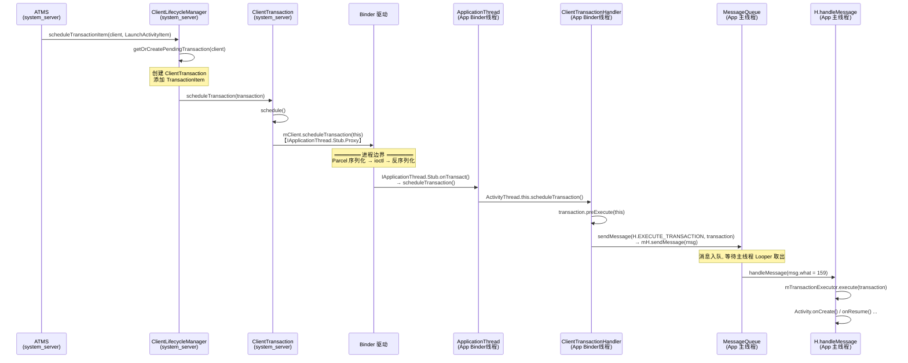

> 基于 Android 16+ (AOSP) 源码分析，源码路径基于 `frameworks/base/`

---

## 一、ActivityThread 内部类 H

### 1.1 定义与角色

`H` 是 `ActivityThread` 的内部类，继承自 `Handler`，是 App 进程**主线程的核心消息调度中枢**。

```
源码位置: core/java/android/app/ActivityThread.java:2873
```

```java
class H extends Handler {
    public static final int BIND_APPLICATION        = 110;
    public static final int EXIT_APPLICATION        = 111;
    public static final int RECEIVER                = 113;
    public static final int CREATE_SERVICE          = 114;
    public static final int EXECUTE_TRANSACTION     = 159;
    // ... 40+ 消息类型
}
```

### 1.2 核心职责 — 线程切换 + 消息分发

AMS/ATMS 的调用通过 Binder IPC 到达 App 进程时，运行在 **Binder 线程池**中。而四大组件的生命周期必须在**主线程**执行。`H` 就是连接两者的桥梁：

```
system_server (AMS/ATMS)
    ↓ Binder IPC
App 进程 Binder 线程
    ↓ mH.sendMessage(EXECUTE_TRANSACTION, transaction)
App 进程主线程 (H.handleMessage)
    ↓ switch(msg.what)
    handleBindApplication() / handleCreateService() / mTransactionExecutor.execute() ...
```

### 1.3 关键消息类型分类

| 类别 | 消息常量 | 触发的方法 |
|------|---------|-----------|
| **应用绑定** | `BIND_APPLICATION (110)` | `handleBindApplication()` — 创建 Application |
| **Activity 生命周期** | `EXECUTE_TRANSACTION (159)` | `mTransactionExecutor.execute()` — 执行 onCreate/onStart/onResume 等 |
| **Activity 重建** | `RELAUNCH_ACTIVITY (160)` | `handleRelaunchActivityLocally()` |
| **Service** | `CREATE_SERVICE (114)`, `BIND_SERVICE (121)`, `SERVICE_ARGS (115)`, `STOP_SERVICE (116)` | 对应 handle 方法 |
| **BroadcastReceiver** | `RECEIVER (113)` | `handleReceiver()` |
| **ContentProvider** | `INSTALL_PROVIDER (145)`, `REMOVE_PROVIDER (131)` | 对应 handle 方法 |
| **配置变更** | `CONFIGURATION_CHANGED (118)` | `handleConfigurationChanged()` |
| **内存管理** | `LOW_MEMORY (124)`, `GC_WHEN_IDLE (120)`, `PURGE_RESOURCES (161)` | GC 和资源清理 |
| **进程退出** | `EXIT_APPLICATION (111)`, `SUICIDE (130)` | 终止 Looper / 杀进程 |

其中最重要的是 **`EXECUTE_TRANSACTION (159)`**，它是现代 Activity 生命周期的统一入口：

```java
// ActivityThread.java:3292
case EXECUTE_TRANSACTION:
    final ClientTransaction transaction = (ClientTransaction) msg.obj;
    mTransactionExecutor.execute(transaction);
    break;
```

### 1.4 实例化与关联

```java
// ActivityThread.java:526-529
final Looper mLooper = Looper.myLooper();
final H mH = new H();                          // 实例字段，绑定主线程 Looper
final Executor mExecutor = new HandlerExecutor(mH);
```

`H` 在 `ActivityThread` 构造时创建，自动绑定到当前线程（主线程）的 Looper。

---

## 二、sMainThreadHandler

### 2.1 定义

```java
// ActivityThread.java:774
static volatile Handler sMainThreadHandler;  // set once in main()
```

### 2.2 赋值时机

在 `ActivityThread.main()` 方法中赋值：

```java
// ActivityThread.java:10435
public static void main(String[] args) {
    Looper.prepareMainLooper();                        // 创建主线程 Looper
    ActivityThread thread = new ActivityThread();       // 构造时 mH = new H()
    thread.attach(false, startSeq);

    if (sMainThreadHandler == null) {
        sMainThreadHandler = thread.getHandler();      // getHandler() 返回 mH
    }

    Looper.loop();  // 主线程消息循环，永不返回
}
```

### 2.3 mH 与 sMainThreadHandler 对比

| 对比项 | `mH` | `sMainThreadHandler` |
|--------|------|---------------------|
| 类型 | `final H` (实例字段) | `static volatile Handler` |
| 定义位置 | `ActivityThread.java:528` | `ActivityThread.java:774` |
| 指向 | `new H()` | `thread.getHandler()` 即 `mH` |
| 访问方式 | 需要 ActivityThread 实例 | 静态访问 |
| 本质 | **同一个对象** | **同一个对象的静态别名** |
| 使用场景 | ActivityThread 内部使用 | 外部类需要向主线程投递消息时使用 |

**`sMainThreadHandler` 被声明为 `volatile`**，保证跨线程可见性（Binder 线程写入，其他线程读取）。

---

## 三、从 system_server 到 App 进程的完整调用链

### 3.1 涉及的核心类

| 类名 | 所在进程 | 角色 |
|------|---------|------|
| `ClientLifecycleManager` | system_server | 事务调度器，构建并发送 ClientTransaction |
| `ClientTransaction` | 跨进程传递 (Parcelable) | 事务容器，封装 TransactionItem 列表 |
| `IApplicationThread` | AIDL 接口 | 定义 `scheduleTransaction()` 等跨进程方法 |
| `ApplicationThread` | App 进程 | IApplicationThread.Stub 实现，Binder 服务端 |
| `ClientTransactionHandler` | App 进程 | ActivityThread 父类，实现线程切换逻辑 |
| `H` (Handler) | App 进程 | 主线程消息分发器 |
| `TransactionExecutor` | App 进程 | 最终执行 Transaction 中的各个 Item |

### 3.2 完整调用链（10 步）

| 步骤 | 类.方法() | 文件路径 | 进程/线程 |
|------|----------|---------|----------|
| 1 | `ClientLifecycleManager.scheduleTransactionItem()` | `services/.../wm/ClientLifecycleManager.java:109` | system_server / WM 线程 |
| 2 | `ClientLifecycleManager.scheduleTransaction()` | `ClientLifecycleManager.java:73` | system_server / WM 线程 |
| 3 | `ClientTransaction.schedule()` | `core/.../servertransaction/ClientTransaction.java:243` | system_server / WM 线程 |
| 4 | **`mClient.scheduleTransaction(this)`** | `ClientTransaction.java:245` | **Binder IPC 跨进程** |
| 5 | `ApplicationThread.scheduleTransaction()` | `core/.../app/ActivityThread.java:2599` | App / **Binder 线程** |
| 6 | `ClientTransactionHandler.scheduleTransaction()` | `core/.../app/ClientTransactionHandler.java:61` | App / Binder 线程 |
| 7 | `transaction.preExecute(this)` | `ClientTransactionHandler.java:62` | App / Binder 线程 |
| 8 | **`sendMessage(H.EXECUTE_TRANSACTION, transaction)`** | `ClientTransactionHandler.java:63` | App / Binder线程 → **主线程队列** |
| 9 | `H.handleMessage(EXECUTE_TRANSACTION)` | `ActivityThread.java:3292` | App / **主线程** |
| 10 | `mTransactionExecutor.execute(transaction)` | `ActivityThread.java:3298` | App / 主线程 |

### 3.3 时序图



### 3.4 三个关键节点深入

#### 节点 A: system_server 侧 — 构建并发送事务

`ClientLifecycleManager` 是 system_server 中的事务调度器：

```java
// ClientLifecycleManager.java:73
// 其中mClient是ClientTransaction类中的成员变量，private final IApplicationThread mClient;
boolean scheduleTransaction(@NonNull ClientTransaction transaction) {
    final RemoteException e = transaction.schedule();  // → mClient.scheduleTransaction(this) 
    // ...
}
```

`ClientLifecycleManager` 还有**批量调度优化**：通过 `mPendingTransactions` 缓存，等待 `RootWindowContainer#performSurfacePlacementNoTrace` 时统一 dispatch，减少 Binder 调用次数。

```java
// ClientLifecycleManager.java:162
void dispatchPendingTransactions() {
    for (int i = 0; i < size; i++) {
        scheduleTransaction(mPendingTransactions.valueAt(i));
    }
    mPendingTransactions.clear();
}
```

#### 节点 B: Binder 跨进程传输

`ClientTransaction` 实现了 `Parcelable`，跨进程时：

1. **system_server 侧**: `writeToParcel()` 序列化 `mTransactionItems` 列表
2. **Binder 驱动**: 一次内存拷贝传递数据
3. **App 进程侧**: `createFromParcel()` 反序列化重建对象

**关键细节** — `mClient` 字段不参与序列化：

```java
// ClientTransaction.java:262
private ClientTransaction(@NonNull Parcel in) {
    mClient = null;  // This field is unnecessary on the client side.
    in.readParcelableList(mTransactionItems, ...);
}
```

App 进程不需要持有自己的 Binder 代理。

#### 节点 C: Binder 线程 → 主线程切换

这是整个链路最关键的设计点。`ActivityThread` 继承 `ClientTransactionHandler`：

```java
// ClientTransactionHandler.java:61
void scheduleTransaction(ClientTransaction transaction) {
    transaction.preExecute(this);                                    // Binder 线程执行预处理
    sendMessage(ActivityThread.H.EXECUTE_TRANSACTION, transaction);  // ← 线程切换点
}
```

`sendMessage` 最终通过 `mH` 投递到主线程：

```java
// ActivityThread.java:4788
private void sendMessage(int what, Object obj, int arg1, int arg2, boolean async) {
    Message msg = Message.obtain();
    msg.what = what;    // H.EXECUTE_TRANSACTION = 159
    msg.obj = obj;      // ClientTransaction 对象
    mH.sendMessage(msg);  // ← 投递到主线程 Looper 的 MessageQueue
}
```

---

## 四、设计总结

### 4.1 三次关键转换

```
① system_server 进程 (WM锁内)
   ClientLifecycleManager 构建 ClientTransaction
        ↓ ① IApplicationThread.Proxy → Binder驱动 【进程切换】
② App 进程 Binder 线程
   ApplicationThread.scheduleTransaction() 接收
        ↓ ② mH.sendMessage() 【线程切换】
③ App 进程主线程
   H.handleMessage(EXECUTE_TRANSACTION)
   → TransactionExecutor.execute()
   → Activity.onCreate() ...
```

- **第 1 次转换（进程间）**: `IApplicationThread` Binder IPC，从 system_server 到 App 进程
- **第 2 次转换（线程间）**: `mH.sendMessage()`，从 Binder 线程到主线程
- **设计意图**: 进程解耦（安全性/稳定性）+ 线程解耦（保证 UI 操作在主线程顺序执行）

### 4.2 为什么 H 采用 Handler 消息机制而非直接调用

1. **线程安全**: Binder 线程不能直接操作 UI，必须切换到主线程
2. **顺序性**: MessageQueue 保证消息 FIFO 顺序执行，避免生命周期乱序
3. **解耦**: 发送方（Binder 线程）和处理方（主线程）完全异步解耦
4. **可调度**: 支持延迟消息、异步消息、消息优先级等灵活调度

### 4.3 ClientTransaction 的批量优化

`ClientLifecycleManager` 不是每次都立即发送事务，而是：
1. 先缓存到 `mPendingTransactions`（按 client 进程分组）
2. 等待 `performSurfacePlacement` 布局完成时统一 dispatch
3. 减少 Binder IPC 次数，提升系统性能

只有在以下情况才立即发送：
- 没有正在进行/已调度的布局
- 调用方显式要求立即发送（如冷启动需要立即知道结果）

---

## 五、关键源码索引

| 文件 | 关键行号 | 内容 |
|------|---------|------|
| `core/java/android/app/ActivityThread.java` | 402 | `class ActivityThread extends ClientTransactionHandler` |
| 同上 | 528 | `final H mH = new H()` |
| 同上 | 774 | `static volatile Handler sMainThreadHandler` |
| 同上 | 1348 | `class ApplicationThread extends IApplicationThread.Stub` |
| 同上 | 2599 | `ApplicationThread.scheduleTransaction()` |
| 同上 | 2873 | `class H extends Handler` — 消息常量定义 |
| 同上 | 3011 | `H.handleMessage()` — 消息分发入口 |
| 同上 | 3292 | `case EXECUTE_TRANSACTION` — 执行 ClientTransaction |
| 同上 | 4788 | `sendMessage()` — 投递到 mH |
| 同上 | 10435 | `main()` — App 进程入口，初始化 Looper 和 sMainThreadHandler |
| `core/java/android/app/ClientTransactionHandler.java` | 61 | `scheduleTransaction()` — 线程切换核心 |
| `core/java/android/app/servertransaction/ClientTransaction.java` | 50 | 事务容器，Parcelable 实现 |
| 同上 | 243 | `schedule()` — 发起 Binder 调用 |
| `core/java/android/app/IApplicationThread.aidl` | 177 | AIDL 接口定义 `scheduleTransaction()` |
| `services/core/.../wm/ClientLifecycleManager.java` | 43 | system_server 侧事务调度器 |
| 同上 | 73 | `scheduleTransaction()` — 发送事务 |
| 同上 | 162 | `dispatchPendingTransactions()` — 批量发送 |

## 六、推荐阅读

- [gityuan - Handler消息机制](https://gityuan.com/tags/#handler) — 理解 Handler/Looper/MessageQueue 基础
- [gityuan - Binder系列](https://gityuan.com/tags/#binder) — 理解 Proxy/Stub/驱动层原理
- [gityuan - startActivity启动过程](https://gityuan.com/tags/#ams) — 从 AMS 侧发起的完整流程