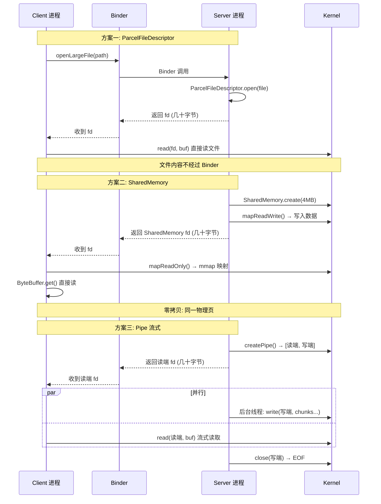

## 1. 为什么需要特殊处理？

### 1.1 Binder 的 1MB 限制

**TransactionTooLargeException.java:20-55**：

> *"The Binder transaction buffer has a limited fixed size, **currently 1MB**, which is shared by all transactions in progress for the process."*

关键点：
- 1MB 是**所有进行中事务共享**的，不是单个事务独占
- 超限直接抛 `TransactionTooLargeException` 崩溃
- 官方建议："Avoid transferring huge arrays of strings or large bitmaps"

### 1.2 Socket 的缓冲区限制

**InputTransport.cpp:135**：

```cpp
constexpr size_t SOCKET_BUFFER_SIZE = 32 * 1024;  // 32KB
```

Socket 缓冲区适合小消息，大文件需要分包 + 重组，复杂且低效。

### 1.3 核心解决思路

**Binder 传 fd，不传数据。**

fd（文件描述符）只有几十字节，远小于 1MB 限制。Binder 驱动在内核态将 fd 复制到目标进程的 fd 表（不复制文件内容），对端拿到 fd 后通过 mmap/read/write 直接访问数据。

---

## 2. 方案全景图

```
跨进程传递大数据
│
├── ① Binder 传 fd（核心原理都一样：Binder 只传 fd，数据不经过 Binder）
│   ├── AIDL 方法直接传 ParcelFileDescriptor ← 最灵活，自定义服务
│   ├── AIDL 方法传 SharedMemory             ← 零拷贝共享内存
│   ├── AIDL 方法传 Pipe 读端                ← 流式传输动态数据
│   ├── ContentProvider.openFile()          ← 最标准，适合对外暴露文件
│   ├── Intent 附带 Uri + FileProvider       ← App 间分享文件
│   └── Bundle 携带 ParcelFileDescriptor     ← Activity/Service 间传递
│
├── ② 不经过 Binder
│   ├── Socket 直接传输                      ← 完全自主控制
│   └── 文件系统共享（同一路径 + 权限控制）    ← 最简单，但需同一用户组
│
└── ③ 混合方案
    └── Binder 传路径/Uri + 文件系统读取      ← 传字符串，对端自己打开
```

---

## 3. 三大核心方案详解

### 3.1 方案一：ParcelFileDescriptor — 传 fd 而非传数据

#### 原理

```
Client 进程                    Binder                    Server 进程
                                │
   openFile(uri) ──────────────>│
                                │
                  Parcel 中只有 fd│(几十字节)
                  不含文件内容    │
                                │
   <── ParcelFileDescriptor ────│
                                │
   通过 fd 直接 read()           │
   文件不经过 Binder             │
```

#### 方式 A：AIDL 直接传 ParcelFileDescriptor（最灵活，不需要 ContentProvider）

**任何 AIDL 接口都可以直接传 fd**：

```aidl
// IMyService.aidl
interface IMyService {
    ParcelFileDescriptor openLargeFile(String path);
}
```

服务端实现：

```java
@Override
public ParcelFileDescriptor openLargeFile(String path) {
    File file = new File(path);
    return ParcelFileDescriptor.open(file, ParcelFileDescriptor.MODE_READ_ONLY);
    // Binder 只传了 fd（几十字节），5GB 的文件也没问题
}
```

客户端使用：

```java
try {
    ParcelFileDescriptor pfd = myService.openLargeFile("/data/large.bin");
    InputStream is = new ParcelFileDescriptor.AutoCloseInputStream(pfd);
    // 流式读取，文件内容不经过 Binder
} catch (RemoteException e) {
    // Binder 调用必须 try-catch
}
```

#### 方式 B：ContentProvider.openFile()（对外暴露文件的标准方式）

**源码** — `ContentProvider.java:2194`：

```java
public @Nullable ParcelFileDescriptor openFile(@NonNull Uri uri, @NonNull String mode)
        throws FileNotFoundException {
    throw new FileNotFoundException("No files supported by provider at " + uri);
}
```

注释（行 2207-2209）：

> *"This method returns a ParcelFileDescriptor, which is returned directly to the caller. **This way large data (such as images and documents) can be returned without copying the content.**"*

子类实现：

```java
@Override
public ParcelFileDescriptor openFile(Uri uri, String mode) throws FileNotFoundException {
    File file = getFileForUri(uri);
    int fileMode = modeToMode(mode);
    return ParcelFileDescriptor.open(file, fileMode);  // 返回 fd
}
```

#### 方式 C：Intent + FileProvider（App 间分享）

```java
// 发送方
Uri fileUri = FileProvider.getUriForFile(context, authority, largeFile);
Intent intent = new Intent(Intent.ACTION_SEND);
intent.putExtra(Intent.EXTRA_STREAM, fileUri);
intent.addFlags(Intent.FLAG_GRANT_READ_URI_PERMISSION);
startActivity(intent);

// 接收方
Uri uri = intent.getParcelableExtra(Intent.EXTRA_STREAM);
InputStream is = getContentResolver().openInputStream(uri);  // 底层走 ContentProvider → fd
```

#### ParcelFileDescriptor 核心 API

**源码** — `ParcelFileDescriptor.java:76`：

```java
public class ParcelFileDescriptor implements Parcelable, Closeable {
```

| 方法 | 行号 | 用途 |
|------|------|------|
| `open(File, mode)` | — | 从文件创建 fd |
| `fromFd(int fd)` | 405 | 从 native fd 创建 |
| `createPipe()` | 513 | 创建管道对（用于方案三） |
| `createSocketPair()` | 551 | 创建 socket 对 |
| `createReliablePipe()` | 534 | 带错误检测的管道 |

---

### 3.2 方案二：SharedMemory — 零拷贝共享内存

#### 原理

```
进程 A (写入方)                                进程 B (读取方)
  │                                              │
  SharedMemory.create("data", 4MB)               │
  │                                              │
  ByteBuffer buf = mapReadWrite()                │
  buf.put(largeData)  ← 写入共享内存              │
  │                                              │
  ── 通过 Binder 传递 fd(几十字节) ──>            │
  │                                     SharedMemory(fd)
  │                                     ByteBuffer buf = mapReadOnly()
  │                                     buf.get() ← 直接读，零拷贝！
  │                                              │
  ┌──────────────────────────────────────────────┐
  │          同一块物理内存页                       │
  │          进程 A 写，进程 B 读                   │
  │          零拷贝，只有 mmap 映射开销              │
  └──────────────────────────────────────────────┘
```

#### 核心源码

**SharedMemory.java:42** — 实现了 `Parcelable`，可以通过 Binder 传递：

```java
public final class SharedMemory implements Parcelable, Closeable {
    private final FileDescriptor mFileDescriptor;
    private final int mSize;
}
```

创建（行 84）：

```java
public static SharedMemory create(String name, int size) throws ErrnoException {
    return new SharedMemory(nCreate(name, size));  // 底层调用 ashmem_create_region
}
```

映射为可读写 ByteBuffer（行 235）：

```java
public ByteBuffer mapReadWrite() throws ErrnoException {
    return map(OsConstants.PROT_READ | OsConstants.PROT_WRITE, 0, mSize);
}
```

映射为只读 ByteBuffer（行 249）：

```java
public ByteBuffer mapReadOnly() throws ErrnoException {
    return map(OsConstants.PROT_READ, 0, mSize);
}
```

#### AIDL 中使用 SharedMemory

```aidl
// IMyService.aidl
interface IMyService {
    SharedMemory getLargeData();
}
```

```java
@Override
public SharedMemory getLargeData() throws RemoteException {
    try {
        SharedMemory shm = SharedMemory.create("data", 4 * 1024 * 1024);
        ByteBuffer buf = shm.mapReadWrite();
        buf.put(largeByteArray);  // 写入 4MB 数据
        SharedMemory.unmap(buf);
        return shm;  // Binder 只传 fd，对端 mmap 零拷贝读取
    } catch (ErrnoException e) {
        throw new RemoteException(e.getMessage());
    }
}
```

#### Framework 实例一：CursorWindow（数据库查询结果）

**CursorWindow.java:39**：

```java
/**
 * A buffer containing multiple cursor rows.
 *
 * A CursorWindow is read-write when initially created and used locally.
 * When sent to a remote process (by writing it to a Parcel), the remote process
 * receives a read-only view of the cursor window.
 */
public class CursorWindow extends SQLiteClosable implements Parcelable {
```

底层实现：CursorWindow 在 native 层使用 `ashmem`（Android Shared Memory）分配共享内存，通过 Parcel 传递 fd 给另一个进程，另一个进程 mmap 后直接读取数据库结果。**数据库查询结果可能有几 MB 甚至几十 MB，全部通过共享内存传递，零拷贝**。

#### Framework 实例二：ApplicationSharedMemory（Android 16+ 系统级共享）

**ApplicationSharedMemory.java:34**：

```java
/**
 * This shared memory region can be used as an alternative to Binder IPC for driving
 * communication between system processes and application processes at a lower latency
 * and higher throughput than Binder IPC can provide.
 *
 * Unlike Binder IPC, shared memory doesn't support synchronous transactions,
 * client identity, and access auditing.
 */
public class ApplicationSharedMemory implements AutoCloseable {
```

system_server 创建（行 87）：

```java
public static ApplicationSharedMemory create() {
    int fd = nativeCreate();               // 分配共享内存
    long ptr = nativeMap(fd, true);        // 可读写映射
    nativeInit(ptr);
    return new ApplicationSharedMemory(fileDescriptor, true, ptr);
}
```

App 进程接收（行 111）：

```java
public static ApplicationSharedMemory fromFileDescriptor(
        FileDescriptor fileDescriptor, boolean mutable) {
    long ptr = nativeMap(fileDescriptor.getInt$(), mutable);  // 只读映射
    return new ApplicationSharedMemory(fileDescriptor, mutable, ptr);
}
```

**使用场景**：动画缩放系数等频繁变更的数据，system_server 写入共享内存，所有 App 直接读取，完全不走 Binder。

---

### 3.3 方案三：Pipe 流式传输 — 动态生成的大数据

#### 原理

```
Server 进程                                Client 进程
                                           │
  createPipe() → [读端fd, 写端fd]           │
                                           │
  ── 通过 Binder 传递读端 fd ──>            │
                                           │
  后台线程:                                 读端 fd:
    while (hasData) {                       while (true) {
      write(写端fd, chunk)  ──(内核管道)──>    read(读端fd, buf)
    }                                       }
    close(写端fd)                            EOF → 读取完毕
```

#### 源码：ContentProvider.openPipeHelper()

**ContentProvider.java:2607**：

```java
public <T> ParcelFileDescriptor openPipeHelper(final Uri uri,
        final String mimeType, final Bundle opts, final T args,
        final PipeDataWriter<T> func) throws FileNotFoundException {
    try {
        final ParcelFileDescriptor[] fds = ParcelFileDescriptor.createPipe();  // 创建管道

        // 后台线程写入数据
        AsyncTask<Object, Object, Object> task = new AsyncTask<>() {
            @Override
            protected Object doInBackground(Object... params) {
                func.writeDataToPipe(fds[1], uri, mimeType, opts, args);  // 写入写端
                fds[1].close();  // 关闭写端 → 读端收到 EOF
                return null;
            }
        };
        task.executeOnExecutor(AsyncTask.THREAD_POOL_EXECUTOR, (Object[]) null);

        return fds[0];  // 返回读端给调用方（通过 Binder 传递 fd）
    } catch (IOException e) {
        throw new FileNotFoundException("failure making pipe");
    }
}
```

#### ParcelFileDescriptor.createPipe() 源码

**ParcelFileDescriptor.java:513**：

```java
public static ParcelFileDescriptor[] createPipe() throws IOException {
    try {
        final FileDescriptor[] fds = Os.pipe2(ifAtLeastQ(O_CLOEXEC));
        return new ParcelFileDescriptor[] {
                new ParcelFileDescriptor(fds[0]),   // 读端
                new ParcelFileDescriptor(fds[1]) }; // 写端
    } catch (ErrnoException e) {
        throw e.rethrowAsIOException();
    }
}
```

#### AIDL 中使用 Pipe

```aidl
interface IMyService {
    ParcelFileDescriptor streamAnimationData();
}
```

```java
@Override
public ParcelFileDescriptor streamAnimationData() throws RemoteException {
    try {
        ParcelFileDescriptor[] pipe = ParcelFileDescriptor.createPipe();
        new Thread(() -> {
            try (OutputStream os = new ParcelFileDescriptor.AutoCloseOutputStream(pipe[1])) {
                writeHugeDataTo(os);  // 后台线程流式写入，无大小限制
            } catch (IOException e) { }
        }).start();
        return pipe[0];  // 返回读端，Binder 只传 fd
    } catch (IOException e) {
        throw new RemoteException(e.getMessage());
    }
}
```

---

## 4. 不经过 Binder 的方案

### 4.1 Socket 直接传输

两个进程约定好路径，直接通过 Socket 传大文件：

```java
// 服务端
LocalServerSocket server = new LocalServerSocket("my_transfer");
LocalSocket client = server.accept();
OutputStream os = client.getOutputStream();
os.write(hugeFileBytes);  // 直接写，无 Binder 参与

// 客户端
LocalSocket socket = new LocalSocket();
socket.connect(new LocalSocketAddress("my_transfer"));
InputStream is = socket.getInputStream();
// 流式读取，无大小限制
```

**缺点**：没有 Binder 的 UID 安全验证，需要自行做权限控制。

### 4.2 文件系统共享

如果两个进程属于同一 App（如背屏进程和主进程共用一个 UID）：

```java
// 进程 A：写入文件
File shared = new File(context.getFilesDir(), "shared_data.bin");
writeDataToFile(shared, largeData);

// 通过 Binder 只传路径字符串（几十字节）
myService.notifyFileReady(shared.getAbsolutePath());

// 进程 B：直接打开
File shared = new File(path);
readDataFromFile(shared);
```

**限制**：两个进程必须有权限访问同一路径（通常要求同一 UID）。

---

## 5. 时序图



---

## 6. 全方案对比

### 6.1 三大核心方案对比

| 维度 | ParcelFileDescriptor (fd) | SharedMemory (mmap) | Pipe (流式) |
|------|--------------------------|--------------------|-----------|
| **拷贝次数** | 0（直接 read/write fd） | **0**（mmap 映射同一物理页） | 1（内核管道缓冲区） |
| **大小限制** | 文件系统限制（TB 级） | 可配置（通常 MB 级） | 无限制（流式） |
| **数据来源** | 已存在的文件 | 内存中的数据 | 动态生成的数据 |
| **随机访问** | 支持（seek） | 支持（ByteBuffer offset） | 不支持（顺序读） |
| **Binder 传输量** | fd 几十字节 | fd 几十字节 | fd 几十字节 |
| **Framework 典型** | ContentProvider.openFile() | CursorWindow | openPipeHelper() |
| **适用场景** | 图片/文档/大文件 | 数据库结果集/频繁共享数据 | 导出/流媒体/动态内容 |

### 6.2 所有方案综合决策表

| 方案 | 需要 ContentProvider？ | 需要 Binder？ | 安全性 | 复杂度 | 适用场景 |
|------|---------------------|-------------|--------|--------|---------|
| **AIDL 传 PFD/SharedMemory** | **否** | 是 | 高（UID 验证） | 低 | **自定义系统服务（背屏项目首选）** |
| ContentProvider.openFile() | 是 | 是 | 高 | 中 | 对外暴露文件的标准方式 |
| Intent + FileProvider | 是（内部） | 是 | 高 | 低 | App 间分享文件 |
| Socket 直传 | 否 | **否** | 低（无 UID） | 中 | 特殊场景，需自建协议 |
| 文件系统共享 + Binder 传路径 | 否 | 传路径 | 中（依赖文件权限） | **最低** | 同 UID 进程间 |

---

## 7. 场景决策流程

```
需要跨进程传大数据？
│
├── 数据是否已存在于文件？
│   ├── 是 → 两个进程同一 UID？
│   │         ├── 是 → Binder 传路径字符串，对端直接读（最简单）
│   │         └── 否 → AIDL 传 ParcelFileDescriptor 或 ContentProvider.openFile()
│   └── 否 → 数据在内存中
│             ├── 需要随机访问？
│             │   ├── 是 → SharedMemory（零拷贝 mmap）
│             │   └── 否 → 数据是否动态生成？
│             │             ├── 是 → Pipe 流式传输（createPipe + 后台线程写入）
│             │             └── 否 → SharedMemory 或先写文件再传 fd
│
└── 是否需要频繁更新同一块数据？
    ├── 是 → SharedMemory / ApplicationSharedMemory（零拷贝，无 Binder 开销）
    └── 否 → 上述方案按需选择
```

---

## 8. 背屏项目推荐方案

根据 CLAUDE.md 中的架构（背屏进程 + SystemUI 进程 + SystemServer 进程，内存预算 < 52MB）：

```aidl
// 背屏 AIDL 接口示例
interface ISubScreenService {
    // 小数据：直接 Binder 传（< 1MB）
    void updateAnimationParams(in AnimationConfig config);

    // 大数据方案一：传 fd，对端直接读文件
    ParcelFileDescriptor getAnimationResource(String name);

    // 大数据方案二：共享内存，零拷贝（适合频繁更新的帧数据）
    SharedMemory getFrameBuffer();

    // 大数据方案三：管道流式（适合动态生成内容）
    ParcelFileDescriptor streamAnimationData();
}
```

| 场景 | 推荐方案 | 原因 |
|------|---------|------|
| 传递动画资源文件 | `ParcelFileDescriptor` (fd) | 文件已存在，直接传 fd |
| 共享帧缓冲区/渲染数据 | `SharedMemory` | 零拷贝，适合高频更新，节约 52MB 内存预算 |
| 动态生成的动画数据流 | `createPipe()` 流式 | 边生成边传，无需缓存全部数据 |
| 传递配置/参数 | 直接 Binder Parcel | 数据量小（< 100KB），无需特殊处理 |

---

## 9. 要点总结

| 要点 | 说明 |
|------|------|
| **Binder 限制** | 事务缓冲区 1MB，所有进行中的事务共享，塞大数据必崩 |
| **核心原则** | **Binder 传 fd，不传数据**。fd 只有几十字节，数据通过 fd 直接访问 |
| **ContentProvider 非必须** | AIDL 中直接声明 `ParcelFileDescriptor` 或 `SharedMemory` 类型参数即可 |
| **ParcelFileDescriptor** | 最通用：文件、图片、文档，AIDL/ContentProvider 都可用 |
| **SharedMemory** | 最高效：零拷贝 mmap，适合内存数据（CursorWindow、帧缓冲、动画参数） |
| **Pipe** | 最灵活：流式传输，适合动态生成数据（openPipeHelper） |
| **fd 传递原理** | Binder 驱动在内核态复制 fd 到目标进程的 fd 表，不复制文件内容 |

---

## 10. 推荐阅读

- **gityuan.com**: [Binder 系列](https://gityuan.com/tags/#binder)
- **源码关键位置**:
  - `TransactionTooLargeException.java:30` — Binder 1MB 限制的官方说明
  - `SharedMemory.java:84` — `create()` 创建匿名共享内存
  - `SharedMemory.java:235,249` — `mapReadWrite()`/`mapReadOnly()` 零拷贝映射
  - `ContentProvider.java:2207` — `openFile()` 注释："large data can be returned without copying"
  - `ContentProvider.java:2607` — `openPipeHelper()` 管道流式传输
  - `ParcelFileDescriptor.java:513` — `createPipe()` 底层 pipe2 系统调用
  - `ParcelFileDescriptor.java:551` — `createSocketPair()` socket 对
  - `CursorWindow.java:39` — 数据库结果集通过共享内存跨进程传递
  - `ApplicationSharedMemory.java:34` — Android 16+ 系统级零拷贝共享内存