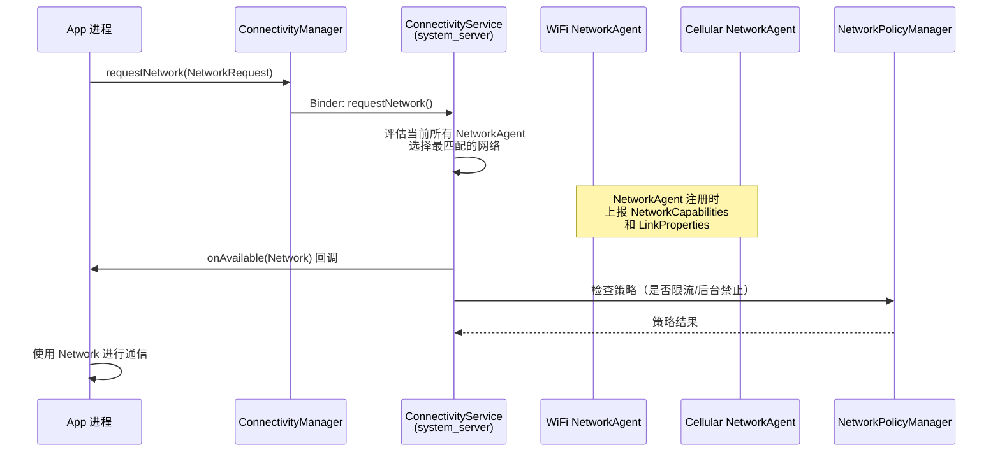
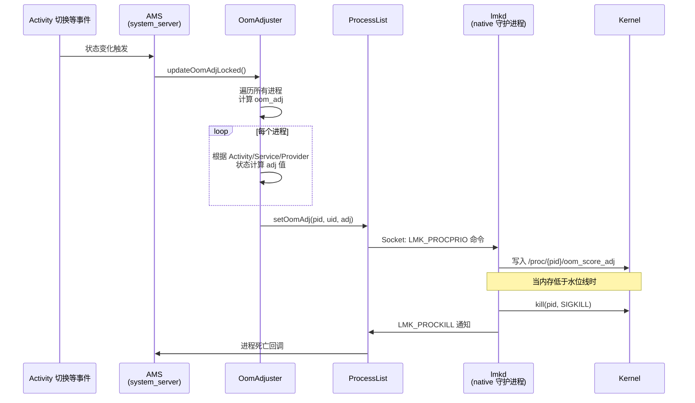
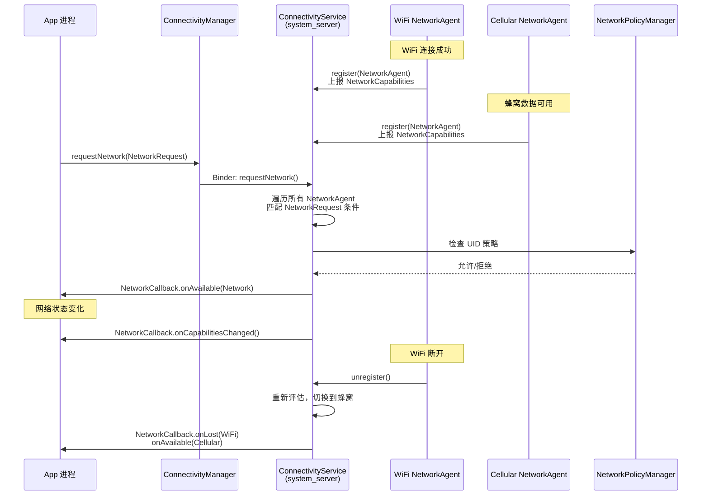

## 1. 概述

| 维度 | 网络管理 | 内存管理 |
|------|---------|---------|
| **核心问题** | 管理多种网络连接、数据流量、网络策略 | 在有限内存中管理进程优先级、决定杀谁 |
| **核心服务** | `ConnectivityService`, `NetworkPolicyManagerService` | `ActivityManagerService`, `OomAdjuster`, `lmkd` |
| **所在进程** | system_server + Connectivity 模块 | system_server + lmkd (native 守护进程) |
| **架构模式** | Manager(App) → AIDL → Service(system_server) | AMS → OomAdjuster → ProcessList → lmkd(socket) |

---

## Part A: 网络管理

### A1. 架构分层

```
┌──────────────────────────────────────────────┐
│  App 层                                       │
│  ConnectivityManager / TrafficStats           │
│  requestNetwork() / registerNetworkCallback() │
├──────────────────────────────────────────────┤
│  AIDL Binder                                  │
│  IConnectivityManager.aidl                    │
├──────────────────────────────────────────────┤
│  system_server / Connectivity Module          │
│  ConnectivityService    (网络连接调度)          │
│  NetworkPolicyManagerService (流量策略)         │
│  NetworkStatsService    (流量统计)              │
├──────────────────────────────────────────────┤
│  网络提供者                                    │
│  WifiService → NetworkAgent                   │
│  TelephonyService → NetworkAgent              │
├──────────────────────────────────────────────┤
│  Kernel                                       │
│  netfilter / eBPF / iptables / routing table  │
└──────────────────────────────────────────────┘
```

### A2. 核心类与职责

| 类 | 源码路径 | 核心职责 |
|---|---------|---------|
| `ConnectivityManager` | `packages/modules/Connectivity/framework/src/android/net/ConnectivityManager.java:126` | App 端 API，请求网络、注册回调 |
| `ConnectivityService` | `packages/modules/Connectivity/service/src/com/android/server/ConnectivityService.java:488` | 核心调度器，管理所有 NetworkAgent，评估最优网络 |
| `NetworkAgent` | `packages/modules/Connectivity/framework/src/android/net/NetworkAgent.java:95` | 网络提供者的抽象基类（WiFi/蜂窝各自实现） |
| `NetworkPolicyManagerService` | `frameworks/base/services/core/java/com/android/server/net/NetworkPolicyManagerService.java:348` | 流量策略（限速/后台限制/计费网络） |
| `NetworkStatsService` | `packages/modules/Connectivity/service-t/src/com/android/server/net/NetworkStatsService.java:230` | 按 UID 统计网络流量 |
| `TrafficStats` | `packages/modules/Connectivity/framework-t/src/android/net/TrafficStats.java:69` | App 端流量统计 API |

### A3. 网络请求核心流程



### A4. 三个关键机制

#### 机制一: NetworkRequest 匹配

App 通过 `NetworkRequest` 描述需要的网络能力（WiFi? 蜂窝? 不计费?），`ConnectivityService` 遍历所有 `NetworkAgent`，找到满足条件的最优网络。

**关键 API**（ConnectivityManager.java）：
- `requestNetwork(NetworkRequest, NetworkCallback)` — 行 4952: 主动请求满足条件的网络
- `registerNetworkCallback(NetworkRequest, NetworkCallback)` — 行 5313: 被动监听网络变化
- `getActiveNetwork()` — 行 1560: 获取当前活跃网络

#### 机制二: NetworkCallback 监听

App 注册 `NetworkCallback`，网络状态变化时收到回调（`onAvailable`/`onLost`/`onCapabilitiesChanged`），是观察者模式。

#### 机制三: 流量策略控制

`NetworkPolicyManagerService` 通过 UID 维度控制：

| 方法 | 行号 | 功能 |
|------|------|------|
| `setUidPolicy(uid, policy)` | 3284 | 设置单个应用的网络策略 |
| `setRestrictBackground(boolean)` | 3676 | 全局后台数据限制 |
| `getRestrictBackgroundStatus(uid)` | 3752 | 查询应用的后台限制状态 |
| `setNetworkPolicies(policies)` | 3512 | 批量设置网络策略（含流量上限） |

---

## Part B: 内存管理

### B1. 架构分层

```
┌──────────────────────────────────────────────┐
│  App 层                                       │
│  ActivityManager.getMemoryInfo()              │
│  onTrimMemory() / onLowMemory() 回调          │
├──────────────────────────────────────────────┤
│  system_server                                │
│  ActivityManagerService                       │
│    → OomAdjuster (计算每个进程的 oom_adj)       │
│    → ProcessList (与 lmkd 通信)                │
├──────────────────────────────────────────────┤
│  lmkd (Native 守护进程)                        │
│  接收 oom_adj → 监控内存水位 → 杀进程            │
├──────────────────────────────────────────────┤
│  Kernel                                       │
│  /proc/pid/oom_score_adj                      │
│  cgroup memory controller                     │
└──────────────────────────────────────────────┘
```

### B2. 核心类与职责

| 类 | 源码路径 | 核心职责 |
|---|---------|---------|
| `ActivityManagerService` | `AMS.java:750` | 入口，触发 `updateOomAdjLocked()` |
| `OomAdjuster` | `psc/OomAdjuster.java:185` | 核心算法：根据进程状态计算 oom_adj 值 |
| `ProcessRecordInternal` | `psc/ProcessRecordInternal.java` | 保存每个进程的 `mCurAdj`/`mSetAdj`/`mCurProcState` |
| `ProcessList` | `ProcessList.java:263` | 与 lmkd 通信，设置 oom_adj，管理内存水位线 |
| `Constants` | `psc/Constants.java:28` | 定义所有 oom_adj 常量（-1000 ~ 999） |
| `ActivityManager` | `ActivityManager.java` | App 端 API: `getMemoryInfo()`/`isLowRamDevice()` |

### B3. oom_adj 优先级体系（核心）

这是内存管理最关键的设计 — **每个进程被打上一个 -1000 到 999 的分数，分数越高越容易被杀**：

| oom_adj 值 | 常量名 | 含义 | 源码行号 |
|-----------|--------|------|---------|
| **-1000** | `NATIVE_ADJ` | Native 进程（不受管理） | Constants.java:127 |
| **-900** | `SYSTEM_ADJ` | system_server | 123 |
| **-800** | `PERSISTENT_PROC_ADJ` | 系统持久进程（如电话） | 120 |
| **-700** | `PERSISTENT_SERVICE_ADJ` | 持久服务 | 116 |
| **0** | `FOREGROUND_APP_ADJ` | 前台 App（用户正在操作） | 112 |
| **50** | `PERCEPTIBLE_RECENT_FOREGROUND_APP_ADJ` | 刚刚切走的前台 App | 108 |
| **100** | `VISIBLE_APP_ADJ` | 可见但非前台（如弹窗后面的 Activity） | 99 |
| **200** | `PERCEPTIBLE_APP_ADJ` | 可感知（如后台播放音乐） | 95 |
| **250** | `PERCEPTIBLE_LOW_APP_ADJ` | 系统绑定的重要进程 | 85 |
| **300** | `BACKUP_APP_ADJ` | 正在备份 | 81 |
| **400** | `HEAVY_WEIGHT_APP_ADJ` | 重量级应用 | 77 |
| **500** | `SERVICE_ADJ` | 服务进程 | 72 |
| **600** | `HOME_APP_ADJ` | 桌面（Launcher） | 68 |
| **700** | `PREVIOUS_APP_ADJ` | 上一个前台 App | 62 |
| **800** | `SERVICE_B_ADJ` | 老旧服务 | 54 |
| **900** | `CACHED_APP_MIN_ADJ` | 缓存进程（最不容易杀） | 41 |
| **950** | `CACHED_APP_LMK_FIRST_ADJ` | 缓存进程（优先杀） | 46 |
| **999** | `CACHED_APP_MAX_ADJ` | 缓存进程（最先杀） | 40 |

### B4. 内存回收完整调用链

| 步骤 | 类.方法() | 文件:行号 | 说明 |
|------|----------|----------|------|
| 1 | 状态变化（Activity 切换/Service 绑定等） | — | 触发点 |
| 2 | `AMS.updateOomAdjLocked()` | `AMS.java:17577` | 入口 |
| 3 | `ProcessStateController.runFullUpdate()` | — | 遍历所有进程 |
| 4 | `OomAdjuster` 计算每个进程的 oom_adj | `OomAdjuster.java:185` | 核心算法 |
| 5 | 更新 `ProcessRecordInternal.mCurAdj` | `ProcessRecordInternal.java:442` | 存储计算结果 |
| 6 | `ProcessList.setOomAdj(pid, uid, amt)` | `ProcessList.java:1709` | 构造 LMK_PROCPRIO 命令 |
| 7 | `ProcessList.writeLmkd(buf)` | `ProcessList.java:1861` | 通过 socket 发送给 lmkd |
| 8 | **lmkd** 更新进程优先级 | Native 守护进程 | 写入 `/proc/{pid}/oom_score_adj` |
| 9 | 内存不足时，lmkd 按优先级从高到低杀进程 | — | **adj 值越大越先杀** |

### B5. lmkd 通信协议

`ProcessList.java:345-368` 定义了与 lmkd 的通信命令：

```java
// ProcessList.java
static final byte LMK_TARGET     = 0;   // 设置 6 级内存水位线
static final byte LMK_PROCPRIO   = 1;   // 设置单个进程优先级
static final byte LMK_PROCREMOVE = 2;   // 移除进程追踪
static final byte LMK_PROCPURGE  = 3;   // 清除所有旧进程
static final byte LMK_GETKILLCNT = 4;   // 获取杀进程统计
static final byte LMK_SUBSCRIBE  = 5;   // 订阅事件
static final byte LMK_PROCKILL   = 6;   // 进程被杀通知（lmkd → AMS）
static final byte LMK_PROCS_PRIO = 11;  // 批量设置（每包最多 3 个进程）

// 小米定制扩展
static final byte LMK_SPTM          = 16;  // 智能进程管理
static final byte LMK_GAME_MODE     = 17;  // 游戏模式
static final byte LMK_SS_MODE       = 18;  // 省电模式
static final byte LMK_CLEAN_CACHED  = 40;  // 清理所有缓存进程
```

**setOomAdj 的实际实现**（ProcessList.java:1713）：

```java
public static void setOomAdj(int pid, int uid, int amt, boolean forLmkdOnly) {
    if (pid <= 0) return;
    if (amt == UNKNOWN_ADJ) return;

    long start = SystemClock.elapsedRealtime();
    ByteBuffer buf = ByteBuffer.allocate(4 * 5);
    buf.putInt(LMK_PROCPRIO);
    buf.putInt(pid);
    buf.putInt(uid);
    buf.putInt(amt);       // oom_adj 值
    buf.putInt(forLmkdOnly ? 1 : 0);
    writeLmkd(buf, null);  // 发送给 lmkd

    long now = SystemClock.elapsedRealtime();
    if ((now - start) > 250) {
        Slog.w("ActivityManager", "SLOW OOM ADJ: " + (now-start) + "ms for pid " + pid);
    }
}
```

**批量设置**（ProcessList.java:1750）：

```java
public static void batchSetOomAdj(ArrayList<ProcessRecordInternal> apps) {
    ByteBuffer buf = ByteBuffer.allocate(MAX_OOM_ADJ_BATCH_LENGTH);
    buf.putInt(LMK_PROCS_PRIO);
    for (int i = 0; i < totalApps; i++) {
        // 每包最多 3 个进程，超出则发送当前包并重新开始
        buf.putInt(pid);
        buf.putInt(uid);
        buf.putInt(amt);
        buf.putInt(0);  // proc type
        buf.putInt(0);  // for_lmkd_only
    }
    writeLmkd(buf, null);
}
```

### B6. 6 级内存水位线

`ProcessList.java:396-411` 定义了 lmkd 的 6 级杀进程策略：

| 级别 | oom_adj | 低端设备水位 (KB) | 高端设备水位 (KB) | 含义 |
|------|---------|-----------------|-----------------|------|
| 1 | FOREGROUND (0) | 12,288 (12MB) | 73,728 (72MB) | 极度紧张才杀前台 |
| 2 | VISIBLE (100) | 18,432 (18MB) | 92,160 (90MB) | 可见进程 |
| 3 | PERCEPTIBLE (200) | 24,576 (24MB) | 110,592 (108MB) | 可感知进程 |
| 4 | PERCEPTIBLE_LOW (250) | 36,864 (36MB) | 129,024 (126MB) | 低感知进程 |
| 5 | CACHED_MIN (900) | 43,008 (42MB) | 147,456 (144MB) | 缓存进程开始 |
| 6 | CACHED_LMK_FIRST (950) | 49,152 (48MB) | 184,320 (180MB) | 最先杀缓存进程 |

当系统可用内存低于某级水位线时，lmkd 杀掉 oom_adj >= 该级别的进程。

源码（ProcessList.java:396-411）：

```java
private final int[] mOomAdj = new int[] {
    FOREGROUND_APP_ADJ, VISIBLE_APP_ADJ, PERCEPTIBLE_APP_ADJ,
    PERCEPTIBLE_LOW_APP_ADJ, CACHED_APP_MIN_ADJ, CACHED_APP_LMK_FIRST_ADJ
};
private final int[] mOomMinFreeLow = new int[] {
    12288, 18432, 24576, 36864, 43008, 49152
};
private final int[] mOomMinFreeHigh = new int[] {
    73728, 92160, 110592, 129024, 147456, 184320
};
```

---

## Part C: 时序图

### 内存回收流程



### 网络请求流程



---

## Part D: 两大子系统对比

| 维度 | 网络管理 | 内存管理 |
|------|---------|---------|
| **核心服务** | ConnectivityService | AMS + OomAdjuster + lmkd |
| **App 端 API** | ConnectivityManager | ActivityManager |
| **Binder 接口** | IConnectivityManager.aidl | IActivityManager.aidl |
| **与底层通信** | Netd (iptables/eBPF) | lmkd (socket 协议) |
| **决策模型** | NetworkRequest 匹配 NetworkAgent | oom_adj 优先级分级 |
| **策略控制** | NetworkPolicyManagerService（按 UID 限流） | OomAdjuster（按进程状态调优先级） |
| **监控机制** | NetworkCallback (onAvailable/onLost) | onTrimMemory/onLowMemory 回调 |
| **模块化** | 独立 Connectivity 模块 (packages/modules/) | 内嵌在 AMS (frameworks/base/services/) |
| **小米定制** | — | LMK_SPTM / LMK_GAME_MODE / LMK_CLEAN_CACHED |

---

## Part E: 要点总结

### 网络管理的设计意图

- **抽象统一**: 无论 WiFi/蜂窝/以太网，统一通过 `NetworkAgent` 注册、`ConnectivityService` 调度
- **按需连接**: `requestNetwork()` 声明式 API，系统自动选择最优网络
- **策略分层**: 连接管理（ConnectivityService）与流量策略（NetworkPolicyManagerService）分离
- **模块化**: Android 12+ 将 Connectivity 拆分为独立 Mainline 模块（`packages/modules/Connectivity/`），可独立升级

### 内存管理的设计意图

- **分级杀进程**: oom_adj 从 -1000 到 999，越重要越不容易被杀
- **动态调整**: 每次状态变化（Activity 切换/Service 绑定）都重新计算所有进程的 oom_adj
- **用户空间+内核协同**: AMS 在用户空间计算优先级，lmkd 在内核侧执行杀进程，避免内核 OOM Killer 的粗暴行为
- **6 级水位线**: 根据设备 RAM 和屏幕大小动态插值，适配不同档位设备
- **批量优化**: `batchSetOomAdj()` 每包 3 个进程，减少 socket 通信次数
- **小米定制**: 增加了 `LMK_SPTM`(智能进程管理)、`LMK_GAME_MODE`(游戏模式)、`LMK_CLEAN_CACHED`(清理缓存进程) 等扩展命令

---

## Part F: 推荐阅读

- **gityuan.com**: [Android 进程管理](https://gityuan.com/tags/) — oom_adj 与 lmkd 系列
- **源码关键位置**:
  - `psc/Constants.java:28-127` — 完整的 oom_adj 常量表（必读）
  - `ProcessList.java:396-411` — 6 级内存水位线定义
  - `ProcessList.java:1709-1734` — setOomAdj 与 lmkd 通信的实现
  - `ProcessList.java:1750-1780` — batchSetOomAdj 批量优化
  - `ProcessList.java:345-368` — lmkd 通信协议定义（含小米扩展）
  - `AMS.java:17577` — updateOomAdjLocked 入口
  - `ConnectivityService.java:488` — 网络管理核心服务
  - `ConnectivityManager.java:4952,5313` — requestNetwork/registerNetworkCallback
  - `NetworkPolicyManagerService.java:348` — 流量策略控制