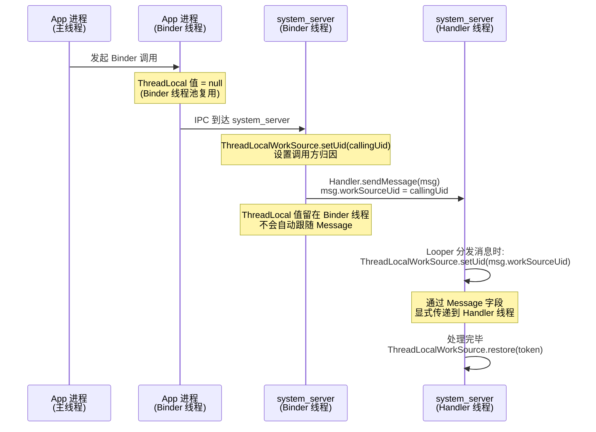

## 1. 概述

| 项目 | 说明 |
|------|------|
| **功能描述** | ThreadLocal 提供线程局部变量，每个线程持有独立副本，无需加锁 |
| **涉及范围** | Framework 中发现 **28+ 处** ThreadLocal 使用 |
| **核心价值** | 用空间换时间——避免锁竞争，实现线程隔离 |

---

## 2. Framework 中 6 大使用模式

### 2.1 模式一：线程绑定单例（最常见）

每个线程绑定一个独立实例，线程内全局共享。

**典型: Looper** — `Looper.java:96`

```java
static final ThreadLocal<Looper> sThreadLocal = new ThreadLocal<Looper>();

// 一个线程最多一个 Looper
private static void prepare(boolean quitAllowed) {
    if (sThreadLocal.get() != null) {
        throw new RuntimeException("Only one Looper may be created per thread");
    }
    sThreadLocal.set(new Looper(quitAllowed));  // 行 158
}

public static @Nullable Looper myLooper() {
    return sThreadLocal.get();                   // 行 510
}
```

**典型: Choreographer** — `Choreographer.java:181`

```java
private static final ThreadLocal<Choreographer> sThreadInstance =
        new ThreadLocal<Choreographer>() {
    @Override
    protected Choreographer initialValue() {
        Looper looper = Looper.myLooper();
        if (looper == null) {
            throw new IllegalStateException("The current thread must have a looper!");
        }
        Choreographer choreographer = new Choreographer(looper, VSYNC_SOURCE_APP);
        if (looper == Looper.getMainLooper()) {
            mMainInstance = choreographer;
        }
        return choreographer;
    }
};
```

**同类**: `FocusFinder`、`AnimationHandler`、`AnimationUtils.AnimationState`

**适用场景**: 对象与线程生命周期一致，且线程内需要全局访问。

---

### 2.2 模式二：对象池复用（避免频繁创建）

线程内复用临时对象，避免高频 GC。

**典型: View.sThreadLocal** — `View.java:2839`

```java
static final ThreadLocal<Rect> sThreadLocal = ThreadLocal.withInitial(Rect::new);
```

每个线程复用同一个 Rect 对象，用于 `fitSystemWindows()`、`setBackground()` 等高频方法中的临时计算。

**同类**: `Location.sBearingDistanceCache`、`PerfettoTrackEventExtra`

**适用场景**: 高频调用中需要临时对象，但每次 new 太浪费。

---

### 2.3 模式三：Token 保存/恢复（Binder 调用归因）

set 时返回 token，用于后续恢复。

**典型: ThreadLocalWorkSource** — `ThreadLocalWorkSource.java:43`

```java
private static final ThreadLocal<int[]> sWorkSourceUid =
        ThreadLocal.withInitial(() -> new int[] {UID_NONE});

public static long setUid(int uid) {
    final long token = getToken();          // 保存旧值
    sWorkSourceUid.get()[0] = uid;
    return token;                           // 返回 token
}

public static void restore(long token) {
    sWorkSourceUid.get()[0] = parseUidFromToken(token); // 恢复旧值
}
```

**使用场景**: system_server 中追踪"这个工作是替谁干的"，Binder 调用和 Handler 消息分发时自动传播。

**同类**: `Binder.clearCallingIdentity()`/`restoreCallingIdentity()` 也是同样的 token 模式。

---

### 2.4 模式四：作用域上下文（显式清理）

任务结束后显式 remove()，防止泄漏。

**典型: Choreographer.releaseInstance()** — `Choreographer.java:564`

```java
public static void releaseInstance() {
    Choreographer old = sThreadInstance.get();
    sThreadInstance.remove();   // 从 ThreadLocal 移除
    old.dispose();              // 释放 native 资源
}
```

**典型: AppOpsManager** — `AppOpsManager.java:11410`

```java
public static void finishNotedAppOpsCollection() {
    sBinderThreadCallingUid.remove();              // 行 11411
    sAppOpsNotedInThisBinderTransaction.remove();  // 行 11412
}
```

**适用场景**: 线程任务结束时需要确保清理，防止内存泄漏。

---

### 2.5 模式五：每线程数据库会话

**典型: SQLiteDatabase** — `SQLiteDatabase.java:115`

```java
// Each thread has its own database session.
private final ThreadLocal<SQLiteSession> mThreadSession = ThreadLocal
        .withInitial(this::createSession);
```

每个线程拥有独立的 SQLiteSession，避免数据库连接的锁竞争。

**注意**: 这是 **实例级** ThreadLocal（非 static），随 SQLiteDatabase 对象生命周期。

---

### 2.6 模式六：线程策略/违规追踪

**典型: StrictMode** — `StrictMode.java` 中定义了 **6 个** ThreadLocal：

```java
// 违规监听器
private static final ThreadLocal<OnThreadViolationListener> sThreadViolationListener;  // 行 435
private static final ThreadLocal<Executor> sThreadViolationExecutor;                    // 行 437

// 违规收集
private static final ThreadLocal<ArrayList<ViolationInfo>> gatheredViolations;          // 行 1365
private static final ThreadLocal<ArrayList<ViolationInfo>> violationsBeingTimed;        // 行 1732

// 线程级 Handler 和策略
private static final ThreadLocal<Handler> THREAD_HANDLER;                               // 行 1741
private static final ThreadLocal<AndroidBlockGuardPolicy> THREAD_ANDROID_POLICY;        // 行 1749
```

每个线程独立追踪自己的违规信息和策略，互不干扰。

---

## 3. 汇总对照表

| 模式 | 代表类 | 初始化方式 | 清理方式 | 生命周期 |
|------|--------|----------|---------|---------|
| 线程绑定单例 | `Looper`, `Choreographer` | `set()` / `initialValue()` | 线程结束或 `remove()` | = 线程 |
| 对象池复用 | `View`(Rect), `Location` | `withInitial()` | 不清理（复用） | = 线程 |
| Token 保存/恢复 | `ThreadLocalWorkSource`, `Binder` | `withInitial()` | `restore(token)` | 方法调用级 |
| 作用域上下文 | `Choreographer`, `AppOpsManager` | `set()` | `remove()` + `dispose()` | 显式管理 |
| 每线程会话 | `SQLiteDatabase` | `withInitial()` | 随 DB 对象关闭 | = DB 实例 |
| 策略/违规追踪 | `StrictMode` | `initialValue()` | 不清理 | = 线程 |

---

## 4. 可能出现的问题及解决方案

### 4.1 问题一：内存泄漏（最常见、最严重）

**原因**: ThreadLocal 的值以 `Entry(WeakReference<ThreadLocal>, value)` 存储在线程的 `ThreadLocalMap` 中。当 ThreadLocal 引用被回收后，key 变成 null，但 **value 不会自动回收**，直到线程结束或下次 get/set 触发清理。

**高危场景**: **线程池中的线程不会销毁**（如 Binder 线程池、AsyncTask 线程池），value 永远不会被回收。

```java
// 危险示例：线程池场景
executorService.execute(() -> {
    threadLocal.set(new LargeObject()); // 存入大对象
    doWork();
    // 忘记 remove() → 线程回到池中 → LargeObject 永远不被回收
});
```

**解决方案**: **用完必须 remove()**，Framework 中的标准写法：

```java
// 参考 AppOpsManager.java:11410 的做法
try {
    threadLocal.set(value);
    doWork();
} finally {
    threadLocal.remove();  // 必须在 finally 中清理
}
```

---

### 4.2 问题二：线程池中数据残留（脏数据）

**原因**: 线程池中的线程被复用，上一个任务设置的 ThreadLocal 值会被下一个任务读到。

```java
// 危险示例
executorService.execute(() -> {
    threadLocal.set("TaskA_data");
    // 处理完毕，忘记 remove
});
executorService.execute(() -> {
    String data = threadLocal.get();
    // data 可能是 "TaskA_data"！脏数据！
});
```

**解决方案**: 参考 `ThreadLocalWorkSource` 的 **token 模式**：

```java
// 安全写法：保存 → 设置 → 恢复
long token = ThreadLocalWorkSource.setUid(callingUid);  // 保存旧值，设置新值
try {
    doWork();
} finally {
    ThreadLocalWorkSource.restore(token);                 // 恢复旧值
}
```

---

### 4.3 问题三：与 Binder 线程交互的陷阱

**原因**: Binder 线程来自线程池，AMS 在 Binder 线程设置的 ThreadLocal 值不会传递到目标进程的主线程。

**解决方案**: 参考 Framework 的做法 — 在 Binder 线程中读取 ThreadLocal，通过 Handler 消息将值显式传递到主线程：

```java
// Looper.java:316 中自动传播 workSourceUid
long origWorkSource = ThreadLocalWorkSource.setUid(msg.workSourceUid);
try {
    msg.target.dispatchMessage(msg);
} finally {
    ThreadLocalWorkSource.restore(origWorkSource);
}
```

**关键原则**: ThreadLocal 的值 **不会** 跨线程自动传递，需要手动通过 Message/Bundle/参数 等方式显式传递。

---

### 4.4 问题四：实例级 ThreadLocal 导致外部类泄漏

**原因**: **非 static** 的 ThreadLocal 字段持有外部类引用（如 Activity），当线程存活时间超过 Activity 生命周期，Activity 无法被回收。

```java
// 危险示例
public class MyActivity extends Activity {
    // 非 static！隐式持有 MyActivity.this 引用
    private ThreadLocal<MyData> mThreadLocal = new ThreadLocal<>();
}
```

**解决方案**: ThreadLocal 声明为 **static**，或在 `onDestroy()` 中 remove：

```java
// 安全写法 1: static（推荐）
private static final ThreadLocal<MyData> sThreadLocal = new ThreadLocal<>();

// 安全写法 2: 生命周期管理
@Override
protected void onDestroy() {
    super.onDestroy();
    mThreadLocal.remove();
}
```

---

### 4.5 问题五：initialValue() 中持有外部引用

**原因**: `initialValue()` 或 `withInitial()` 的 lambda 可能捕获外部对象引用。

```java
// 危险示例：lambda 捕获了 this
public class MyService {
    private final ThreadLocal<Session> mSession = ThreadLocal
            .withInitial(this::createSession);  // 持有 MyService 引用
}
```

**解决方案**: 如果是 static ThreadLocal，确保 initialValue 不引用实例字段。如果是实例级的（像 `SQLiteDatabase` 那样），需要确保 ThreadLocal 和宿主对象生命周期一致。

---

## 5. 问题速查决策表

| 问题 | 触发条件 | 后果 | 解决方案 |
|------|---------|------|---------|
| **内存泄漏** | 线程池 + 忘记 remove() | value 永驻内存 | **finally 中 remove()** |
| **脏数据** | 线程池复用 + 未清理 | 读到上一任务的值 | **token 保存/恢复模式** |
| **跨线程失效** | 期望值跨线程传递 | 目标线程读到 null | **通过 Message 显式传递** |
| **Activity 泄漏** | 非 static ThreadLocal | Activity 无法回收 | **声明为 static final** |
| **initialValue 泄漏** | lambda 捕获外部引用 | 外部对象无法回收 | **避免引用实例字段** |

---

## 6. 背屏项目使用建议

针对小米背屏的 **内存预算 < 52MB** 和 **跨进程 Binder 通信** 场景：

| 建议 | 原因 | 参考源码 |
|------|------|---------|
| 优先使用 `static final` 声明 | 避免实例级 ThreadLocal 导致外部对象泄漏 | `Looper.java:96` |
| **必须在 finally 中 remove()** | 背屏进程内存有限，泄漏会导致 OOM | `AppOpsManager.java:11410` |
| Binder 回调中不要依赖 ThreadLocal 传值 | Binder 线程池中线程被复用，值不可靠 | `ThreadLocalWorkSource.java:67` |
| 参考 token 模式做保存/恢复 | 适合 AIDL 调用中的上下文传递 | `ThreadLocalWorkSource.java:67-78` |
| 使用 `withInitial()` 代替 `initialValue()` 重写 | 更简洁，Java 8+ 标准写法 | `View.java:2839` |
| 对象池场景使用 ThreadLocal 替代 synchronized | 无锁，性能更高 | `View.java:2839`, `FocusFinder.java:40` |

---

## 7. 时序图：ThreadLocal 在 Binder 调用中的传播



---

## 8. 推荐阅读

- **gityuan.com**: [理解 Java 中的 ThreadLocal](https://gityuan.com/tags/) — ThreadLocal 原理
- **源码关键位置**:
  - `Looper.java:96,158` — 线程绑定单例的标准模式
  - `Choreographer.java:181,564` — 带 `remove()` + `dispose()` 的完整清理模式
  - `ThreadLocalWorkSource.java:43-78` — token 保存/恢复模式（完整示范）
  - `AppOpsManager.java:11410-11412` — Binder 线程中 `remove()` 清理模式
  - `View.java:2839` — 对象池复用模式
  - `SQLiteDatabase.java:115` — 实例级每线程会话模式
  - `StrictMode.java:435-1755` — 多 ThreadLocal 协同的策略追踪模式