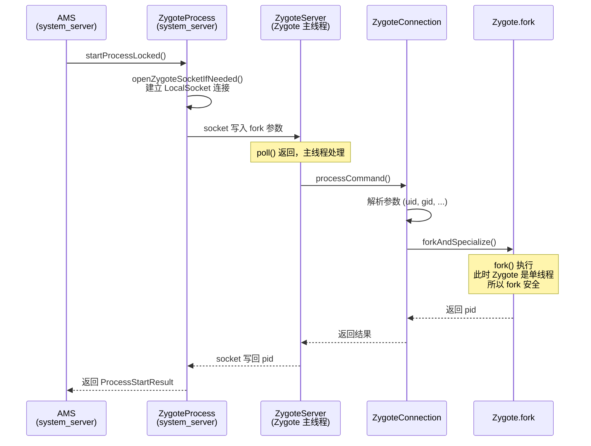
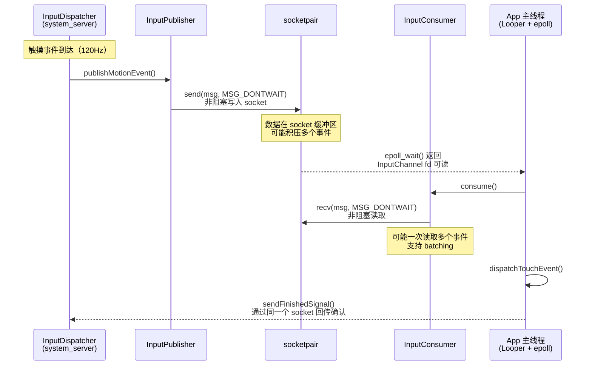

## 1. 概述

| 场景 | 实际使用的 IPC | 不用 Binder 的核心原因 |
|------|-------------|---------------------|
| SystemServer → Zygote 创建进程 | **LocalSocket (Unix Domain Socket)** | fork 安全性：Binder 多线程与 fork 不兼容 |
| InputDispatcher → App 传递触摸事件 | **socketpair (SOCK_SEQPACKET)** | 性能：避免 Binder 上下文切换和线程唤醒开销 |

---

## Part A: 为什么 Zygote 用 Socket 而不用 Binder？

### A1. 根本原因：Binder 是多线程的，fork 要求单线程

回顾 Zygote 的启动：

```java
// ZygoteInit.java:985
ZygoteHooks.startZygoteNoThreadCreation();  // 禁止创建线程！
```

Zygote 在等待 fork 请求时**必须保持单线程**。原因是 Linux `fork()` 的致命限制：

> **fork() 只复制调用线程，不复制其他线程。** 如果进程是多线程的，fork 后子进程中其他线程持有的锁将永远无法释放 → **死锁**。

### A2. Binder 天然是多线程的

`ProcessState.cpp:53`：

```cpp
#define DEFAULT_MAX_BINDER_THREADS 15
```

每个使用 Binder 的进程都有一个 **Binder 线程池（默认最多 15 个线程）**。如果 Zygote 使用 Binder：

```
Zygote 进程
  ├── 主线程 (等待 fork 请求)
  ├── Binder 线程 1 ← 这些线程在 fork 时会"消失"
  ├── Binder 线程 2 ← 它们持有的锁会永远锁死
  └── Binder 线程 N ← 子进程会死锁
```

### A3. Socket 是单线程安全的

**服务端** — `ZygoteServer.java:452` — `runSelectLoop()`：

```java
// Zygote 主线程中的单线程事件循环
while (true) {
    Os.poll(pollFDs, pollTimeoutMs);  // 单线程 poll 等待
    // ...
    connection.processCommand(this, multipleForksOK);  // 单线程处理
}
```

**客户端** — `ZygoteProcess.java:527` — SystemServer 发送 fork 请求：

```java
private Process.ProcessStartResult attemptZygoteSendArgsAndGetResult(
        ZygoteState zygoteState, String msgStr) {
    final BufferedWriter zygoteWriter = zygoteState.mZygoteOutputWriter;
    final DataInputStream zygoteInputStream = zygoteState.mZygoteInputStream;

    zygoteWriter.write(msgStr);       // 通过 socket 发送参数
    zygoteWriter.flush();

    result.pid = zygoteInputStream.readInt();       // 读取 fork 结果
    result.usingWrapper = zygoteInputStream.readBoolean();
    return result;
}
```

**整个流程都在单线程中完成**：写参数 → flush → fork → 读结果。没有额外线程，没有锁，fork 安全。

### A4. "先有鸡还是先有蛋"问题

进程启动顺序：

```
init → Zygote → fork 出 SystemServer → SystemServer 启动 ServiceManager → Binder 体系就绪
       ↑                                                                        ↑
       │                                                                        │
       └── Zygote 已在运行，等待 fork 请求                    Binder 此时才可用 ──┘
```

Zygote 比 ServiceManager 更早启动。当 Zygote 开始接收 fork 请求时，Binder 的 ServiceManager 都还没有启动。**Zygote 没法注册到一个尚不存在的 ServiceManager 中**。

### A5. 时序图



### A6. 总结：为什么 Zygote 不用 Binder

| 原因 | 说明 |
|------|------|
| **fork 安全** | `fork()` 只复制调用线程，Binder 线程池中的其他线程会"消失"，导致子进程死锁 |
| **时序要求** | fork 必须在单线程环境下执行，Socket 的 poll 模型天然单线程 |
| **启动顺序** | Zygote 比 ServiceManager 更早启动，Binder 体系此时尚未就绪 |
| **简单可靠** | 创建进程是低频操作，Socket 的 2 次拷贝开销可以接受 |

---

## Part B: 为什么 Input 事件用 Socket 而不用 Binder？

### B1. 根本原因：高频、低延迟、异步 — Binder 的模型不匹配

触摸事件的特点：
- **频率极高**：120Hz 屏幕 = 每秒 120 个事件，手指滑动时更多
- **延迟敏感**：多 1ms 用户就能感知卡顿
- **单向传输**：InputDispatcher → App，不需要等待返回值

### B2. 源码证据 — socketpair 创建

`InputTransport.cpp:400`：

```cpp
status_t InputChannel::openInputChannelPair(const std::string& name,
        std::unique_ptr<InputChannel>& outServerChannel,
        std::unique_ptr<InputChannel>& outClientChannel) {
    int sockets[2];
    if (socketpair(AF_UNIX, SOCK_SEQPACKET, 0, sockets)) {  // 创建 socket 对
        return -errno;
    }

    int bufferSize = SOCKET_BUFFER_SIZE;  // 32KB (行 135)
    setsockopt(sockets[0], SOL_SOCKET, SO_SNDBUF, &bufferSize, sizeof(bufferSize));
    setsockopt(sockets[0], SOL_SOCKET, SO_RCVBUF, &bufferSize, sizeof(bufferSize));
    setsockopt(sockets[1], SOL_SOCKET, SO_SNDBUF, &bufferSize, sizeof(bufferSize));
    setsockopt(sockets[1], SOL_SOCKET, SO_RCVBUF, &bufferSize, sizeof(bufferSize));

    // server 端留在 InputDispatcher（system_server）
    outServerChannel = InputChannel::create(name, std::move(serverFd), token);
    // client 端传给 App 进程
    outClientChannel = InputChannel::create(name, std::move(clientFd), token);
    return OK;
}
```

**关键选择**: `SOCK_SEQPACKET` — 保证消息边界的数据报式 socket，每个事件就是一个完整的消息包。

缓冲区注释（`InputTransport.cpp:131-135`）：

```cpp
// Socket buffer size.  The default is typically about 128KB, which is much larger than
// we really need.  So we make it smaller.  It just needs to be big enough to hold
// a few dozen large multi-finger motion events in the case where an application gets
// behind processing touches.
constexpr size_t SOCKET_BUFFER_SIZE = 32 * 1024;
```

### B3. 源码证据 — 事件发送（非阻塞）

`InputTransport.cpp:429`：

```cpp
status_t InputChannel::sendMessage(const InputMessage* msg) {
    const size_t msgLength = msg->size();
    InputMessage cleanMsg;
    msg->getSanitizedCopy(&cleanMsg);
    ssize_t nWrite;
    do {
        nWrite = ::send(getFd(), &cleanMsg, msgLength, MSG_DONTWAIT | MSG_NOSIGNAL);
        //                                              ^^^^^^^^^^^^
        //                                              非阻塞！发完就走，不等对方接收
    } while (nWrite == -1 && errno == EINTR);
    return OK;
}
```

### B4. 源码证据 — 事件接收（非阻塞）

`InputTransport.cpp:477`：

```cpp
android::base::Result<InputMessage> InputChannel::receiveMessage() {
    ssize_t nRead;
    InputMessage msg;
    do {
        nRead = ::recv(getFd(), &msg, sizeof(InputMessage), MSG_DONTWAIT);
        //                                                  ^^^^^^^^^^^^
        //                                                  非阻塞！没数据就立即返回
    } while (nRead == -1 && errno == EINTR);
    return msg;
}
```

### B5. 为什么 Binder 不适合这个场景？

| 维度 | Binder | socketpair |
|------|--------|-----------|
| **调用模型** | 同步 RPC（调用方阻塞等回复） | 异步 send/recv（非阻塞） |
| **线程切换** | 唤醒 Binder 线程池中的线程 | 直接写入 socket 缓冲区，epoll 通知 |
| **上下文切换** | 2 次（进内核 + 唤醒目标线程） | 1 次（写入缓冲区，目标 epoll 触发） |
| **延迟** | 需要 Parcel 序列化 + 线程调度 | 直接内存拷贝，无序列化开销 |
| **数据大小** | 有事务缓冲区限制（~1MB） | 32KB 缓冲区，按需读取 |
| **batching** | 不支持 | 天然支持（多个事件积压在缓冲区，一次取出） |

**具体问题**：

1. **Binder 是同步 RPC**：`transact()` 默认阻塞等回复。输入事件是**单向推送**，不需要等回复。虽然 Binder 有 `FLAG_ONEWAY`，但每个 oneway 调用仍需唤醒目标线程池，开销大。

2. **Binder 线程调度开销**：每次 Binder 调用需要内核唤醒目标进程的 Binder 线程 → 上下文切换。120Hz 下每秒 120+ 次上下文切换，严重影响延迟。

3. **Socket + epoll 更高效**：InputChannel 的 fd 被加入 App 主线程的 Looper（epoll），事件到达时直接在主线程处理，**零线程切换**。

4. **事件批处理（batching）**：手指快速滑动时，多个 MotionEvent 会积压在 socket 缓冲区。App 可以一次性读出所有事件并合并处理，减少绘制次数。Binder 每个调用都是独立的，无法做到这一点。

### B6. 时序图



### B7. 总结：为什么 Input 事件不用 Binder

| 原因 | 说明 |
|------|------|
| **高频率** | 120Hz+ 触摸事件，Binder 的线程调度开销无法承受 |
| **低延迟** | socket send/recv 是直接内存操作 + epoll 通知，比 Binder 上下文切换快 |
| **单向异步** | 事件是推送式的，不需要 Binder 的 RPC 请求-响应模型 |
| **事件批处理** | socket 缓冲区天然支持积压和批量读取，Binder 不支持 |
| **零线程切换** | socket fd 注册在 App 的 Looper epoll 中，事件直接在主线程处理 |

---

## Part C: 全局对比 — 三种场景下的最优 IPC 选择

| 维度 | Binder（系统服务调用） | Socket（Zygote fork） | socketpair（Input 事件） |
|------|---------------------|---------------------|------------------------|
| **频率** | 低~中 | 极低（创建进程） | 极高（120Hz+） |
| **方向** | 双向 RPC | 单次请求-响应 | 单向推送 + 确认 |
| **延迟要求** | 一般 | 不敏感 | **极敏感** |
| **线程模型** | 多线程池 | **必须单线程**（fork 安全） | 主线程 epoll |
| **安全需求** | 高（需 UID 验证） | 低（仅 SystemServer 连接） | 低（fd 由 WMS 分配） |
| **数据大小** | 中等 | 小（fork 参数） | 小（单个事件 ~100B） |
| **选择原因** | 安全 + 对象引用 + AIDL | **fork 安全，无 Binder 线程** | **非阻塞、零线程切换、批处理** |

---

## Part D: 要点总结

**Binder 不是银弹。** Android 在三个层面做了精准的 IPC 选择：

### 1. 系统服务调用 → Binder

需要安全验证（UID）、对象引用传递、C/S 架构。1 次拷贝足够高效。

### 2. Zygote fork → Socket

`fork()` 要求单线程环境，Binder 线程池与 fork 不兼容。Socket 的 poll 模型保证单线程安全。且 Zygote 比 ServiceManager 更早启动，Binder 机制此时尚未就绪。

### 3. Input 事件 → socketpair

120Hz 高频、低延迟、单向推送。`send(MSG_DONTWAIT)` + epoll 的非阻塞模型比 Binder 的线程唤醒模型延迟更低，且天然支持事件批处理。

**一句话**: 选择 IPC 机制的本质是**在安全性、性能、线程模型之间做权衡**，没有万能方案。

---

## Part E: 推荐阅读

- **gityuan.com**: [Binder 系列](https://gityuan.com/tags/#binder) / [Input 系列](https://gityuan.com/tags/#input) / [Zygote 系列](https://gityuan.com/tags/#zygote)
- **源码关键位置**:
  - `ZygoteProcess.java:527-554` — socket 发送 fork 参数并读取结果
  - `ZygoteServer.java:452` — 单线程 `poll()` 事件循环
  - `ProcessState.cpp:53` — `DEFAULT_MAX_BINDER_THREADS = 15`（Binder 多线程证据）
  - `InputTransport.cpp:404` — `socketpair(AF_UNIX, SOCK_SEQPACKET, 0, sockets)` 创建 Input 通道
  - `InputTransport.cpp:135` — `SOCKET_BUFFER_SIZE = 32 * 1024`（32KB 缓冲区）
  - `InputTransport.cpp:439` — `send(MSG_DONTWAIT)` 非阻塞发送事件
  - `InputTransport.cpp:481` — `recv(MSG_DONTWAIT)` 非阻塞接收事件