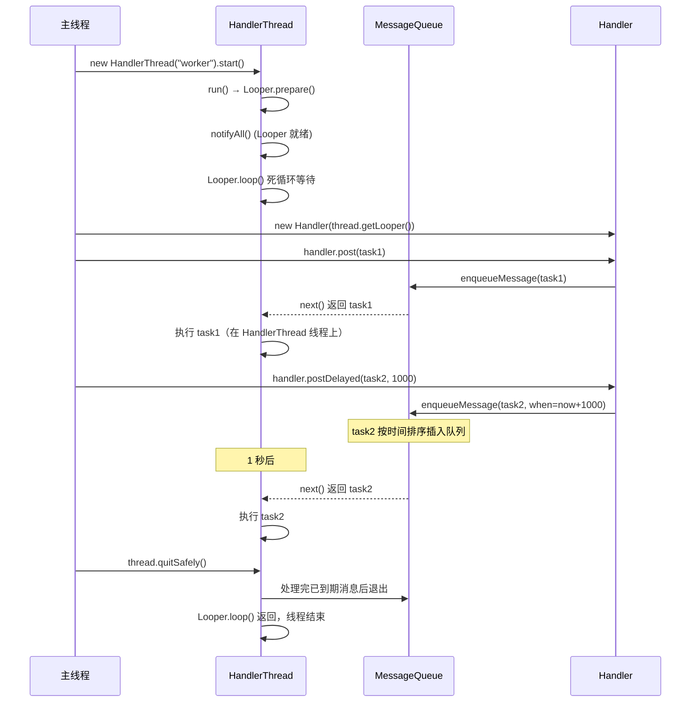

## 1. 概述

| 项目 | 说明 |
|------|------|
| **本质** | 一个**自带 Looper 的线程** — 封装了 `Looper.prepare()` + `Looper.loop()` |
| **核心价值** | 让子线程拥有消息循环，可以串行处理异步任务 |
| **源码位置** | `HandlerThread.java:85` — 仅 269 行，非常精简 |
| **继承关系** | `HandlerThread extends Thread` |

---

## 2. 源码解析：为什么说它是"自带 Looper 的线程"

### 2.1 run() — 核心方法

`HandlerThread.run()` 的全部逻辑（`HandlerThread.java:130`）：

```java
@Override
public void run() {
    mTid = Process.myTid();
    Looper.prepare();                  // ① 创建该线程的 Looper 和 MessageQueue
    synchronized (this) {
        mLooper = Looper.myLooper();
        notifyAll();                   // ② 唤醒在 getLooper() 中等待的线程
    }
    Process.setThreadPriority(mPriority);
    onLooperPrepared();                // ③ 回调：Looper 就绪，可以做初始化
    Looper.loop();                     // ④ 进入死循环，处理消息
    mTid = -1;
}
```

对比之前学过的 `ActivityThread.main()`：

| | ActivityThread.main() | HandlerThread.run() |
|--|----------------------|---------------------|
| 本质 | 主线程的消息循环 | 子线程的消息循环 |
| Looper 类型 | `prepareMainLooper()`（不可退出） | `prepare()`（可退出） |
| 死循环 | `Looper.loop()` | `Looper.loop()` |
| 线程 | 主线程 | 自定义子线程 |

**一句话**: HandlerThread = `new Thread()` + `Looper.prepare()` + `Looper.loop()` 的封装。

### 2.2 字段定义

`HandlerThread.java:85-90`：

```java
public class HandlerThread extends Thread {
    int mPriority;                              // 线程优先级
    int mTid = -1;                              // 线程 ID
    Looper mLooper;                             // 该线程的 Looper
    private volatile @Nullable Handler mHandler; // 共享 Handler
    private volatile @Nullable Executor mExecutor; // 共享 Executor
}
```

### 2.3 构造方法

```java
// 默认优先级
public HandlerThread(String name) {
    super(name);
    mPriority = Process.THREAD_PRIORITY_DEFAULT;  // 行 92-96
}

// 自定义优先级
public HandlerThread(String name, int priority) {
    super(name);
    mPriority = priority;                          // 行 104-108
}
```

---

## 3. 关键方法

### 3.1 getLooper() — 线程安全的等待机制

```java
// HandlerThread.java:149
public Looper getLooper() {
    if (!isAlive()) return null;

    boolean wasInterrupted = false;

    synchronized (this) {
        while (isAlive() && mLooper == null) {
            wait();           // 阻塞等待 run() 中 notifyAll()
        }
    }

    if (wasInterrupted) {
        Thread.currentThread().interrupt();
    }

    return mLooper;
}
```

**设计精妙之处**: 调用 `thread.start()` 后立即调用 `thread.getLooper()` 不会出问题，因为 `getLooper()` 会阻塞等到 `run()` 中 Looper 创建完成并 `notifyAll()`。

### 3.2 getThreadHandler() / getThreadExecutor()

```java
// 行 183: 获取与该线程关联的共享 Handler
public Handler getThreadHandler() {
    if (mHandler == null) {
        mHandler = new Handler(getLooper());
    }
    return mHandler;
}

// 行 195: 获取与该线程关联的共享 Executor
public Executor getThreadExecutor() {
    if (mExecutor == null) {
        mExecutor = new HandlerExecutor(getThreadHandler());
    }
    return mExecutor;
}
```

### 3.3 quit() vs quitSafely()

| 方法 | 行为 | 源码行号 |
|------|------|---------|
| `quit()` | 立即终止，**丢弃队列中所有未处理的消息** | 224 |
| `quitSafely()` | 处理完**已到期**的消息后终止，丢弃延迟消息 | 254 |

```java
// 行 224: 立即退出
public boolean quit() {
    Looper looper = getLooper();
    if (looper != null) {
        looper.quit();
        return true;
    }
    return false;
}

// 行 254: 安全退出（推荐）
public boolean quitSafely() {
    Looper looper = getLooper();
    if (looper != null) {
        looper.quitSafely();
        return true;
    }
    return false;
}
```

### 3.4 onLooperPrepared() — 初始化回调

```java
// 行 126: 子类可重写，在 Looper 开始循环前执行初始化
protected void onLooperPrepared() {
}
```

---

## 4. Framework 中的使用——ServiceThread 体系

Framework 不直接用 `HandlerThread`，而是通过 `ServiceThread` 子类构建了一套**专用线程体系**。

### 4.1 继承层次

```
HandlerThread (android.os)
  └── ServiceThread (com.android.server)  ← 增加 StrictMode / IO 控制
        ├── DisplayThread      ← WMS/DMS/InputManager 共享
        ├── AnimationThread    ← 窗口动画
        ├── SurfaceAnimationThread ← Surface 动画
        ├── UiThread           ← 系统 UI 操作
        ├── FgThread           ← 前台服务
        ├── IoThread           ← 网络 I/O
        ├── PermissionThread   ← 权限检查
        └── BackgroundThread   ← 后台杂务（直接继承 HandlerThread）
```

### 4.2 ServiceThread — 所有系统线程的基类

`ServiceThread.java:30`：

```java
public class ServiceThread extends HandlerThread {
    private final boolean mAllowIo;

    public ServiceThread(String name, int priority, boolean allowIo) {
        super(name, priority);
        mAllowIo = allowIo;
    }

    @Override
    public void run() {
        if (!mAllowIo) {
            StrictMode.initThreadDefaults(null);  // 禁止 IO 操作时启用 StrictMode 检测
        }
        super.run();
    }
}
```

**关键设计**: `allowIo` 参数控制是否允许在该线程做磁盘/网络 IO。对于显示相关的线程（DisplayThread、AnimationThread），`allowIo=false`，防止 IO 操作阻塞渲染导致掉帧。

### 4.3 DisplayThread — 单例模式典范

`DisplayThread.java:31`：

```java
public final class DisplayThread extends ServiceThread {
    private static DisplayThread sInstance;
    private static Handler sHandler;

    private DisplayThread() {
        // 优先级仅次于 AnimationThread
        super("android.display", Process.THREAD_PRIORITY_DISPLAY + 1, false);
    }

    private static void ensureThreadLocked() {
        if (sInstance == null) {
            sInstance = new DisplayThread();
            sInstance.start();
            sInstance.getLooper().setTraceTag(Trace.TRACE_TAG_SYSTEM_SERVER);
            sHandler = makeSharedHandler(sInstance.getLooper());
        }
    }

    public static Handler getHandler() {
        synchronized (DisplayThread.class) {
            ensureThreadLocked();
            return sHandler;
        }
    }
}
```

**WMS、DMS、InputManager 共享同一个 DisplayThread**，避免为每个服务都创建独立线程。

### 4.4 各系统线程的优先级与职责

| 线程 | 线程名 | 优先级 | allowIo | 职责 |
|------|--------|--------|---------|------|
| **AnimationThread** | `android.anim` | DISPLAY (−4) | false | 窗口动画，最高优先级 |
| **SurfaceAnimationThread** | `android.anim.lf` | DISPLAY (−4) | false | Surface 动画 |
| **DisplayThread** | `android.display` | DISPLAY+1 (−3) | false | WMS/DMS/Input 共享 |
| **UiThread** | `android.ui` | FOREGROUND (−2) | false | 系统 UI 操作 |
| **FgThread** | `android.fg` | DEFAULT (0) | true | 前台服务操作 |
| **IoThread** | `android.io` | DEFAULT (0) | true | 网络 I/O |
| **PermissionThread** | `android.perm` | DEFAULT (0) | true | 权限检查 |
| **BackgroundThread** | `android.bg` | BACKGROUND (10) | — | 后台杂务 |

---

## 5. Framework 中各服务使用 HandlerThread 的实际案例

| 服务 | 线程名 | 优先级 | allowIo | 用途 | 源码行号 |
|------|--------|--------|---------|------|---------|
| **AMS** | `"ActivityManager"` | FOREGROUND | false | 主处理线程 | AMS.java:3006 |
| **AMS** | `"ActivityManager:procStart"` | FOREGROUND | false | 进程启动专用 | AMS.java:3012 |
| **PMS** | `"PackageManagerBg"` | BACKGROUND | true | 包管理后台 | PMS.java:1800 |
| **PowerMS** | `"PowerManagerService"` | DISPLAY | false | 电源管理 | PowerMS.java:1444 |
| **NotificationMS** | `"ranker"` | BACKGROUND | — | 通知排序 | NMS.java:771 |
| **NotificationMS** | `"NMS Broadcasts"` | DEFAULT | — | 通知广播 | NMS.java:3283 |
| **SyncManager** | `"SyncManager"` | BACKGROUND | — | 同步调度 | SyncManager.java:724 |
| **BackupMS** | `"backup"` | BACKGROUND | — | 备份操作 | BackupMS.java:183 |
| **BatteryStats** | `"batterystats-handler"` | DEFAULT | — | 电池统计 | BatteryStats.java:466 |
| **Watchdog** | `"watchdog.monitor"` | DEFAULT | true | 死锁监控 | Watchdog.java:564 |
| **AccessibilityMS** | `"AccessibilityManager..."` | BACKGROUND | — | 包监控（避免 ANR） | A11yMS.java:1243 |
| **HdmiControl** | `"Hdmi Control Io Thread"` | DEFAULT | — | HDMI I/O | HdmiControl.java:397 |

**通用模式**：

```java
// 创建
mHandlerThread = new ServiceThread(TAG, priority, allowIo);
mHandlerThread.start();
mHandler = new Handler(mHandlerThread.getLooper());

// 使用
mHandler.sendMessage(msg);
mHandler.post(() -> doWork());
mHandler.postDelayed(() -> doDelayedWork(), 1000);

// 退出
mHandlerThread.quitSafely();
```

---

## 6. HandlerThread vs 线程池：核心区别

### 6.1 架构对比

```
┌─────────────────────────────┐    ┌─────────────────────────────┐
│      HandlerThread          │    │        线程池                 │
│                             │    │    (ThreadPoolExecutor)      │
│  ┌───────────────────────┐  │    │  ┌──┐ ┌──┐ ┌──┐ ┌──┐       │
│  │ Thread + Looper       │  │    │  │T1│ │T2│ │T3│ │T4│       │
│  │                       │  │    │  └──┘ └──┘ └──┘ └──┘       │
│  │  ┌─────────────────┐  │  │    │       ↑                     │
│  │  │  MessageQueue   │  │  │    │  ┌────┴────────────────┐   │
│  │  │  msg1→msg2→msg3 │  │  │    │  │   BlockingQueue     │   │
│  │  │  (按时间排序)    │  │  │    │  │   task1,task2,task3 │   │
│  │  └─────────────────┘  │  │    │  └─────────────────────┘   │
│  │  串行处理，FIFO        │  │    │  并行处理，竞争获取任务     │
│  └───────────────────────┘  │    │                             │
└─────────────────────────────┘    └─────────────────────────────┘
```

### 6.2 详细对比

| 维度 | HandlerThread | 线程池 (ThreadPoolExecutor) |
|------|--------------|--------------------------|
| **线程数** | **1 个** | N 个（可配置） |
| **执行模式** | **串行** — 消息按顺序一个一个处理 | **并行** — 多个任务同时执行 |
| **队列** | `MessageQueue`（按时间排序，支持延迟） | `BlockingQueue`（FIFO/优先级） |
| **延迟任务** | 原生支持 `postDelayed()` | 需要 `ScheduledThreadPoolExecutor` |
| **线程安全** | 天然安全（单线程串行，无竞争） | 需要自行处理共享数据同步 |
| **生命周期** | 长期存活，等待消息 | 可动态伸缩（核心线程 + 临时线程） |
| **内存开销** | 1 个线程的开销 | N 个线程的开销 |
| **适用场景** | 顺序依赖的任务、与 Handler API 交互 | CPU 密集型 / 大量独立并发任务 |
| **取消机制** | `removeMessages(what)` 精确取消 | `Future.cancel()` |
| **与 Android API 集成** | 直接搭配 Handler 使用 | 需要额外适配 |
| **空闲时** | `nativePollOnce()` 阻塞，不耗 CPU | 核心线程 `take()` 阻塞等待 |

---

## 7. 使用场景决策

### 7.1 用 HandlerThread 的场景

| 场景 | 原因 | Framework 实例 |
|------|------|---------------|
| **任务必须串行执行** | 有先后依赖，不能乱序 | AMS 处理生命周期消息 |
| **需要延迟/定时任务** | `postDelayed()` 原生支持 | Watchdog 定时检查 |
| **需要与 Handler API 配合** | 很多系统 API 要求传 Handler | 传感器监听、GPS 回调 |
| **长期存活的后台线程** | 避免反复创建/销毁线程 | BatteryStatsService |
| **状态机/事件驱动** | 消息驱动的状态转换 | WifiStateMachine |
| **避免多线程同步** | 单线程天然无竞争 | 数据库写入线程 |

### 7.2 用线程池的场景

| 场景 | 原因 |
|------|------|
| **大量独立、无依赖的任务** | 并行处理效率高 |
| **CPU 密集型计算** | 多核并行加速 |
| **批量网络请求** | 并发 I/O |
| **任务数量波动大** | 线程池可动态伸缩 |
| **需要 Future/取消/超时** | ExecutorService 提供完整 API |

### 7.3 决策流程

```
任务需要串行执行？
  ├── 是 → 需要与 Handler/Looper API 交互？
  │         ├── 是 → HandlerThread ✓
  │         └── 否 → 单线程 Executor 也行（Executors.newSingleThreadExecutor()）
  └── 否 → 需要并发？
            ├── 是 → 线程池 ✓
            └── 否 → 看具体需求
```

---

## 8. 时序图



---

## 9. HandlerThread 官方注释中的性能警告

`HandlerThread.java:59-82` 的官方文档明确指出了三个性能问题：

| 问题 | 说明 |
|------|------|
| **过多线程创建** | 每个 HandlerThread 占用一个系统线程，即使空闲也消耗驻留内存。大量专用 HandlerThread 不如一个可伸缩的线程池 |
| **锁竞争** | MessageQueue 使用单锁同步，多个线程同时 enqueue 和 dequeue 时会互相阻塞 |
| **优先级反转** | 高优先级 HandlerThread 可能被低优先级线程阻塞（在 enqueue/dequeue 锁竞争时） |

**官方建议（行 28-33）**: 如果不需要与 Handler API 交互，优先使用 `Executor` 或 Kotlin 协程。

---

## 10. 要点总结

- **HandlerThread 的本质**: `Thread` + `Looper.prepare()` + `Looper.loop()` 的封装，让子线程拥有消息循环能力
- **核心价值**: 单线程串行处理，天然线程安全，无需加锁
- **与线程池的根本区别**: HandlerThread 是 **1 个线程串行处理**，线程池是 **N 个线程并行处理**
- **getLooper() 的同步机制**: 使用 `wait()`/`notifyAll()` 确保在 Looper 就绪前阻塞调用方
- **Framework 实践**: system_server 中几乎所有系统服务都通过 `ServiceThread`（HandlerThread 子类）运行，形成了 `DisplayThread`/`AnimationThread`/`UiThread`/`IoThread` 等专用线程体系
- **ServiceThread 的 allowIo**: 显示相关线程禁止 IO（`allowIo=false`），防止磁盘操作阻塞渲染

---

## 11. 推荐阅读

- **gityuan.com**: [Android 消息机制](https://gityuan.com/tags/#handler) — Handler/Looper/MessageQueue 系列
- **源码关键位置**:
  - `HandlerThread.java:130-141` — `run()` 方法，理解 Looper 初始化的完整流程
  - `HandlerThread.java:149-176` — `getLooper()` 的 wait/notifyAll 同步机制
  - `HandlerThread.java:24-83` — 官方文档中的性能警告和替代方案建议
  - `ServiceThread.java:30` — Framework 对 HandlerThread 的封装（增加 StrictMode/IO 控制）
  - `DisplayThread.java:31` — 单例 HandlerThread 的标准实现模式
  - `AMS.java:3006-3015` — AMS 创建两个 ServiceThread 的实际用法