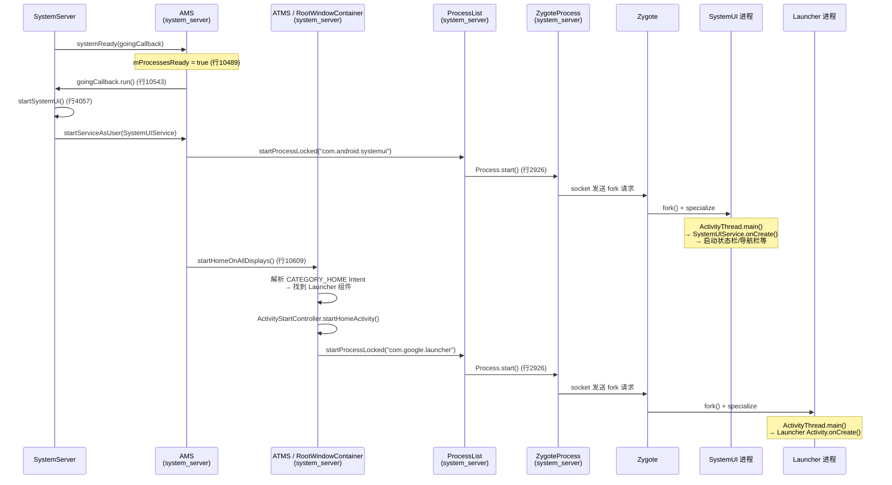

## 1. 概述

| 项目 | SystemUI | 桌面 (Launcher) |
|------|----------|-----------------|
| **进程名** | `com.android.systemui` | `com.google.android.apps.nexuslauncher` |
| **是否由 Zygote 创建** | **是** | **是** |
| **启动方式** | `startServiceAsUser()` → 触发进程创建 | `startActivity()` (CATEGORY_HOME) → 触发进程创建 |
| **启动时机** | `AMS.systemReady()` 的 goingCallback 内部 | `AMS.systemReady()` 的 goingCallback 执行完之后 |

**两者都是由 Zygote fork 出来的**，底层都走 `ProcessList.startProcessLocked()` → `Process.start()` → `ZygoteProcess` → Zygote socket → `fork()`。

---

## 2. 启动时序：SystemUI 先于 Launcher

源码证据在 `ActivityManagerService.systemReady()`：

```java
// ActivityManagerService.java
public void systemReady(final Runnable goingCallback, TimingsTraceAndSlog t) {
    // ① 各种初始化...
    mProcessesReady = true;           // 行 10489: 标记进程可以启动

    // ② 执行 goingCallback（来自 SystemServer）
    goingCallback.run();              // 行 10543
    //  └── startSystemUi(context)    // SystemServer.java:4057 ← SystemUI 在这里启动

    // ③ 启动 Launcher
    startHomeOnAllDisplays(...)       // 行 10609 ← Launcher 在这里启动
}
```

关键结论：
- `goingCallback.run()`（行 10543）内部调用了 `startSystemUi()`（SystemServer.java:4057）
- `startHomeOnAllDisplays()`（行 10609）在 goingCallback 之后执行
- 因此 **SystemUI 的启动请求先于 Launcher 发出**

---

## 3. SystemUI 启动调用链

### 3.1 调用链总览

| 步骤 | 类.方法() | 文件:行号 | 进程 |
|------|----------|----------|------|
| 1 | `SystemServer.startOtherServices()` | `SystemServer.java:1797` | system_server |
| 2 | `AMS.systemReady(goingCallback)` | `AMS.java:10422` | system_server |
| 3 | `goingCallback.run()` | `AMS.java:10543` | system_server |
| 4 | `SystemServer.startSystemUi()` | `SystemServer.java:4223` | system_server |
| 5 | `context.startServiceAsUser(intent, SYSTEM)` | `SystemServer.java:4229` | system_server |
| 6 | → AMS 发现 SystemUI 进程不存在，需要创建 | | system_server |
| 7 | `ProcessList.startProcessLocked()` | `ProcessList.java:2018` | system_server |
| 8 | `ProcessList.startProcess()` | `ProcessList.java:2749` | system_server |
| 9 | `Process.start("android.app.ActivityThread", ...)` | `ProcessList.java:2926` | system_server |
| 10 | `ZygoteProcess.start()` | `ZygoteProcess.java:386` | system_server |
| 11 | `ZygoteProcess.startViaZygote()` | `ZygoteProcess.java:690` | system_server |
| 12 | `ZygoteProcess.zygoteSendArgsAndGetResult()` | `ZygoteProcess.java:466` | system_server → zygote (socket) |
| 13 | **Zygote fork()** | `Zygote.forkAndSpecialize()` | zygote |
| 14 | `ActivityThread.main()` | | com.android.systemui |
| 15 | `SystemUIService.onCreate()` | `SystemUIService.java:79` | com.android.systemui |
| 16 | `startSystemUserServicesIfNeeded()` | `SystemUIApplicationImpl.java:224` | com.android.systemui |

### 3.2 关键源码

**入口 — SystemServer.startSystemUi()**（SystemServer.java:4223）：

```java
private static void startSystemUi(Context context, WindowManagerService windowManager) {
    PackageManagerInternal pm = LocalServices.getService(PackageManagerInternal.class);
    Intent intent = new Intent();
    intent.setComponent(pm.getSystemUiServiceComponent());
    intent.addFlags(Intent.FLAG_DEBUG_TRIAGED_MISSING);
    context.startServiceAsUser(intent, UserHandle.SYSTEM);
    windowManager.onSystemUiStarted();
}
```

**SystemUI 进程内 — SystemUIService.onCreate()**（SystemUIService.java:79）：

```java
@Override
public void onCreate() {
    super.onCreate();
    // Start all of SystemUI
    ((SystemUIApplication) getApplication()).startSystemUserServicesIfNeeded();
}
```

**组件加载 — SystemUIApplicationImpl**（SystemUIApplicationImpl.java:224）：

```java
public void startSystemUserServicesIfNeeded() {
    Map<Class<?>, Provider<CoreStartable>> sortedStartables = new TreeMap<>(
        Comparator.comparing(Class::getName));
    sortedStartables.putAll(mSysUIComponent.getStartables());
    sortedStartables.putAll(mSysUIComponent.getPerUserStartables());
    startServicesIfNeeded(sortedStartables, "StartServices", vendorComponent);
}
```

---

## 4. Launcher 启动调用链

### 4.1 调用链总览

| 步骤 | 类.方法() | 文件:行号 | 进程 |
|------|----------|----------|------|
| 1 | `AMS.systemReady()` | `AMS.java:10609` | system_server |
| 2 | `ATMS.startHomeOnAllDisplays()` | `ATMS.java:8101` | system_server |
| 3 | `RootWindowContainer.startHomeOnAllDisplays()` | `RootWindowContainer.java:1410` | system_server |
| 4 | `startHomeOnDisplay()` | `RootWindowContainer.java:1530` | system_server |
| 5 | `startHomeOnTaskDisplayArea()` | `RootWindowContainer.java:1561` | system_server |
| 6 | 解析 `CATEGORY_HOME` Intent → 找到 Launcher | `RootWindowContainer.java:1578` | system_server |
| 7 | `ActivityStartController.startHomeActivity()` | `ActivityStartController.java:170` | system_server |
| 8 | `ActivityStarter.execute()` | `ActivityStartController.java:206-212` | system_server |
| 9 | → 发现 Launcher 进程不存在，需要创建 | | system_server |
| 10 | `ProcessList.startProcessLocked()` | `ProcessList.java:2018` | system_server |
| 11 | `Process.start("android.app.ActivityThread", ...)` | `ProcessList.java:2926` | system_server |
| 12 | `ZygoteProcess.startViaZygote()` | `ZygoteProcess.java:690` | system_server → zygote (socket) |
| 13 | **Zygote fork()** | `Zygote.forkAndSpecialize()` | zygote |
| 14 | `ActivityThread.main()` | | com.google.android.apps.nexuslauncher |
| 15 | Launcher Activity `onCreate()` | | com.google.android.apps.nexuslauncher |

### 4.2 关键源码

**入口 — AMS.systemReady()**（AMS.java:10607-10610）：

```java
if (isBootingSystemUser && !UserManager.isHeadlessSystemUserMode()) {
    t.traceBegin("startHomeOnAllDisplays");
    mAtmInternal.startHomeOnAllDisplays(currentUserId, "systemReady");
    t.traceEnd();
}
```

**遍历所有屏幕 — RootWindowContainer**（RootWindowContainer.java:1410）：

```java
boolean startHomeOnAllDisplays(int userId, String reason) {
    boolean homeStarted = false;
    for (int i = getChildCount() - 1; i >= 0; i--) {
        final int displayId = getChildAt(i).mDisplayId;
        homeStarted |= startHomeOnDisplay(userId, reason, displayId);
    }
    return homeStarted;
}
```

**解析 Home 并启动 — startHomeOnTaskDisplayArea()**（RootWindowContainer.java:1561）：

```java
boolean startHomeOnTaskDisplayArea(int userId, String reason,
        TaskDisplayArea taskDisplayArea, ...) {
    // 解析 CATEGORY_HOME Intent，找到 Launcher 组件
    final Pair<ActivityInfo, Intent> homeActivityIntentPair =
            getHomeIntentAndInfoForTaskDisplayArea(taskDisplayArea, userId);

    final ActivityInfo aInfo = homeActivityIntentPair.first;
    final Intent homeIntent = homeActivityIntentPair.second;

    homeIntent.setComponent(new ComponentName(aInfo.applicationInfo.packageName, aInfo.name));
    homeIntent.setFlags(homeIntent.getFlags() | FLAG_ACTIVITY_NEW_TASK);

    // 通过 ActivityStarter 启动 Launcher
    mService.getActivityStartController().startHomeActivity(homeIntent, aInfo, myReason,
            taskDisplayArea, onTop);
    return true;
}
```

**执行启动 — ActivityStartController.startHomeActivity()**（ActivityStartController.java:170）：

```java
void startHomeActivity(Intent intent, ActivityInfo aInfo, String reason,
        TaskDisplayArea taskDisplayArea, boolean onTop) {
    final ActivityOptions options = ActivityOptions.makeBasic();
    options.setLaunchWindowingMode(WINDOWING_MODE_FULLSCREEN);
    options.setLaunchActivityType(ACTIVITY_TYPE_HOME);
    options.setLaunchDisplayId(displayId);

    rootHomeTask = taskDisplayArea.getOrCreateRootHomeTask(onTop);

    mLastHomeActivityStartResult = obtainStarter(intent, "startHomeActivity: " + reason)
            .setOutActivity(tmpOutRecord)
            .setCallingUid(0)
            .setActivityInfo(aInfo)
            .setActivityOptions(options.toBundle(), ...)
            .execute();
}
```

**HOME Intent 构造 — ATMS.getHomeIntent()**（ATMS.java:6912）：

```java
Intent getHomeIntent() {
    Intent intent = new Intent(mTopAction, mTopData != null ? Uri.parse(mTopData) : null);
    intent.setComponent(mTopComponent);
    intent.addFlags(Intent.FLAG_DEBUG_TRIAGED_MISSING);
    if (mFactoryTest != FactoryTest.FACTORY_TEST_LOW_LEVEL) {
        intent.addCategory(Intent.CATEGORY_HOME);
    }
    return intent;
}
```

---

## 5. 共同的进程创建路径

无论 SystemUI（startService）还是 Launcher（startActivity），当目标进程不存在时，都走以下统一路径：

```
ProcessList.startProcessLocked()                    // ProcessList.java:2018
  → ProcessList.handleProcessStart()                // ProcessList.java:2448
    → ProcessList.startProcess()                    // ProcessList.java:2749
      → Process.start("android.app.ActivityThread") // ProcessList.java:2926
        → ZygoteProcess.start()                     // ZygoteProcess.java:386
          → ZygoteProcess.startViaZygote()          // ZygoteProcess.java:690
            → zygoteSendArgsAndGetResult()          // ZygoteProcess.java:466
              → 通过 LocalSocket 发送参数给 Zygote
                → Zygote.forkAndSpecialize()        // Zygote.java:395
                  → nativeForkAndSpecialize()       // JNI → fork()
```

---

## 6. 时序图



---

## 7. 核心数据结构

| 类名 | 关键字段/方法 | 作用 |
|------|-------------|------|
| `ActivityManagerService` | `mProcessesReady`, `mBooting` | 控制是否允许启动新进程 |
| `ProcessList` | `startProcessLocked()`, `startProcess()` | AMS 中进程创建的统一入口 |
| `ZygoteProcess` | `startViaZygote()`, `mZygoteSocketAddress` | 通过 socket 向 Zygote 发送 fork 请求 |
| `RootWindowContainer` | `startHomeOnTaskDisplayArea()` | 解析 HOME Intent 并启动 Launcher |
| `ActivityStartController` | `startHomeActivity()`, `obtainStarter()` | 构造 ActivityStarter 并 execute |
| `Zygote` | `forkAndSpecialize()`, `nativeForkAndSpecialize()` | 执行实际的 fork 系统调用 |

---

## 8. 要点总结

- **两者都由 Zygote fork**: 所有 Java 应用进程（包括 SystemUI 和 Launcher）都通过 `ProcessList` → `Process.start()` → `ZygoteProcess` → Zygote socket → `fork()` 创建，没有例外
- **启动顺序: SystemUI 先于 Launcher**
  - SystemUI: `goingCallback.run()` 内的 `startSystemUi()`（AMS.java 行 10543 → SystemServer.java 行 4057）
  - Launcher: goingCallback 之后的 `startHomeOnAllDisplays()`（AMS.java 行 10609）
- **启动方式不同**:
  - SystemUI 通过 `startServiceAsUser()` 启动（Service 组件），由 SystemServer 直接调用
  - Launcher 通过 `startHomeActivity()` 启动（Activity 组件），匹配 `Intent.CATEGORY_HOME`
- **共同的进程创建路径**: 无论 startService 还是 startActivity，当目标进程不存在时，AMS 都会走 `ProcessList.startProcessLocked()` → `Process.start()` → Zygote fork 这条统一路径
- **设计意图**: SystemUI 优先启动是因为状态栏、导航栏等系统 UI 元素需要在用户看到桌面之前就准备好

---

## 9. 推荐阅读

- **gityuan.com**: [Android系统启动系列](https://gityuan.com/tags/#系统启动) — 从 init 到 Launcher 的完整启动链
- **gityuan.com**: [startActivity启动过程分析](https://gityuan.com/tags/#activity) — Activity 启动流程详解
- **源码关键位置**:
  - `AMS.java:10543` — goingCallback 执行点，理解 SystemUI 启动时机
  - `AMS.java:10609` — startHomeOnAllDisplays 调用点，理解 Launcher 启动时机
  - `ProcessList.java:2926` — Process.start() 调用点，理解进程创建的统一入口
  - `RootWindowContainer.java:1561` — startHomeOnTaskDisplayArea，理解 Home Intent 解析过程