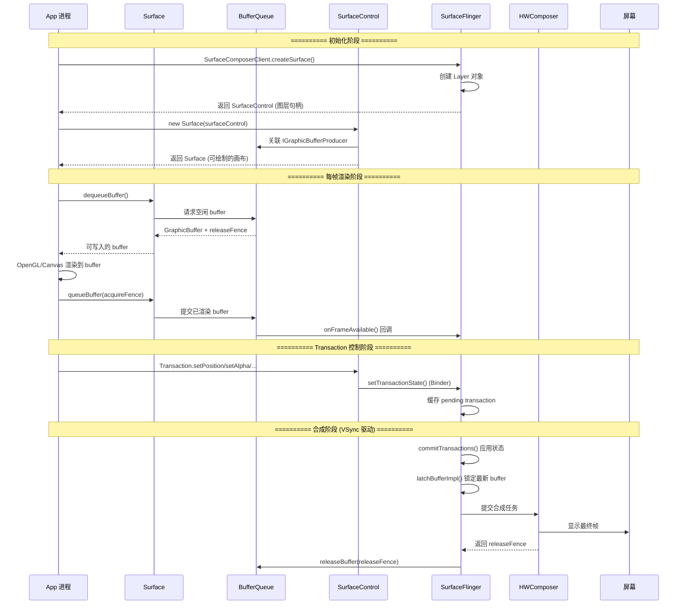

## 1. 概述

这三者是 Android 图形系统的核心三角关系，分别承担 **缓冲区操作**、**元数据控制** 和 **合成输出** 的职责。

| 组件 | 定位 | 进程 | 层级 |
|------|------|------|------|
| **Surface** | 图形缓冲区的**生产者端口**，负责往 buffer 里写像素 | App 进程 | Java + Native |
| **SurfaceControl** | 图层的**遥控器**，控制位置/大小/透明度/Z序等元数据 | App / SystemServer | Java + Native |
| **SurfaceFlinger** | 系统级**合成器服务**，将所有 Layer 合成为最终帧送显 | surfaceflinger 进程 | Native |

**核心关系一句话**：App 通过 `Surface` 向 BufferQueue 提交图形数据，通过 `SurfaceControl.Transaction` 告诉 SurfaceFlinger 如何摆放这些图层，`SurfaceFlinger` 将所有图层合成后送往屏幕。

---

## 2. 各组件详解

### 2.1 Surface — 缓冲区的"画布"

**源码位置**：
- Java: `frameworks/base/core/java/android/view/Surface.java`
- Native: `frameworks/native/libs/gui/Surface.cpp`
- Header: `frameworks/native/libs/gui/include/gui/Surface.h`

**官方定义** (Surface.java):
> Handle onto a raw buffer that is being managed by the screen compositor.
> A Surface is generally created by or from a consumer of image buffers, and is handed to some kind of producer to draw into.

**Native 层定义** (Surface.h):
> An implementation of ANativeWindow that feeds graphics buffers into a BufferQueue. This is typically used by programs that want to render frames through some means (maybe OpenGL, a software renderer, or a hardware decoder) and have the frames they create forwarded to SurfaceFlinger for compositing.

**核心职责**：
- 实现 `ANativeWindow` 接口（Native 层），是 EGL/OpenGL/Vulkan 的渲染目标
- 封装 `IGraphicBufferProducer`，负责 dequeue/queue buffer 操作
- 提供 `lockCanvas()` / `unlockCanvasAndPost()` 用于软件渲染
- 提供 `lockHardwareCanvas()` 用于硬件加速渲染（HWUI）

**关键方法**：

| 方法 | 作用 |
|------|------|
| `dequeueBuffer()` | 从 BufferQueue 获取空闲 buffer，App 在此 buffer 上渲染 |
| `queueBuffer()` | 将渲染好的 buffer 提交给 BufferQueue，触发消费者回调 |
| `lockCanvas(Rect)` | 软件渲染：锁定 buffer 并返回 Canvas |
| `unlockCanvasAndPost(Canvas)` | 软件渲染：解锁并提交 buffer |
| `lockHardwareCanvas()` | 硬件加速渲染：返回硬件 Canvas |

**关键字段** (Native 层)：

| 字段 | 类型 | 作用 |
|------|------|------|
| `mGraphicBufferProducer` | `sp<IGraphicBufferProducer>` | 连接 BufferQueue 的生产者端 |
| `mSlots[NUM_BUFFER_SLOTS]` | `BufferSlot[]` | 本地 buffer 缓存，避免重复 Binder 传输 |

---

### 2.2 SurfaceControl — 图层的"遥控器"

**源码位置**：
- Java: `frameworks/base/core/java/android/view/SurfaceControl.java`
- Native: `frameworks/native/libs/gui/SurfaceComposerClient.cpp`
- Header: `frameworks/native/libs/gui/include/gui/SurfaceComposerClient.h`

**官方定义** (SurfaceControl.java):
> Handle to an on-screen Surface managed by the system compositor. The SurfaceControl is a combination of a buffer source, and metadata about how to display the buffers. SurfaceControls are arranged into a scene-graph like hierarchy, and as such any SurfaceControl may have a parent. Geometric properties like transform, crop, and Z-ordering will be inherited from the parent, as if the child were content in the parents buffer stream.

**核心职责**：
- 代表 SurfaceFlinger 中的一个 **Layer**（图层句柄）
- 通过 `Transaction` 原子性地批量修改图层属性
- 管理图层的父子层级关系（scene-graph 树形结构）
- 几何属性（transform、crop、Z-ordering）从父节点继承

**Transaction 关键操作**：

```java
Transaction t = new SurfaceControl.Transaction();
t.setPosition(sc, x, y);          // 位置
t.setLayer(sc, z);                 // Z 序
t.setAlpha(sc, 0.8f);             // 透明度
t.setCrop(sc, rect);              // 裁剪区域
t.setScale(sc, sx, sy);           // 缩放
t.setCornerRadius(sc, radius);    // 圆角
t.setMatrix(sc, dsdx, dtdx, dtdy, dsdy); // 变换矩阵
t.setBackgroundBlurRadius(sc, r); // 背景模糊
t.show(sc);                        // 显示
t.hide(sc);                        // 隐藏
t.reparent(sc, newParent);        // 重新挂载父节点
t.apply();                         // 原子提交到 SurfaceFlinger
```

**Transaction 原子性原理**：
- Java 层的 `apply()` → JNI → Native `SurfaceComposerClient::Transaction::apply()`
- Native 层将所有变更打包为 `TransactionState`
- 通过一次 Binder 调用 `sf->setTransactionState()` 送达 SurfaceFlinger
- SurfaceFlinger 在下一个 VSync 周期的 `commitTransactions()` 中一次性应用

**Native createSurface() 流程**：
```
SurfaceComposerClient::createSurface()
  → mClient->createSurface() (AIDL Binder)
  → SurfaceFlinger 创建 Layer 对象
  → 返回 handle, layerId, layerName, transformHint
  → 构造 SurfaceControl 对象返回给调用者
```

---

### 2.3 SurfaceFlinger — 系统合成器

**源码位置**：
- `frameworks/native/services/surfaceflinger/SurfaceFlinger.cpp/.h`
- `frameworks/native/services/surfaceflinger/Layer.cpp/.h`

**核心职责**：
- 接收所有 App 提交的图形 buffer 和 Transaction 状态
- 按照 VSync 节拍，将所有可见 Layer **合成** 为一帧
- 通过 HWComposer（硬件合成器）或 GPU 合成后送显
- 管理所有 Display 的生命周期

**init() 初始化流程**：
1. 创建 RenderEngine（GPU 渲染引擎）
2. 初始化 HWComposer（硬件合成器抽象层）
3. 调用 `configureLocked()` 处理初始 Display 热插拔
4. 初始化 Scheduler（VSync 和帧调度）
5. 建立主显示设备

**合成流程（VSync 驱动）**：
```
VSync 信号到来
  → commitTransactions()    // 应用所有待处理的 Transaction
  → latchBufferImpl()       // 锁定每个 Layer 的最新 buffer
  → composite()             // 通过 CompositionEngine 合成所有可见 Layer
  → present to Display      // 通过 HWComposer 送显
  → releaseBuffer()         // 释放已显示的 buffer，返回给生产者
```

**Layer 核心状态** (Layer.h State 结构体)：

| 字段 | 作用 |
|------|------|
| `sequence` | Layer 排序序号 |
| `buffer` | 当前图形缓冲区 |
| `crop`, `transform` | 空间变换信息 |
| `frameNumber`, `frameTimelineInfo` | 帧同步时间信息 |
| `acquireFence`, `acquireFenceTime` | 同步原语（生产者完成渲染的信号） |
| `desiredPresentTime` | 期望呈现时间 |

---

## 3. BufferQueue — 连接 Surface 和 SurfaceFlinger 的桥梁

**源码位置**：
- `frameworks/native/libs/gui/BufferQueue.cpp`
- `frameworks/native/libs/gui/BufferQueueProducer.cpp`
- `frameworks/native/libs/gui/include/gui/BufferQueueProducer.h`

BufferQueue 是 Surface（生产者）和 SurfaceFlinger Layer（消费者）之间的缓冲区管道。

**创建流程** (BufferQueue.cpp):
```cpp
BufferQueue::createBufferQueue()
  → 创建 BufferQueueCore（共享状态）
  → 创建 BufferQueueProducer（生产者 API）
  → 创建 BufferQueueConsumer（消费者 API）
  → 返回两端接口给调用者
```

**Buffer 状态机**：
```
FREE → DEQUEUED → QUEUED → ACQUIRED → FREE
 ↑        |                     |
 └────────┘ (cancelBuffer)      └── (releaseBuffer)
```

**Fence 同步机制**：
- `acquireFence`：生产者渲染完成时设置，消费者等待此 fence 信号后才能读取 buffer
- `releaseFence`：消费者（SurfaceFlinger）显示完成后设置，生产者等待此 fence 后才能重新写入

---

## 4. 三者关联 — 时序图



---

## 5. 架构总览图

```
┌─────────────────────────────────────────────────────┐
│                    App 进程                          │
│                                                     │
│  ┌──────────────┐         ┌───────────────────┐     │
│  │   Surface     │         │  SurfaceControl   │     │
│  │  (画布/Buffer) │         │  (图层遥控器)      │     │
│  │              │         │                   │     │
│  │ lockCanvas() │         │ Transaction {     │     │
│  │ queueBuffer()│         │   setPosition()   │     │
│  │              │         │   setAlpha()       │     │
│  └──────┬───────┘         │   setLayer()       │     │
│         │                 │   apply() ─────────┼──┐  │
│         │                 │ }                  │  │  │
│         │                 └───────────────────┘  │  │
└─────────┼────────────────────────────────────────┼──┘
          │ IGraphicBufferProducer                 │ ISurfaceComposer
          │ (Binder)                               │ setTransactionState()
          ▼                                        │ (Binder)
┌─────────────────────┐                            │
│    BufferQueue       │                            │
│ ┌─────┬─────┬─────┐ │                            │
│ │slot0│slot1│slot2│ │  ← 通常 3 个 buffer         │
│ └──┬──┴──┬──┴──┬──┘ │    (triple buffering)      │
│    │     │     │     │                            │
└────┼─────┼─────┼─────┘                            │
     │     │     │ IGraphicBufferConsumer            │
     ▼     ▼     ▼                                  ▼
┌─────────────────────────────────────────────────────┐
│              SurfaceFlinger 进程                     │
│                                                     │
│  ┌─────────┐  ┌─────────┐  ┌─────────┐            │
│  │ Layer A  │  │ Layer B  │  │ Layer C  │  ...      │
│  │(状态栏)  │  │(App窗口) │  │(导航栏)  │            │
│  └────┬─────┘  └────┬─────┘  └────┬─────┘            │
│       │             │             │                  │
│       ▼             ▼             ▼                  │
│  ┌──────────────────────────────────────┐           │
│  │        CompositionEngine             │           │
│  │   (按 Z 序合成所有可见 Layer)          │           │
│  └──────────────┬───────────────────────┘           │
│                 │                                    │
│                 ▼                                    │
│  ┌──────────────────────┐                           │
│  │     HWComposer       │  ← 硬件合成 or GPU 合成    │
│  └──────────┬───────────┘                           │
└─────────────┼───────────────────────────────────────┘
              │
              ▼
         ┌──────────┐
         │  Display  │  ← 屏幕显示
         └──────────┘
```

---

## 6. 核心数据结构汇总

| 类名 | 关键字段 | 作用 |
|------|---------|------|
| `Surface` (Native) | `mGraphicBufferProducer` | 连接 BufferQueue 的生产者端 |
| `Surface` (Native) | `mSlots[NUM_BUFFER_SLOTS]` | 本地 buffer 缓存，避免重复 Binder 传输 |
| `SurfaceControl` (Java) | `mNativeObject` (long) | 指向 native SurfaceControl 的指针 |
| `SurfaceControl.Transaction` | `mNativeObject` (long) | 指向 native Transaction 的指针，内部维护状态变更列表 |
| `SurfaceFlinger::Layer` | `mDrawingState` | 当前参与合成的图层状态 |
| `SurfaceFlinger::Layer` | `mBufferInfo` | 当前活跃 buffer 的元数据 |
| `BufferQueueCore` | `mSlots[]` | slot 数组，维护空闲/入队/出队状态机 |
| `BufferQueueProducer` | `mCore` | 生产者端操作 BufferQueue |
| `BufferQueueConsumer` | `mCore` | 消费者端操作 BufferQueue |

---

## 7. 要点总结

### 设计意图 — 职责分离

| 关注点 | 由谁负责 | 为什么分离 |
|--------|---------|-----------|
| **像素数据**（画什么） | Surface + BufferQueue | App 端渲染，通过共享内存避免跨进程拷贝大量像素 |
| **显示属性**（怎么摆） | SurfaceControl.Transaction | 轻量 Binder 调用，原子提交保证一致性 |
| **最终合成**（合在一起） | SurfaceFlinger | 统一调度，全局优化合成策略 |

### 关键机制

1. **BufferQueue 生产者-消费者模型**：Surface 是生产者端，SurfaceFlinger（通过 Layer）是消费者端。通过 Fence 机制实现 GPU/CPU 无锁同步，不需要等待 GPU 完成就能提交下一帧。

2. **Transaction 原子性**：多个图层属性变更打包在一个 Transaction 中，调用 `apply()` 后通过一次 Binder 调用 `setTransactionState()` 送达 SurfaceFlinger，保证一帧内所有变更同时生效，避免画面撕裂。

3. **Triple Buffering**：BufferQueue 通常维护 3 个 buffer slot，使得 App 渲染和 SurfaceFlinger 合成可以流水线化：App 写 buffer A，SurfaceFlinger 读 buffer B，buffer C 待命，减少卡顿。

4. **VSync 驱动**：SurfaceFlinger 的合成由 Scheduler 管理的 VSync 信号驱动，保证帧率稳定。App 端的 `Choreographer` 也由 VSync 驱动，形成完整的帧同步链路。

5. **共享内存零拷贝**：GraphicBuffer 底层使用 `gralloc` 分配的共享内存（通过 ION/dmabuf），App 和 SurfaceFlinger 映射同一块物理内存，避免像素数据的跨进程拷贝。

### 与背屏开发的关联

- 背屏动画中如果直接操作 `SurfaceControl.Transaction`（如窗口动画），就是在控制图层元数据
- 如果通过 Canvas/OpenGL 渲染内容，底层就是在操作 Surface 的 BufferQueue
- 所有内容最终都由 SurfaceFlinger 合成后送到背屏 Display
- 背屏进程内存预算 < 52MB，需注意 GraphicBuffer 的内存占用

---

## 8. 源码路径索引

| 组件 | 文件路径 |
|------|---------|
| Surface (Java) | `frameworks/base/core/java/android/view/Surface.java` |
| Surface (Native) | `frameworks/native/libs/gui/Surface.cpp` |
| Surface (Header) | `frameworks/native/libs/gui/include/gui/Surface.h` |
| SurfaceControl (Java) | `frameworks/base/core/java/android/view/SurfaceControl.java` |
| SurfaceComposerClient | `frameworks/native/libs/gui/SurfaceComposerClient.cpp` |
| SurfaceComposerClient (Header) | `frameworks/native/libs/gui/include/gui/SurfaceComposerClient.h` |
| SurfaceFlinger | `frameworks/native/services/surfaceflinger/SurfaceFlinger.cpp/.h` |
| Layer | `frameworks/native/services/surfaceflinger/Layer.cpp/.h` |
| BufferQueue | `frameworks/native/libs/gui/BufferQueue.cpp` |
| BufferQueueProducer | `frameworks/native/libs/gui/BufferQueueProducer.cpp` |

---

## 9. 推荐阅读

- **gityuan.com**: https://gityuan.com/tags/ → 搜索 "SurfaceFlinger"、"Choreographer" 相关文章
- 源码关键注释：
  - `Surface.h:43-52` — ANativeWindow 实现的设计说明
  - `SurfaceControl.java:103-111` — scene-graph 层级关系说明
  - `BufferQueue.cpp:118-141` — 生产者消费者创建流程
  - `Layer.h:129-218` — Layer 状态结构体定义