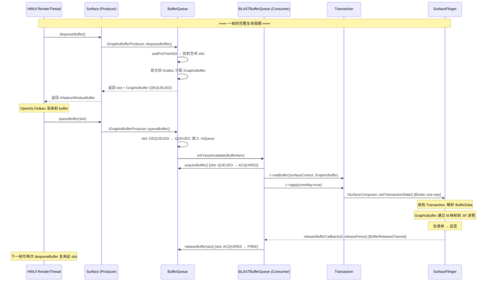

## 第一部分：Buffer 机制全貌

### 1. 概述

Android 的图形 Buffer 机制是一个**生产者-消费者**模型，核心围绕 `BufferQueue` 构建：

- **生产者（Producer）**：App 进程，通过 HWUI 渲染内容到 GraphicBuffer
- **消费者（Consumer）**：SurfaceFlinger 进程，从 BufferQueue 获取渲染好的 Buffer 进行合成
- **中间桥梁**：`BLASTBufferQueue`（BBQ）运行在 App 进程，同时充当 BufferQueue 的消费者和 SurfaceFlinger Transaction 的提交者

涉及进程：**App 进程**（ViewRootImpl / HWUI / BBQ）→ **SurfaceFlinger 进程**

核心文件：

| 文件 | 路径 | 角色 |
|------|------|------|
| BLASTBufferQueue.java | `base/graphics/java/android/graphics/` | Java 层 BBQ 封装 |
| BLASTBufferQueue.cpp/h | `native/libs/gui/` | C++ 层 BBQ 实现 |
| BufferQueueCore.cpp/h | `native/libs/gui/` | BufferQueue 核心状态管理 |
| BufferQueueProducer.cpp | `native/libs/gui/` | 生产者端（dequeue/queue） |
| BufferQueueConsumer.cpp | `native/libs/gui/` | 消费者端（acquire/release） |
| Surface.cpp | `native/libs/gui/` | ANativeWindow 实现，封装 Producer |
| SurfaceComposerClient.cpp | `native/libs/gui/` | Transaction 提交到 SF |
| GraphicBuffer.cpp | `native/libs/ui/` | 图形内存封装 |
| BufferReleaseChannel.cpp | `native/libs/gui/` | SF→App 的 buffer 释放通知通道 |

---

### 2. 应用怎么申请 Buffer、申请多少、怎么使用

#### 2.1 Buffer 的申请入口

App 通过 HWUI RenderThread 渲染时，最终通过 `Surface`（即 `ANativeWindow`）接口与 BufferQueue 交互：

```
HWUI RenderThread
  → EGL eglSwapBuffers() / ANativeWindow_dequeueBuffer()
    → Surface::dequeueBuffer()           // native/libs/gui/Surface.cpp
      → IGraphicBufferProducer::dequeueBuffer()  // Binder 或本地调用
        → BufferQueueProducer::dequeueBuffer()   // 实际分配逻辑
```

**`BufferQueueProducer::dequeueBuffer()`**（`BufferQueueProducer.cpp:462`）的核心流程：

```cpp
status_t BufferQueueProducer::dequeueBuffer(int* outSlot, sp<Fence>* outFence,
        uint32_t width, uint32_t height, PixelFormat format, uint64_t usage, ...) {
    // 1. 在 mFreeBuffers / mFreeSlots 中寻找空闲 slot
    int found = BufferItem::INVALID_BUFFER_SLOT;
    while (found == INVALID_BUFFER_SLOT) {
        status_t status = waitForFreeSlotThenRelock(FreeSlotCaller::Dequeue, lock, &found);
    }

    // 2. 如果 slot 没有 buffer 或尺寸/格式不匹配，需要分配新的 GraphicBuffer
    if (needsReallocation) {
        sp<GraphicBuffer> graphicBuffer = new GraphicBuffer(width, height, format, ...);
        // GraphicBuffer 内部通过 Gralloc HAL 分配共享内存
        mSlots[*outSlot].mGraphicBuffer = graphicBuffer;
    }

    // 3. 将 slot 状态设为 DEQUEUED，返回给生产者
    mSlots[found].mBufferState.dequeue();
    return returnFlags;
}
```

#### 2.2 Buffer 使用（渲染 + 提交）

```
App 主线程                          HWUI RenderThread
    │                                    │
    │ performTraversals()                │
    │   → draw()                         │
    │     → ThreadedRenderer.draw()      │
    │       ─────────────────────────────→│
    │                                    │ syncFrameState()
    │                                    │ dequeueBuffer() ← 从 BQ 拿一块空 buffer
    │                                    │ 绑定为 EGL Surface 的后备缓冲
    │                                    │ OpenGL/Vulkan 渲染到 buffer
    │                                    │ queueBuffer()   ← 渲染完毕，归还给 BQ
    │                                    │
```

**`queueBuffer()`**（`BufferQueueProducer.cpp:976`）将渲染好的 buffer 入队：

```cpp
status_t BufferQueueProducer::queueBuffer(int slot, const QueueBufferInput& input, ...) {
    // 1. 将 slot 状态从 DEQUEUED → QUEUED
    mSlots[slot].mBufferState.queue();
    ++mCore->mFrameCounter;

    // 2. 构造 BufferItem 放入 mQueue（FIFO）
    item.mGraphicBuffer = mSlots[slot].mGraphicBuffer;
    mCore->mQueue.push_back(item);

    // 3. 通知消费者（BBQ）有新帧可用
    frameAvailableListener->onFrameAvailable(item);
}
```

#### 2.3 Buffer 个数

**默认 buffer 个数 = `mMaxDequeuedBufferCount` + `mMaxAcquiredBufferCount` + (异步 ? 1 : 0)**

来自 `BufferQueueCore::getMaxBufferCountLocked()`（`BufferQueueCore.cpp:260`）：

```cpp
int BufferQueueCore::getMaxBufferCountLocked() const {
    int maxBufferCount = mMaxAcquiredBufferCount + mMaxDequeuedBufferCount +
            ((mAsyncMode || mDequeueBufferCannotBlock) ? 1 : 0);
    maxBufferCount = std::min(mMaxBufferCount, maxBufferCount);
    return maxBufferCount;
}
```

| 参数 | 默认值 | 含义 |
|------|--------|------|
| `mMaxDequeuedBufferCount` | **1** | 生产者同时持有（正在渲染）的 buffer 数 |
| `mMaxAcquiredBufferCount` | **1** | 消费者同时持有（等待合成）的 buffer 数 |
| 异步额外 buffer | 0 或 1 | 异步模式下多一个避免阻塞 |

**典型场景下的 buffer 数量：**

| 场景 | maxDequeued | maxAcquired | async | 总数 | 说明 |
|------|------------|------------|-------|------|------|
| 普通 App（双缓冲） | 1 | 1 | 0 | **2** | 最常见 |
| HWUI 三缓冲 | 2 | 1 | 0 | **3** | HWUI 可设置 |
| 异步模式 | 1 | 1 | 1 | **3** | 多一个防阻塞 |

Slot 池上限定义在 `BufferQueueDefs.h:25`：
```cpp
static constexpr int NUM_BUFFER_SLOTS = 64;  // 最大 64 个 slot
```

但实际分配数量由 `getMaxBufferCountLocked()` 动态决定，远小于 64。

---

### 3. Buffer 是从 BBQ 申请的吗？个数固定吗？

#### 3.1 BBQ 与 BufferQueue 的关系

**Buffer 并不是"从 BBQ 申请"的**。架构如下：

```
┌─────────────── App 进程 ───────────────┐
│                                         │
│  ViewRootImpl                           │
│    └── BLASTBufferQueue (BBQ)           │
│          ├── BufferQueueProducer ◄─── Surface (ANativeWindow)  ◄── HWUI
│          ├── BufferQueueConsumer ◄─── BLASTBufferItemConsumer
│          └── BufferQueueCore     ←── 管理 mSlots[]             │
│                                                                 │
│  App 通过 Surface.dequeueBuffer() 向 BufferQueue 申请 buffer    │
│  BBQ 作为消费者 acquire buffer 后打包到 Transaction 发给 SF      │
└─────────────────────────────────────────┘
```

关键点：

1. **BBQ 创建了 BufferQueue**：在 `BLASTBufferQueue::createBufferQueue()` 中创建 Producer/Consumer pair
2. **HWUI 通过 Surface（封装了 Producer）dequeue/queue buffer**：这是真正的 buffer 申请
3. **BBQ 作为 Consumer acquire buffer**：收到 `onFrameAvailable` 后 acquire，打包成 Transaction 发给 SF
4. **Buffer 的真正分配是在 BufferQueueProducer 中**：通过 Gralloc HAL 从内核分配共享内存

`ViewRootImpl.java:3076` 创建 BBQ：

```java
mBlastBufferQueue = new BLASTBufferQueue(mTag, true);
mBlastBufferQueue.update(mSurfaceControl, mSurfaceSize.x, mSurfaceSize.y, mWindowAttributes.format);
blastSurface = mBlastBufferQueue.createSurfaceWithHandle();  // 获取封装了 Producer 的 Surface
mSurface.transferFrom(blastSurface);  // 将 Surface 交给 HWUI 使用
```

#### 3.2 Buffer 个数固定吗？

**不固定，是动态按需分配的：**

1. **Slot 不等于 Buffer**：BufferQueue 有 slot 池，但 slot 可以没有 GraphicBuffer 附着
2. **首次 dequeue 时分配**：当 slot 没有 buffer 或尺寸变化时，`dequeueBuffer()` 才分配 GraphicBuffer
3. **尺寸变化时重新分配**：`needsReallocation(width, height, format, usage)` 检查是否需要重分配
4. **maxBufferCount 可以动态变化**：
   - Producer 调用 `setMaxDequeuedBufferCount()` 可改变
   - Consumer 调用 `setMaxAcquiredBufferCount()` 可改变
   - 异步模式 `setAsyncMode()` 切换时会加减 1

BBQ 中也有动态调整（`BLASTBufferQueue.h:206`）：
```cpp
int32_t mMaxAcquiredBuffers = 1;  // BBQ 默认 acquire 1 个
```

当 SF 通知需要更多 buffer 时（如 VRR 场景），通过 `releaseBufferCallback` 的 `currentMaxAcquiredBufferCount` 参数动态调整。

---

### 4. App 渲染后，SF 怎么拿到 Buffer？

#### 4.1 整体流程（BLAST 架构）

与传统架构不同，**BLAST 架构下 buffer 不再直接跨进程传递**。而是：

```
App 进程内部:
  HWUI queueBuffer() → BufferQueue → onFrameAvailable() → BBQ acquireBuffer()
  → BBQ 把 buffer 放入 SurfaceComposerClient::Transaction
  → Transaction.apply() → Binder 调用 sf->setTransactionState()

SurfaceFlinger 进程:
  收到 Transaction → 解析 layer_state_t → 从 BufferData 拿到 GraphicBuffer
  → 合成帧 → 释放 buffer → 通过 BufferReleaseChannel 通知 App
```

#### 4.2 关键步骤源码

**步骤 1：BBQ acquire buffer 后包装进 Transaction**

`BLASTBufferQueue::acquireNextBufferLocked()`（`BLASTBufferQueue.cpp:575`）：

```cpp
status_t BLASTBufferQueue::acquireNextBufferLocked(...) {
    // 1. 从 BufferQueue 消费端获取渲染好的 buffer
    mBufferItemConsumer->acquireBuffer(&bufferItem, 0);
    auto buffer = bufferItem.mGraphicBuffer;  // sp<GraphicBuffer>

    // 2. 将 buffer 放入 Transaction
    t->setBuffer(mSurfaceControl, buffer, fence, bufferItem.mFrameNumber,
                 mProducerId, releaseBufferCallback, dequeueTime);

    // 3. 应用 Transaction（one-way Binder 调用发送给 SF）
    if (applyTransaction) {
        t->setApplyToken(mApplyToken).apply(false, true);  // oneWay = true
    }
}
```

**步骤 2：Transaction.setBuffer() 打包 buffer 信息**

`SurfaceComposerClient.cpp:1700`：

```cpp
Transaction& Transaction::setBuffer(const sp<SurfaceControl>& sc,
        const sp<GraphicBuffer>& buffer, ...) {
    // 将 GraphicBuffer 包装进 BufferData
    std::shared_ptr<BufferData> bufferData = std::make_shared<BufferData>();
    bufferData->buffer = buffer;  // GraphicBuffer 通过 flatten 序列化
    bufferData->frameNumber = frameNumber;
    bufferData->releaseBufferEndpoint = ...;  // 用于回传释放通知

    s->what |= layer_state_t::eBufferChanged;
    s->bufferData = std::move(bufferData);
}
```

**步骤 3：Transaction.apply() 通过 Binder 发送给 SF**

`SurfaceComposerClient.cpp:1145-1208`：

```cpp
status_t Transaction::apply(bool synchronous, bool oneWay) {
    cacheBuffers();  // Buffer 缓存优化，避免重复传输

    sp<ISurfaceComposer> sf(ComposerService::getComposerService());
    // 通过 Binder IPC 发送 TransactionState 给 SurfaceFlinger
    status_t binderStatus = sf->setTransactionState(std::move(state), applyToken);
}
```

#### 4.3 Buffer 释放回传

SF 合成完一帧后，需要通知 App 该 buffer 可以复用：

`BLASTBufferQueue::releaseBufferCallbackLocked()` 收到释放通知后：
1. 从 `mSubmitted` 中找到对应 buffer
2. 调用 `mBufferItemConsumer->releaseBuffer()` 归还给 BufferQueue
3. BufferQueue 将 slot 状态从 ACQUIRED → FREE
4. 生产者（HWUI）下次 `dequeueBuffer()` 即可复用

---

### 5. Buffer 一帧完整生命周期时序图



### 6. Buffer Slot 状态机

```
                    dequeueBuffer()
        FREE ──────────────────────→ DEQUEUED
         ↑                              │
         │                              │ queueBuffer()
    releaseBuffer()                     ↓
         │                           QUEUED
     ACQUIRED ◄────────────────────────┘
                    acquireBuffer()
```

| 状态 | 持有者 | 含义 |
|------|--------|------|
| **FREE** | BufferQueue | 空闲，可被 dequeue |
| **DEQUEUED** | Producer (HWUI) | 正在渲染 |
| **QUEUED** | BufferQueue (FIFO) | 渲染完毕，等待消费 |
| **ACQUIRED** | Consumer (BBQ/SF) | 正在合成/显示 |

---

## 第二部分：跨进程通信机制详解

整个 Buffer 生命周期涉及 **5 种不同的 IPC 机制**，每种都有其不可替代的原因。

### 7. 全景图：每个环节用了什么通信

```
┌──── App 进程 ────────────────────────────────────────────┐
│                                                           │
│  HWUI ──dequeue/queue──→ BufferQueue ──acquire──→ BBQ     │
│          (进程内调用)      (进程内)     (进程内)            │
│                                                           │
│  BBQ ─── Transaction.setBuffer(GraphicBuffer) ──→ apply() │
│                                                    │      │
└────────────────────────────────────────────────────│──────┘
                                                     │
                    ① Binder one-way                 │  ② 共享内存(dmabuf fd)
                    ③ BufferCache 缓存ID             │     随 Binder 传递 fd
                                                     ↓
┌──── SurfaceFlinger 进程 ─────────────────────────────────┐
│                                                           │
│  收到 Transaction → 解析 buffer → mmap 同一块物理内存      │
│  → 合成帧 → 送显 → buffer 用完                             │
│                                                           │
│  ④ BufferReleaseChannel (Unix Socket) ──→ 通知 App 释放   │
│  ⑤ Binder callback ──→ 通知帧 commit/present             │
│                                                           │
└───────────────────────────────────────────────────────────┘
```

---

### 8. 机制一：Binder One-Way — Transaction 提交

**用在哪里**：BBQ 调用 `Transaction.apply()` 将携带 buffer 的 Transaction 发送给 SurfaceFlinger

**源码**：`SurfaceComposerClient.cpp:1189-1208`

```cpp
if (oneWay) {
    mState.mFlags |= ISurfaceComposer::eOneWay;
}
sp<ISurfaceComposer> sf(ComposerService::getComposerService());
status_t binderStatus = sf->setTransactionState(std::move(state), applyToken);
```

BBQ 端的调用（`BLASTBufferQueue.cpp:734`）：
```cpp
t->setApplyToken(mApplyToken).apply(false, true);  // synchronous=false, oneWay=true
```

**为什么用 Binder，且是 one-way？**

| 考量 | 说明 |
|------|------|
| 为什么用 Binder | Transaction 包含完整的窗口状态（位置、大小、层级、buffer 等），数据结构复杂（`layer_state_t`），适合 Binder 的序列化/反序列化能力 |
| 为什么是 one-way | **避免阻塞 App 主线程/渲染线程**。如果用同步 Binder，每帧提交都要等 SF 处理完才返回，会严重拖慢帧率。one-way 调用立即返回，App 可以继续下一帧的渲染 |
| 有序性保证 | 同一个 applyToken 的 one-way 调用在 Binder 驱动中保持**先进先出**顺序，所以帧不会乱序 |

---

### 9. 机制二：共享内存（dmabuf fd）— GraphicBuffer 像素数据

**用在哪里**：GraphicBuffer 的实际像素数据通过 Gralloc HAL 分配为内核共享内存（dmabuf/ion），跨进程只传递 fd

**源码**：`GraphicBuffer.cpp:469` — `flatten()` 序列化时将 `native_handle` 中的 fd 写入 Parcel

```cpp
status_t GraphicBuffer::flatten(void*& buffer, size_t& size, int*& fds, size_t& count) const {
    // 写入宽、高、格式、usage 等元数据
    // 关键：将 native_handle 的 fd 数组复制到 fds
    for (int i = 0; i < handle->numFds; i++) {
        fds[i] = handle->data[i];  // dmabuf fd
    }
}
```

接收端 `unflatten()` 后通过 Gralloc mapper `importBuffer` 将 fd 映射到本进程地址空间。

**为什么用共享内存而非 Binder 传数据？**

| 考量 | 说明 |
|------|------|
| **零拷贝** | 一块 1080p RGBA 的 buffer 约 8MB。如果通过 Binder 传输像素数据，需要在内核中拷贝一次（Binder 的 `copy_from_user`/`copy_to_user`），而共享内存两端 mmap 同一块物理页，**无需任何拷贝** |
| **Binder 传输限制** | Binder 事务的默认大小上限约 1MB（`BINDER_MAX_USER_TRANSACTION_SIZE`），一个 buffer 就会超出。共享内存没有大小限制 |
| **高频访问** | GPU/CPU 每帧读写 buffer，要求零开销访问。mmap 后直接指针访问，无需系统调用 |
| **跨进程只传 fd** | fd 在 Binder 传输时由内核 `dup` 到目标进程（通过 `BINDER_TYPE_FD`），开销极小（几十字节） |

跨进程内存映射示意：

```
┌────── App 进程 ──────┐              ┌────── SF 进程 ──────┐
│                       │              │                      │
│  GraphicBuffer         │    Binder    │  GraphicBuffer       │
│  ├─ native_handle_t ──┼──fd 传递────→├─ native_handle_t    │
│  │   └─ dmabuf fd     │  (flatten/  │  │   └─ dmabuf fd    │
│  │                    │   unflatten) │  │                   │
│  └─ 映射到虚拟地址    │              │  └─ 映射到虚拟地址   │
│     (mmap)            │              │     (mmap)           │
│                       │              │                      │
│   同一块物理内存 ◄════╪══════════════╪═══► 同一块物理内存   │
└───────────────────────┘              └──────────────────────┘
```

---

### 10. 机制三：BufferCache — 避免重复传 fd

**用在哪里**：App 侧的 `BufferCache` 将 GraphicBuffer 缓存为整数 ID，避免每帧重复传输 fd

**源码**：`SurfaceComposerClient.cpp:734-793`

```cpp
void Transaction::cacheBuffers() {
    // 1. 查缓存：如果 buffer 已经传过，只发 ID
    status_t ret = BufferCache::getInstance().getCacheId(s->bufferData->buffer, &cacheId);
    if (ret == OK) {
        // 命中！不需要传 GraphicBuffer，只传 cacheId
        s->bufferData->cachedBuffer.id = cacheId;
        return;
    }
    // 2. 未命中：首次传输，将 buffer + id 一起发送
    cacheId = BufferCache::getInstance().cache(s->bufferData->buffer, uncacheBuffer);
    s->bufferData->cachedBuffer.id = cacheId;
    // SF 侧也会缓存此 buffer，后续只需 id 即可找到
}
```

**为什么需要 BufferCache？**

| 考量 | 说明 |
|------|------|
| **fd 传输有开销** | 每次通过 Binder 传 fd，内核需要 `dup` fd 并在接收方做 Gralloc `importBuffer`（mapper 注册），即便缓冲区内存相同 |
| **buffer 在 slot 间复用** | BufferQueue 通常只有 2-3 个 buffer 在轮转，同一个 GraphicBuffer 会被反复 dequeue/queue。第一次传了 fd 后，后续只需 64bit 的 ID 即可 |
| **LRU 淘汰** | Client 缓存满时按 LRU 淘汰，并通过 `uncacheBuffer` 通知 SF 释放服务端缓存。SF 侧缓存更大，保证不会比 Client 提前淘汰 |

源码注释（`SurfaceComposerClient.cpp:734-740`）：
> *"We use the BufferCache to reduce the overhead of exchanging GraphicBuffers with the server. If we were to simply parcel the GraphicBuffer we would pay two overheads: 1. Cost of sending the FD  2. Cost of importing the GraphicBuffer with the mapper in the receiving process."*

---

### 11. 机制四：BufferReleaseChannel（Unix Domain Socket）— 释放通知

**用在哪里**：SurfaceFlinger 合成完帧后，通知 App 侧 BBQ 该 buffer 可以复用

**源码**：`BufferReleaseChannel.cpp:267-345`

```cpp
status_t BufferReleaseChannel::open(std::string name, ...) {
    int sockets[2];
    socketpair(AF_UNIX, SOCK_SEQPACKET, 0, sockets);  // 创建 Unix 域 socket pair

    // Consumer 端（App 侧）设为非阻塞
    fcntl(consumerFd.get(), F_SETFL, flags | O_NONBLOCK);
    // Consumer 端设为只读
    shutdown(consumerFd.get(), SHUT_WR);
    // Producer 端（SF 侧）设 1 秒超时
    setsockopt(producerFd.get(), SOL_SOCKET, SO_RCVTIMEO, &timeout, sizeof(timeval));
    // Buffer 大小设为 32KB（远小于默认 128KB，节省内存）
    setsockopt(fd, SOL_SOCKET, SO_SNDBUF, &bufferSize, sizeof(bufferSize));
}
```

SF 侧写入释放信息（`BufferReleaseChannel.cpp:202-251`）：
```cpp
status_t ProducerEndpoint::writeReleaseFence(const ReleaseCallbackId& callbackId,
        const sp<Fence>& fence, uint32_t maxAcquiredBufferCount) {
    // 通过 sendmsg 发送 Message + fence fd (SCM_RIGHTS)
    cmsghdr* cmsg = CMSG_FIRSTHDR(&msg);
    cmsg->cmsg_type = SCM_RIGHTS;      // 通过 SCM_RIGHTS 传递 fence fd
    sendmsg(mFd, &msg, 0);
}
```

App 侧读取（`BufferReleaseChannel.cpp:136-200`）：
```cpp
status_t ConsumerEndpoint::readReleaseFence(...) {
    recvmsg(mFd, &msg, 0);  // 非阻塞读取
    message.unflatten(data, dataLen, fdData, fdCount);
    // 解析出 releaseCallbackId + releaseFence + maxAcquiredBufferCount
}
```

**为什么用 Socket 而不用 Binder？**

| 考量 | 说明 |
|------|------|
| **高频、低延迟** | 每帧至少一次释放通知（60Hz = 60次/秒），Socket 直接系统调用 `sendmsg`/`recvmsg`，**无需经过 Binder 驱动**的线程唤醒、事务处理、锁竞争 |
| **需要传 fence fd** | Release fence（GPU 同步栅栏）是个 fd，需要通过 `SCM_RIGHTS` 传递。Socket 天然支持 `SCM_RIGHTS` 传 fd，Binder 也支持但路径更长 |
| **单向、异步** | 释放通知是 SF→App 的单向推送，Consumer 端设为 `O_NONBLOCK`，App 在下次 dequeue 前读取即可，不需要 Binder 的请求-响应模型 |
| **避免 Binder 线程竞争** | SF 每帧要通知多个 App 释放 buffer。如果用 Binder，SF 的 Binder 线程池会成为瓶颈（Binder 线程默认最多 15 个）。独立的 Socket 连接无此问题 |
| **轻量级** | 消息体只有 `{bufferId, frameNumber, releaseFence, maxAcquiredCount}`，约几十字节，Socket 的小消息效率极高 |

---

### 12. 机制五：Binder Callback — 帧完成/提交通知

**用在哪里**：App 注册 `TransactionCompletedCallback` 和 `TransactionCommittedCallback`，SF 在帧 latch/present 后回调通知 App

**源码**：BBQ 注册回调（`BLASTBufferQueue.cpp:680`）：
```cpp
t->addTransactionCompletedCallback(makeTransactionCallbackThunk(), nullptr);
```

SF 侧通过 `ITransactionCompletedListener` Binder 接口回调到 App。

**为什么用 Binder 而不用 Socket？**

| 考量 | 说明 |
|------|------|
| **回调数据复杂** | `SurfaceControlStats` 包含 latchTime、presentFence、previousReleaseFence、帧时间戳等大量结构化数据，适合 Binder 的 Parcel 序列化 |
| **频率较低** | 不是每帧必触发（只有注册了回调的 Transaction），Binder 的开销可接受 |
| **双向通信** | App 需要同步等待（如 `syncNextTransaction`），Binder 的请求-响应模型天然支持 |
| **已有 Binder 连接** | `TransactionCompletedListener` 本就是通过 Binder 注册的接口，无需新建通道 |

---

### 13. 五大机制总结对比

| 机制 | 方向 | 传输内容 | 频率 | 选择原因 |
|------|------|---------|------|---------|
| **Binder one-way** | App → SF | Transaction（窗口状态 + buffer 引用） | 每帧 1 次 | 复杂数据序列化；one-way 不阻塞渲染线程 |
| **共享内存 (dmabuf fd)** | App ↔ SF | GraphicBuffer 像素数据（几 MB） | 首次传 fd，后续共享 | 零拷贝；Binder 传不下；GPU 直接访问 |
| **BufferCache (ID)** | App → SF | 64bit 缓存 ID | 每帧 1 次 | 避免重复传 fd 和 importBuffer 开销 |
| **Unix Socket (BufferReleaseChannel)** | SF → App | ReleaseCallbackId + fence fd（几十字节） | 每帧 1 次 | 高频低延迟；传 fence fd；避免 Binder 线程竞争 |
| **Binder callback** | SF → App | SurfaceControlStats（latch/present 信息） | 按需 | 复杂数据；双向通信；频率低可接受 |

---

### 14. 设计哲学

> **大数据走共享内存（零拷贝），控制命令走 Binder（可靠有序），高频轻量通知走 Socket（低延迟免竞争）。每种机制用在最适合它的场景，没有一种万能方案。**

---

### 15. 推荐阅读

- gityuan.com: [SurfaceFlinger 系列](https://gityuan.com/tags/#SurfaceFlinger)
- 源码关键注释：
  - `BufferQueueCore.h:226-231` — mSlots 的设计说明：通过镜像 slot 避免跨进程传 GraphicBuffer
  - `BufferQueueCore.h:296-306` — maxAcquiredBufferCount / maxDequeuedBufferCount 的默认值和约束
  - `BLASTBufferQueue.h:204-206` — BBQ 的 maxAcquiredBuffers 设计
  - `SurfaceComposerClient.cpp:734-740` — BufferCache 的设计说明
  - `SurfaceComposerClient.cpp:1735-1742` — 为什么 setBuffer 必须附带 transaction callback
  - `BufferReleaseChannel.h:32-33` — Unix Domain Socket 选型说明