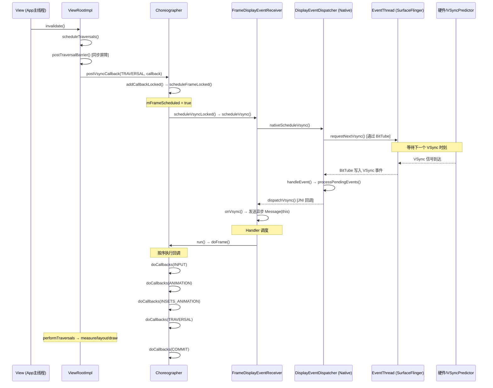

## 1. 概述

- **VSync**（Vertical Synchronization）：由硬件显示设备产生的垂直同步信号，经 SurfaceFlinger 的 Scheduler 模块软件化后分发给各个应用进程
- **Choreographer**（编舞者）：应用进程中协调 **输入、动画、绘制** 时序的核心调度器，以 VSync 信号为节拍，统一编排每一帧的工作
- **核心关系**：VSync 是"节拍器"，Choreographer 是"指挥家"——Choreographer 在需要绘制时主动请求下一个 VSync，VSync 到来时触发 Choreographer 按序执行帧回调

涉及进程：**App 进程**（Choreographer/ViewRootImpl）↔ **SurfaceFlinger 进程**（EventThread/Scheduler）

核心文件：

| 文件 | 路径 |
|------|------|
| Choreographer.java | `frameworks/base/core/java/android/view/Choreographer.java` |
| DisplayEventReceiver.java | `frameworks/base/core/java/android/view/DisplayEventReceiver.java` |
| ViewRootImpl.java | `frameworks/base/core/java/android/view/ViewRootImpl.java` |
| DisplayEventDispatcher.cpp | `frameworks/native/libs/gui/DisplayEventDispatcher.cpp` |
| EventThread.cpp | `frameworks/native/services/surfaceflinger/Scheduler/EventThread.cpp` |

---

## 2. 核心数据结构

| 类名 | 关键字段 | 作用 |
|------|---------|------|
| `Choreographer` | `mDisplayEventReceiver` | VSync 事件接收器 |
| | `mCallbackQueues[5]` | 5 种类型的回调队列（INPUT/ANIMATION/INSETS_ANIMATION/TRAVERSAL/COMMIT） |
| | `mFrameScheduled` | 是否已经请求了 VSync，防止重复请求 |
| | `mLastFrameTimeNanos` | 上一帧的时间戳，用于跳帧检测 |
| `FrameDisplayEventReceiver` | 继承 `DisplayEventReceiver` 实现 `Runnable` | 接收 Native 层 VSync 回调，转发给 `doFrame()` |
| `DisplayEventReceiver` | `mReceiverPtr` (native 指针) | 通过 JNI 连接到 Native `DisplayEventDispatcher` |
| | `mVsyncEventData` | VSync 事件数据（帧时间线、帧间隔等） |
| `DisplayEventDispatcher` (C++) | `mReceiver` (`DisplayEventReceiver`) | 与 SurfaceFlinger 的 BitTube 连接 |
| | `mWaitingForVsync` | 是否正在等待 VSync |

---

## 3. 回调队列优先级

Choreographer 维护了 **5 个回调队列**，在每一帧 VSync 到来后按序执行：

```
CALLBACK_INPUT (0)           → 输入事件处理
CALLBACK_ANIMATION (1)       → 属性动画、ValueAnimator
CALLBACK_INSETS_ANIMATION (2)→ 窗口 Insets 动画
CALLBACK_TRAVERSAL (3)       → View 的 measure/layout/draw
CALLBACK_COMMIT (4)          → 帧提交后处理
```

对应 `Choreographer.java:313-365`。

---

## 4. 完整触发链路

### 阶段一：注册回调（请求 VSync）

以 `View.invalidate()` 触发绘制为例：

```
View.invalidate()
  → ViewRootImpl.scheduleTraversals()          // :3304
    → postTraversalBarrier()                    // 发送同步屏障，阻塞同步消息
    → mChoreographer.postVsyncCallback(         // :3327
        CALLBACK_TRAVERSAL, mTraversalCallback)
      → postCallbackDelayedInternal()           // :622
        → mCallbackQueues[TRAVERSAL].addCallbackLocked()  // 加入 TRAVERSAL 队列
        → scheduleFrameLocked(now)              // :919
```

**`scheduleFrameLocked()`**（:919）是触发 VSync 请求的关键：

```java
private void scheduleFrameLocked(long now) {
    if (!mFrameScheduled) {                    // 防止重复请求
        mFrameScheduled = true;
        if (USE_VSYNC) {
            if (isRunningOnLooperThreadLocked()) {
                scheduleVsyncLocked();          // 直接请求 VSync
            } else {
                // 非 Looper 线程，发送 MSG_DO_SCHEDULE_VSYNC 消息
                Message msg = mHandler.obtainMessage(MSG_DO_SCHEDULE_VSYNC);
                msg.setAsynchronous(true);      // 异步消息，不受同步屏障阻塞
                mHandler.sendMessageAtFrontOfQueue(msg);
            }
        }
    }
}
```

**`scheduleVsyncLocked()`**（:1287）最终调用：

```java
private void scheduleVsyncLocked() {
    mDisplayEventReceiver.scheduleVsync();  // → nativeScheduleVsync()
}
```

### 阶段二：请求穿越进程（App → SurfaceFlinger）

```
DisplayEventReceiver.scheduleVsync()       // Java
  → nativeScheduleVsync()                  // JNI
    → DisplayEventDispatcher::scheduleVsync()  // C++ (:79)
      → mReceiver.requestNextVsync()       // 通过 BitTube 向 SurfaceFlinger 请求
        → EventThread (SF进程) 注册本次请求
```

`DisplayEventDispatcher.cpp:79-103`：

```cpp
status_t DisplayEventDispatcher::scheduleVsync() {
    if (!mWaitingForVsync) {
        processPendingEvents(...);     // 先排空旧事件
        mReceiver.requestNextVsync();  // 向 SF 请求下一次 VSync
        mWaitingForVsync = true;
    }
    return OK;
}
```

**关键设计**：`requestNextVsync()` 是**一次性**的，每次只请求下一个 VSync 脉冲。如果应用持续需要帧（如动画），必须在每帧回调中重新请求。

### 阶段三：VSync 信号回传（SurfaceFlinger → App）

```
硬件 VSync / SW VSync (SurfaceFlinger Scheduler)
  → EventThread 线程唤醒
    → 通过 BitTube (socket pair) 写入 VSync 事件
      → App 进程 Looper 监听到 fd 可读
        → DisplayEventDispatcher::handleEvent()   // C++ (:113)
          → processPendingEvents()                 // 读取所有待处理事件
          → dispatchVsync(timestamp, displayId, count, vsyncEventData)  // (:140)
            → JNI 回调 → DisplayEventReceiver.dispatchVsync()  // Java (:364)
              → onVsync()  // 被 FrameDisplayEventReceiver 重写
```

### 阶段四：VSync 回调触发 doFrame

**`FrameDisplayEventReceiver.onVsync()`**（:1594）：

```java
public void onVsync(long timestampNanos, long physicalDisplayId, int frame,
        VsyncEventData vsyncEventData) {
    // 保存 VSync 数据
    mTimestampNanos = timestampNanos;
    mFrame = frame;
    mLastVsyncEventData.copyFrom(vsyncEventData);

    // 将自身（Runnable）作为异步消息发送到 Handler
    Message msg = Message.obtain(mHandler, this);  // this = Runnable
    msg.setAsynchronous(true);
    mHandler.sendMessageAtTime(msg, timestampNanos / TimeUtils.NANOS_PER_MS);
}

// 当 Handler 处理该消息时执行
public void run() {
    mHavePendingVsync = false;
    doFrame(mTimestampNanos, mFrame, mLastVsyncEventData);
}
```

**为什么不直接调用 doFrame？** 注释（:1603-1606）说得很清楚——为了防止 VSync 事件完全饿死消息队列中的其他消息。通过 `sendMessageAtTime` 将 VSync 回调按时间戳排队，让更早的消息优先处理。

### 阶段五：doFrame 按序执行回调

**`Choreographer.doFrame()`**（:1074）按固定顺序执行 5 种回调：

```java
void doFrame(long frameTimeNanos, int frame, VsyncEventData vsyncEventData) {
    // 1. 抖动检测：如果当前时间 - VSync时间 > 一帧间隔，说明跳帧
    final long jitterNanos = startNanos - frameTimeNanos;
    if (jitterNanos >= frameIntervalNanos) {
        // 重新对齐帧时间，打印 "Skipped N frames!" 警告
        long skippedFrames = jitterNanos / frameIntervalNanos;
    }

    // 2. 标记帧已消费
    mFrameScheduled = false;  // 允许下次 scheduleFrameLocked 重新请求 VSync

    // 3. 按优先级顺序执行回调
    doCallbacks(CALLBACK_INPUT);           // 输入
    doCallbacks(CALLBACK_ANIMATION);       // 动画
    doCallbacks(CALLBACK_INSETS_ANIMATION);// Insets 动画
    doCallbacks(CALLBACK_TRAVERSAL);       // 测量/布局/绘制
    doCallbacks(CALLBACK_COMMIT);          // 提交
}
```

---

## 5. 时序图



---

## 6. 要点总结

### 设计意图

- Choreographer 将分散的帧工作（输入处理、动画计算、UI 绘制）统一到 VSync 节拍上，避免随机时刻绘制导致的撕裂和不一致
- 采用**按需请求**模式（`requestNextVsync` 一次只请求一次），避免空闲时浪费 CPU/GPU

### 关键机制

| 机制 | 说明 | 源码位置 |
|------|------|---------|
| **ThreadLocal 单例** | 每个 Looper 线程一个 Choreographer | `Choreographer.java:127` |
| **mFrameScheduled 防重入** | 同一帧内多次 invalidate/requestLayout 只请求一次 VSync | `Choreographer.java:920` |
| **同步屏障** | `scheduleTraversals` 插入同步屏障，确保 VSync 的异步消息优先处理 | `ViewRootImpl.java:3326` |
| **异步消息** | VSync 回调、Frame 调度消息均设为异步(`setAsynchronous(true)`)，穿越同步屏障 | `Choreographer.java:934`, `:1630` |
| **跳帧检测** | `jitterNanos >= frameIntervalNanos` 时打印 "Skipped N frames!" | `Choreographer.java:1124-1135` |
| **Buffer Stuffing 恢复** | 检测到 buffer 积压时延迟一帧或加负偏移，减少排队 buffer 数 | `Choreographer.java:989-1072` |
| **BitTube** | App 与 SF 之间通过 socket pair 传递 VSync 事件，Looper 监听 fd | `DisplayEventDispatcher.cpp:61` |

### 与其他子系统的关联

- **SurfaceFlinger Scheduler**：VSyncPredictor 预测下一次 VSync 时间，VSyncDispatchTimerQueue 在精确时刻唤醒 EventThread 分发事件
- **HWUI RenderThread**：Choreographer 的 TRAVERSAL 回调触发 `performTraversals()` → `draw()` → 提交 DisplayList 给 RenderThread
- **InputFlinger**：输入事件通过 ViewRootImpl 的 `WindowInputEventReceiver` 接收后，排入 Choreographer 的 `CALLBACK_INPUT` 队列

---

## 7. 推荐阅读

- gityuan.com 相关：[Choreographer 原理](https://gityuan.com/tags/#Choreographer) / [SurfaceFlinger 系列](https://gityuan.com/tags/#SurfaceFlinger)
- 源码中的关键注释：
  - `Choreographer.java:51-92` — 类文档，完整说明了编舞者的定位
  - `DisplayEventReceiver.java:37-45` — 说明 VSync 事件接收的线程安全约束
  - `DisplayEventDispatcher.cpp:40` — VSync 超时 300ms 的保护机制