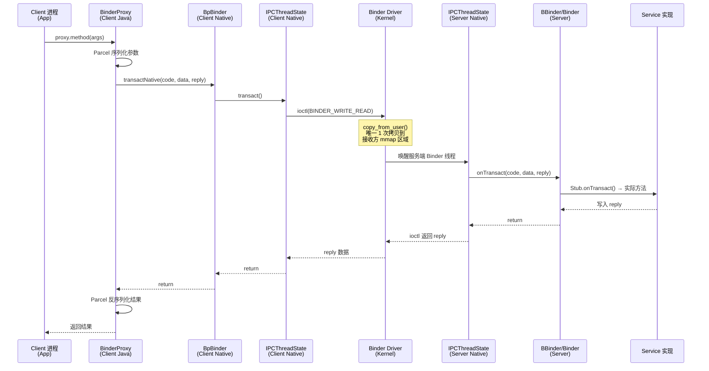

## 1. 概述

| 项目 | 说明 |
|------|------|
| **核心问题** | Android 为什么设计了专用的 Binder IPC，而不用 Linux 已有的管道/Socket/共享内存？ |
| **涉及层次** | Java API → JNI → Native C++ → Binder 驱动 (Kernel) |
| **核心源码** | `Binder.java`、`BinderProxy.java`、`IPCThreadState.cpp`、`ProcessState.cpp` |

---

## 2. Linux 传统 IPC 的不足

| IPC 方式 | 拷贝次数 | 安全性 | 适用场景 | 为什么不适合 Android |
|----------|---------|--------|---------|-------------------|
| **管道 (Pipe)** | 2 次 (用户→内核→用户) | 无身份验证 | 父子进程单向通信 | 半双工，不支持 C/S 架构 |
| **消息队列** | 2 次 | 无身份验证 | 少量数据 | 无法传递复杂对象（如 fd） |
| **信号 (Signal)** | 0 次 | 无 | 异步通知 | 只能传递信号值，无法传数据 |
| **共享内存** | 0 次 | 无身份验证，无同步 | 大数据高性能 | 需自行实现同步和安全 |
| **Socket** | 2 次 | 可通过 SO_PEERCRED | 跨网络通信 | 开销大，通用性导致效率低 |
| **Binder** | **1 次** | **内核级 UID/PID 验证** | **C/S 架构 IPC** | **专为 Android 设计** |

**Android 选择 Binder 的三个核心原因**：
1. **性能**：只需 1 次数据拷贝（传统 IPC 需要 2 次）
2. **安全**：内核级别的调用方身份验证（UID/PID 不可伪造）
3. **易用**：C/S 架构 + AIDL 自动生成代码，天然适合 Android 服务模型

---

## 3. 原因一：一次拷贝 — 性能优势

### 3.1 传统 IPC（如 Socket）的 2 次拷贝

```
发送方用户空间  →  copy_from_user()  →  内核缓冲区  →  copy_to_user()  →  接收方用户空间
                    第 1 次拷贝                          第 2 次拷贝
```

### 3.2 Binder 的 1 次拷贝

```
发送方用户空间  →  copy_from_user()  →  内核缓冲区 ←(mmap 映射)→ 接收方用户空间
                    唯一 1 次拷贝         内核和接收方共享同一物理页
```

### 3.3 源码证据 — mmap 建立共享映射

**ProcessState.cpp:636**：

```cpp
// BINDER_VM_SIZE = (1*1024*1024) - PAGE_SIZE*2 ≈ 1MB  (行 52)
mVMStart = mmap(nullptr, BINDER_VM_SIZE, PROT_READ, MAP_PRIVATE | MAP_NORESERVE,
                opened.get(), 0);
```

每个进程打开 `/dev/binder` 时，通过 `mmap()` 将一块 **~1MB 的内核缓冲区映射到用户空间**（只读）。当数据从发送方 `copy_from_user()` 到内核后，接收方可以**直接通过 mmap 映射读取**，省去了第二次拷贝。

### 3.4 源码证据 — open_driver 打开 Binder 驱动

**ProcessState.cpp:584**：

```cpp
static unique_fd open_driver(const char* driver, String8* error) {
    auto fd = unique_fd(open(driver, O_RDWR | O_CLOEXEC));  // 打开 /dev/binder

    int vers = 0;
    ioctl(fd.get(), BINDER_VERSION, &vers);                   // 协议版本协商

    size_t maxThreads = DEFAULT_MAX_BINDER_THREADS;           // 默认 15 个线程
    ioctl(fd.get(), BINDER_SET_MAX_THREADS, &maxThreads);     // 设置最大线程数

    return fd;
}
```

### 3.5 源码证据 — ioctl 发送数据

**IPCThreadState.cpp:1286**：

```cpp
if (ioctl(mProcess->mDriverFD, BINDER_WRITE_READ, &bwr) >= 0)
    err = NO_ERROR;
```

通过 `BINDER_WRITE_READ` ioctl 将 Parcel 数据指针传给内核驱动，驱动执行唯一的一次拷贝（`copy_from_user`），将数据写入接收方的 mmap 区域。

---

## 4. 原因二：内核级安全 — UID/PID 不可伪造

这是 Binder 相比其他 IPC 最大的安全优势。

### 4.1 源码证据 — getCallingUid/getCallingPid

**Binder.java:342,352**：

```java
// 返回发起调用的进程 PID（由内核填充，不可伪造）
@CriticalNative
public static final native int getCallingPid();

// 返回发起调用的进程 UID（由内核填充，不可伪造）
@CriticalNative
public static final native int getCallingUid();
```

当客户端通过 Binder 调用服务端时，**Binder 驱动在内核态自动记录调用方的 UID 和 PID**，服务端通过这两个方法获取。因为是内核填充的，调用方**无法伪造身份**。

### 4.2 Framework 中的权限检查模式

```java
// 典型的系统服务权限检查
@Override
public void performAction() {
    // Binder 驱动保证 UID 不可伪造
    int callingUid = Binder.getCallingUid();

    // 基于 UID 做权限校验
    if (callingUid != Process.SYSTEM_UID) {
        mContext.enforceCallingPermission(
            Manifest.permission.SOME_PERMISSION,
            "performAction");
    }
    // 执行操作...
}
```

### 4.3 与其他 IPC 的安全性对比

| IPC 方式 | 身份验证 | 安全程度 |
|----------|---------|---------|
| Socket | `SO_PEERCRED` 可获取，但需主动检查 | 中（可能被绕过） |
| 管道/消息队列 | 无内建机制 | 低 |
| 共享内存 | 无 | 低（任何映射进程都能读写） |
| **Binder** | **内核自动填充 UID/PID** | **高（不可伪造）** |

---

## 5. 原因三：C/S 架构 + 对象引用 — 天然适合 Android

### 5.1 ServiceManager — 服务注册中心

**ServiceManager.java:150**：

```java
public static IBinder getService(String name) {
    IBinder service = sCache.get(name);      // 先查本地缓存
    if (service != null) {
        return service;
    } else {
        return Binder.allowBlocking(rawGetService(name));  // 查 ServiceManager
    }
}
```

**ServiceManager.java:130**：

```java
private static IServiceManager getIServiceManager() {
    sServiceManager = ServiceManagerNative
        .asInterface(Binder.allowBlocking(BinderInternal.getContextObject()));
    return sServiceManager;
}
```

**ServiceManager 是 Binder 体系的"DNS"**：服务端通过 `addService()` 注册，客户端通过 `getService()` 查找，得到一个 `IBinder` 引用。

### 5.2 Proxy/Stub 模式 — AIDL 自动生成

```
┌──────────────────┐         ┌──────────────────┐
│   Client 进程     │         │   Server 进程     │
│                  │         │                  │
│  IService.Proxy  │  Binder │  IService.Stub   │
│  (BinderProxy)   │ ───────>│  (Binder)        │
│  transact()      │  Driver │  onTransact()    │
└──────────────────┘         └──────────────────┘
```

### 5.3 同进程零开销 — queryLocalInterface

**本地调用 — Binder.java:803**：

```java
public IInterface queryLocalInterface(String descriptor) {
    if (mDescriptor != null && mDescriptor.equals(descriptor)) {
        return mOwner;  // 同进程，直接返回本地对象
    }
    return null;
}
```

**远程调用 — BinderProxy.java:656**：

```java
public IInterface queryLocalInterface(String descriptor) {
    return null;  // 跨进程，始终返回 null → 使用 Proxy
}
```

**AIDL 生成的 asInterface() 利用这个机制**：

```java
// AIDL 自动生成
public static IMyService asInterface(IBinder obj) {
    IInterface iin = obj.queryLocalInterface(DESCRIPTOR);
    if (iin != null && iin instanceof IMyService) {
        return (IMyService) iin;              // 同进程，直接调用，零开销
    }
    return new IMyService.Stub.Proxy(obj);    // 跨进程，走 Binder IPC
}
```

**这是其他 IPC 完全不具备的能力**：同进程调用零开销，跨进程自动切换到 IPC，对调用方完全透明。

### 5.4 Death Notification — 进程死亡通知

**IBinder.java:319**：

```java
public interface DeathRecipient {
    public void binderDied();
}
```

**IBinder.java:364**：

```java
public void linkToDeath(@NonNull DeathRecipient recipient, int flags) throws RemoteException;
```

当服务进程死亡时，Binder 驱动会通知所有注册了 `DeathRecipient` 的客户端。**这对 Android 至关重要**——App 进程随时可能被杀，系统服务需要感知并清理资源。Socket/管道无法可靠地实现这一点。

---

## 6. Binder 调用的核心源码

### 6.1 服务端 — Binder.transact()

**Binder.java:1318**：

```java
public final boolean transact(int code, @NonNull Parcel data, @Nullable Parcel reply,
        int flags) throws RemoteException {
    if (data != null) {
        data.setDataPosition(0);
    }
    boolean r = onTransact(code, data, reply, flags);  // 调用子类的 onTransact
    if (reply != null) {
        reply.setDataPosition(0);
    }
    return r;
}
```

### 6.2 客户端 — BinderProxy.transact()

**BinderProxy.java:681**：

```java
public boolean transact(int code, Parcel data, Parcel reply, int flags)
        throws RemoteException {
    // ... tracing and listener setup ...
    final boolean result = transactNative(code, data, reply, flags);  // JNI → Native
    return result;
}
```

**BinderProxy.java:775** — 跨越到 Native 层：

```java
public native boolean transactNative(int code, Parcel data, Parcel reply,
        int flags) throws RemoteException;
```

### 6.3 Native 层 — BpBinder → IPCThreadState → Kernel

**BpBinder.cpp:474**：

```cpp
// 客户端 Native 代理
IPCThreadState::self()->transact(binderHandle(), code, data, reply, flags);
```

**IPCThreadState.cpp** — talkWithDriver 与内核通信：

```cpp
// 行 1286: 通过 ioctl 将数据发送给 Binder 驱动
if (ioctl(mProcess->mDriverFD, BINDER_WRITE_READ, &bwr) >= 0)
    err = NO_ERROR;
```

---

## 7. 完整调用链

### 一次跨进程 Binder 调用的完整旅程

| 步骤 | 类.方法() | 文件:行号 | 进程/层次 |
|------|----------|----------|----------|
| 1 | `IMyService.Stub.Proxy.method()` | AIDL 生成代码 | Client (Java) |
| 2 | `data.writeInterfaceToken()` + 写参数 | `Parcel.java` | Client (Java) |
| 3 | `BinderProxy.transact()` | `BinderProxy.java:681` | Client (Java) |
| 4 | `BinderProxy.transactNative()` | `BinderProxy.java:775` (JNI) | Client (Native) |
| 5 | `BpBinder.transact()` | `BpBinder.cpp:474` | Client (Native) |
| 6 | `IPCThreadState.transact()` | `IPCThreadState.cpp` | Client (Native) |
| 7 | `IPCThreadState.talkWithDriver()` | `IPCThreadState.cpp:1286` | Client → Kernel |
| 8 | `ioctl(BINDER_WRITE_READ)` | Binder 驱动 | **Kernel** |
| 9 | `copy_from_user()` → 写入接收方 mmap 区域 | Binder 驱动 | **唯一的一次拷贝** |
| 10 | 唤醒服务端 Binder 线程 | Binder 驱动 | Kernel → Server |
| 11 | `IPCThreadState.talkWithDriver()` 返回 | `IPCThreadState.cpp` | Server (Native) |
| 12 | `BBinder.onTransact()` | `Binder.cpp:994` | Server (Native) |
| 13 | `Binder.execTransact()` (JNI 回调) | `Binder.java:1399` | Server (Java) |
| 14 | `IMyService.Stub.onTransact()` | AIDL 生成代码 | Server (Java) |
| 15 | 执行实际业务逻辑，写入 reply | 服务实现类 | Server (Java) |
| 16 | reply 原路返回给 Client | — | Server → Client |

---

## 8. 时序图



---

## 9. 核心数据结构

| 类 | 源码位置 | 角色 | 关键字段/方法 |
|---|---------|------|-------------|
| `IBinder` | `IBinder.java:96` | 接口定义 | `transact()`, `linkToDeath()`, `FLAG_ONEWAY` |
| `Binder` | `Binder.java:85` | 服务端基类 | `mObject`(native指针), `onTransact()`, `getCallingUid()` |
| `BinderProxy` | `BinderProxy.java:53` | 客户端代理 | `mNativeData`, `transactNative()`, ProxyMap 缓存 |
| `Parcel` | `Parcel.java` | 数据序列化 | `writeStrongBinder()`, `readStrongBinder()` |
| `ServiceManager` | `ServiceManager.java:46` | 服务注册中心 | `getService()`, `addService()`, `sCache` |
| `ProcessState` | `ProcessState.cpp:618` | 进程级状态 | `open_driver()`, `mmap()`, `BINDER_VM_SIZE` |
| `IPCThreadState` | `IPCThreadState.cpp` | 线程级通信 | `transact()`, `talkWithDriver()`, `ioctl()` |
| `BpBinder` | `BpBinder.cpp` | Native 客户端代理 | `transact()` → `IPCThreadState` |
| `BBinder` | `Binder.cpp` | Native 服务端基类 | `onTransact()` |

---

## 10. 五大 IPC 方式对比总结

| 维度 | Pipe | Socket | 共享内存 | 消息队列 | **Binder** |
|------|------|--------|---------|---------|-----------|
| **拷贝次数** | 2 | 2 | 0 | 2 | **1** |
| **安全验证** | 无 | 可选 | 无 | 无 | **内核强制 UID/PID** |
| **C/S 架构** | 不支持 | 支持 | 不支持 | 不支持 | **原生支持** |
| **对象传递** | 不支持 | 不支持 | 不支持 | 不支持 | **支持（Binder 引用）** |
| **死亡通知** | EOF | EPIPE/close | 无 | 无 | **linkToDeath** |
| **同进程优化** | 无 | 无 | 无 | 无 | **queryLocalInterface 零开销** |
| **代码生成** | 无 | 无 | 无 | 无 | **AIDL 自动生成** |
| **使用复杂度** | 低 | 中 | 高（需同步） | 低 | **低（AIDL 封装）** |

---

## 11. 要点总结

**为什么选择 Binder，不选其他？**

| 原因 | 具体说明 | 源码证据 |
|------|---------|---------|
| **性能: 1 次拷贝** | mmap 将内核缓冲区映射到接收方用户空间，省去第 2 次拷贝 | `ProcessState.cpp:636` — mmap 调用 |
| **安全: 内核级身份验证** | Binder 驱动自动填充调用方 UID/PID，不可伪造 | `Binder.java:342,352` — getCallingPid/Uid |
| **架构: C/S + 服务注册** | ServiceManager 提供服务发现，天然适合 Android 服务模型 | `ServiceManager.java:150` — getService |
| **透明性: 同进程零开销** | queryLocalInterface 检测同进程，跳过 IPC 直接调用 | `Binder.java:803` vs `BinderProxy.java:656` |
| **可靠性: 死亡通知** | 进程被杀时，驱动通知所有关联客户端 | `IBinder.java:319` — DeathRecipient |
| **易用性: AIDL** | 定义接口后自动生成 Proxy/Stub 代码 | AIDL 编译器生成代码 |

**一句话总结**: Binder 是专为 Android 量身定制的 IPC 机制，以 **mmap 一次拷贝**保证性能，以**内核级 UID 验证**保证安全，以 **C/S + ServiceManager + AIDL** 保证易用性——这三个优势的组合是其他任何 Linux IPC 都无法同时提供的。

---

## 12. 推荐阅读

- **gityuan.com**: [Binder 系列](https://gityuan.com/tags/#binder) — 从驱动到应用层的完整 Binder 系列
- **源码关键位置**:
  - `ProcessState.cpp:52` — `BINDER_VM_SIZE` 定义（~1MB mmap 大小）
  - `ProcessState.cpp:584-637` — `open_driver()` + `mmap()` 建立共享映射
  - `IPCThreadState.cpp:1286` — `ioctl(BINDER_WRITE_READ)` 核心 IPC 调用
  - `Binder.java:342,352` — `getCallingPid()`/`getCallingUid()` 内核级身份验证
  - `Binder.java:803` — `queryLocalInterface()` 同进程优化
  - `Binder.java:1318` — `transact()`→`onTransact()` 服务端接收
  - `BinderProxy.java:681` — `transact()` 客户端发起 IPC
  - `ServiceManager.java:130-162` — 服务注册与查找