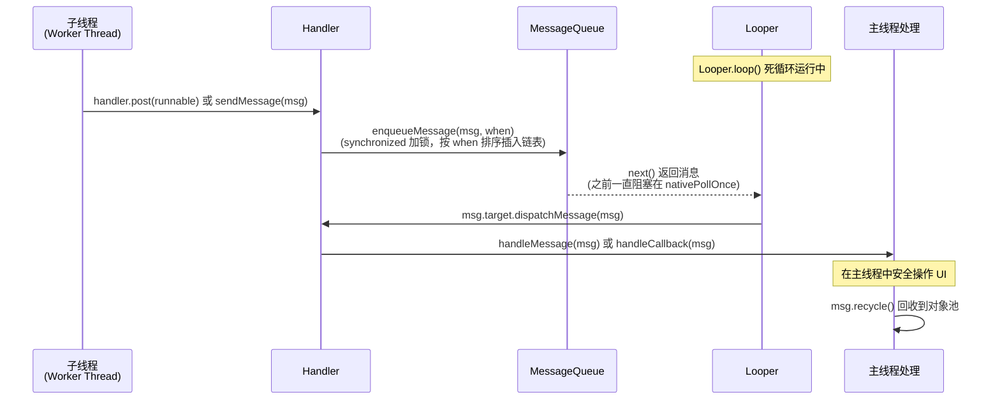

## 1. 概述

| 项目 | 说明 |
|------|------|
| **功能描述** | Handler 是 Android 线程间通信的核心机制，解决"子线程无法直接操作 UI"的根本问题 |
| **涉及进程** | 任意 Android 应用进程内部 |
| **核心类** | `Handler`、`Looper`、`MessageQueue`、`Message` |

---

## 2. Handler 解决的核心问题

### 2.1 问题一：Android UI 工具包不是线程安全的

Android 的 View 体系**没有加锁**。如果多个线程同时操作 View（一个在 measure，另一个在改 text），会出现数据竞争、界面撕裂、崩溃。

**源码证据** — `ViewRootImpl.java:13635`：

```java
void checkThread() {
    Thread current = Thread.currentThread();
    if (mThread != current) {
        throwCalledFromWrongThreadException();
    }
}
```

`ViewRootImpl.java:13647`：

```java
"Only the original thread that created a view hierarchy can touch its views."
```

每次 `requestLayout()`（行 3422）、`invalidateChildInParent()`（行 3469）都会调用 `checkThread()`。**在子线程直接操作 UI 会直接崩溃。**

---

### 2.2 问题二：为什么不给 View 加锁？

| 方案 | 优点 | 缺点 |
|------|------|------|
| **多线程 + 锁** | 任何线程都能操作 UI | 锁竞争导致卡顿；死锁风险高；代码复杂度大增；16ms 内完成绘制更难保证 |
| **单线程 + 消息队列（Handler）** | 无锁，性能高；无死锁；模型简单 | 需要线程切换机制 |

Android 选择了**单线程模型** — 所有 UI 操作在主线程串行执行，用 Handler 将其他线程的请求"投递"到主线程。

---

### 2.3 问题三：子线程如何与主线程通信？

这是 Handler 存在的直接原因。典型场景：

```
子线程（网络请求/数据库查询）
  → 得到结果
  → 需要更新 UI
  → 不能直接操作 View（会崩溃）
  → 通过 Handler.post() / sendMessage() 投递到主线程
  → 主线程 Looper 取出消息，在主线程执行 UI 更新
```

---

## 3. Handler 机制的四个核心组件

### 3.1 架构总览

```
┌─────────────────────────────────────────────────────┐
│                    主线程 (UI Thread)                  │
│                                                       │
│  ┌──────────┐    ┌──────────────┐    ┌───────────┐  │
│  │  Looper   │───>│ MessageQueue │───>│  Handler   │  │
│  │  loop()   │    │   next()     │    │ dispatch() │  │
│  │  无限循环  │    │   按时间排序  │    │ 处理消息    │  │
│  └──────────┘    └──────────────┘    └───────────┘  │
│       ↑                 ↑                            │
└───────┼─────────────────┼────────────────────────────┘
        │                 │
   死循环取消息      enqueueMessage()
                          │
                   ┌──────┴───────┐
                   │    子线程      │
                   │  handler.post │
                   │  sendMessage  │
                   └──────────────┘
```

### 3.2 组件职责

| 组件 | 源码位置 | 核心职责 |
|------|---------|---------|
| **Message** | `Message.java` | 消息载体，包含 `what`/`arg1`/`arg2`/`obj`/`callback`/`target`(Handler)/`when`(时间戳) |
| **MessageQueue** | `MessageQueue.java` | 按 `when` 时间排序的单链表，`enqueueMessage()` 入队，`next()` 阻塞取消息 |
| **Looper** | `Looper.java:398` | 死循环调用 `mQueue.next()` 取消息，调用 `msg.target.dispatchMessage()` 分发 |
| **Handler** | `Handler.java:128` | 发送消息（`sendMessage`/`post`）+ 处理消息（`dispatchMessage` → `handleMessage`） |

### 3.3 核心字段 — Message

| 字段 | 行号 | 类型 | 作用 |
|------|------|------|------|
| `what` | 63 | `int` | 用户定义的消息码，标识消息类型 |
| `arg1` | 70 | `int` | 轻量整型参数 1 |
| `arg2` | 77 | `int` | 轻量整型参数 2 |
| `obj` | 89 | `Object` | 任意对象载荷 |
| `target` | 205 | `Handler` | 目标 Handler（由谁处理） |
| `callback` | 208 | `Runnable` | 通过 `post()` 投递时携带的 Runnable |
| `when` | 194 | `long` | 预定分发时间（`SystemClock.uptimeMillis`） |
| `next` | 212 | `Message` | 链表指针，指向队列中下一条消息 |

---

## 4. 调用链

### 4.1 主线程 Looper 初始化（App 启动时）

| 步骤 | 类.方法() | 文件:行号 | 说明 |
|------|----------|----------|------|
| 1 | `ActivityThread.main()` | `ActivityThread.java:10435` | 进程入口 |
| 2 | `Looper.prepareMainLooper()` | `Looper.java:169` → `ActivityThread.java:10495` | 创建主线程 Looper（不可 quit） |
| 3 | `new ActivityThread()` | `ActivityThread.java:10497` | 内部创建 H Handler |
| 4 | `Looper.loop()` | `Looper.java:398` → `ActivityThread.java:10511` | **进入死循环，永不返回** |

**源码** `ActivityThread.main()`：

```java
public static void main(String[] args) {
    Looper.prepareMainLooper();              // 行 10495: 创建主线程 Looper
    ActivityThread thread = new ActivityThread();
    thread.attach(false, startSeq);          // 行 10498: 与 AMS 建立连接
    sMainThreadHandler = thread.getHandler(); // 行 10501: 获取 H Handler
    Looper.loop();                           // 行 10511: 死循环，永不返回
    throw new RuntimeException("Main thread loop unexpectedly exited");
}
```

### 4.2 Looper 核心循环

**源码** `Looper.loop()`（Looper.java:398）：

```java
public static void loop() {
    final Looper me = myLooper();
    // ...
    for (;;) {                                    // 死循环
        if (!loopOnce(me, ident, thresholdOverride)) {
            return;
        }
    }
}
```

**源码** `Looper.loopOnce()`（Looper.java:238）：

```java
private static boolean loopOnce(final Looper me, ...) {
    Message msg = me.mQueue.next();               // 行 240: 阻塞取消息（可能休眠）
    if (msg == null) {
        return false;                             // 队列退出
    }
    // ...
    msg.target.dispatchMessage(msg);              // 行 316: 分发给目标 Handler
    // ...
}
```

### 4.3 消息发送 → 处理完整链路

| 步骤 | 类.方法() | 文件:行号 | 线程 |
|------|----------|----------|------|
| 1 | `handler.sendMessage(msg)` 或 `handler.post(runnable)` | `Handler.java:714` / `491` | **子线程** |
| 2 | `Handler.sendMessageAtTime()` | `Handler.java` | 子线程 |
| 3 | `MessageQueue.enqueueMessage(msg, when)` | `MessageQueue.java:719` | 子线程（synchronized 加锁） |
| 4 | `Looper.loopOnce()` → `mQueue.next()` | `Looper.java:240` | **主线程** |
| 5 | `msg.target.dispatchMessage(msg)` | `Looper.java:316` | 主线程 |
| 6 | `Handler.dispatchMessageImpl()` | `Handler.java:137` | 主线程 |
| 7 | `handleCallback(msg)` 或 `handleMessage(msg)` | `Handler.java:138-146` | 主线程 |

---

## 5. 消息分发优先级

`Handler.dispatchMessageImpl()`（Handler.java:137）的分发逻辑：

```java
public void dispatchMessageImpl(Message msg) {
    if (msg.callback != null) {        // ① 优先: Message 自带的 Runnable (来自 handler.post())
        handleCallback(msg);
    } else {
        if (mCallback != null) {       // ② 其次: Handler 构造时传入的 Callback
            if (mCallback.handleMessage(msg)) {
                return;
            }
        }
        handleMessage(msg);            // ③ 最后: Handler 子类重写的 handleMessage()
    }
}
```

**分发优先级**: `msg.callback`（Runnable）> `mCallback`（Handler.Callback）> `handleMessage()`（子类重写）

---

## 6. 时序图



---

## 7. Framework 中 Handler 的实际应用

Handler 不仅是给 App 开发者用的工具，它是 **Framework 自身的核心运转机制**。

### 7.1 ActivityThread.H — 四大组件生命周期调度

`ActivityThread.java:2873` 定义了内部 Handler 类 `H`，处理来自 AMS 的所有生命周期指令：

```java
class H extends Handler {
    public static final int BIND_APPLICATION        = 110;  // 绑定 Application
    public static final int RECEIVER                = 113;  // 处理广播
    public static final int CREATE_SERVICE          = 114;  // 创建 Service
    public static final int EXECUTE_TRANSACTION     = 159;  // 执行生命周期事务(含 Activity)
    public static final int RELAUNCH_ACTIVITY       = 160;  // 重建 Activity
    // ... 30+ 种消息类型
}
```

**工作原理**: AMS 通过 Binder 调用 App 进程的 ApplicationThread（Binder 线程），ApplicationThread 再通过 H Handler 将消息投递到主线程执行。这就是为什么 `onCreate`/`onResume` 等回调都在主线程。

```
AMS (system_server 进程)
  → Binder IPC
    → ApplicationThread.scheduleTransaction()    [Binder 线程]
      → mH.sendMessage(EXECUTE_TRANSACTION)      [Binder 线程 → 主线程]
        → TransactionExecutor.execute()           [主线程]
          → Activity.onCreate() / onResume()      [主线程]
```

### 7.2 ViewRootImpl — 绘制调度

`ViewRootImpl` 通过 Handler 调度 `performTraversals()`（measure/layout/draw），确保绘制在主线程执行。

### 7.3 Choreographer — VSync 信号驱动

`Choreographer` 通过 Handler 接收 VSync 信号并在主线程回调动画/绘制。

---

## 8. Looper 的关键设计

### 8.1 ThreadLocal 绑定

**源码** `Looper.java:96`：

```java
static final ThreadLocal<Looper> sThreadLocal = new ThreadLocal<Looper>();
```

`Looper.prepare()`（行 154）：

```java
private static void prepare(boolean quitAllowed) {
    if (sThreadLocal.get() != null) {
        throw new RuntimeException("Only one Looper may be created per thread");
    }
    sThreadLocal.set(new Looper(quitAllowed));
}
```

- 每个线程最多一个 Looper（通过 ThreadLocal 保证）
- 主线程 Looper 通过 `prepareMainLooper()` 创建，`quitAllowed = false`（不允许退出）
- 子线程 Looper 通过 `prepare()` 创建，`quitAllowed = true`（可以退出）

### 8.2 阻塞与唤醒

`MessageQueue.next()` 中：
- 没有消息时调用 `nativePollOnce()` 阻塞（底层 epoll_wait），**不消耗 CPU**
- 新消息入队时调用 `nativeWake()` 唤醒（底层 eventfd write）

这就是为什么主线程虽然在 `Looper.loop()` 死循环，却不会卡死或占满 CPU。

---

## 9. 对比总结

| 维度 | 无 Handler（假设方案） | 有 Handler（实际方案） |
|------|---------------------|---------------------|
| **UI 操作** | 多线程竞争，需要加锁 | 单线程串行，无锁 |
| **线程安全** | 锁竞争、死锁风险 | 无死锁，天然安全 |
| **性能** | 锁开销，难保证 16ms | 无锁，高效 |
| **代码复杂度** | 每次操作都要考虑同步 | 消息投递，模型简单 |
| **定时任务** | 需要额外定时器 | `postDelayed()` 内建支持 |
| **跨线程通信** | 需要自建管道/回调 | `sendMessage()`/`post()` 统一方案 |
| **系统组件调度** | 无统一方案 | AMS → Binder → H Handler → 主线程 |

---

## 10. 要点总结

- **Handler 解决的根本问题**: 在 UI 单线程模型下，提供安全、高效的线程间通信机制
- **为什么不用锁**: 锁会导致性能下降、死锁风险，且难以在 16ms 帧时间内完成绘制
- **核心机制**:
  - `MessageQueue` 是线程安全的（`enqueueMessage` 加 synchronized），是唯一的同步点
  - `Looper.loop()` 是单线程消费者，无需加锁
  - `nativePollOnce()`/`nativeWake()` 基于 epoll 实现高效阻塞/唤醒，不浪费 CPU
- **Framework 自身依赖 Handler**:
  - `ActivityThread.H` 调度四大组件生命周期（30+ 种消息类型）
  - `ViewRootImpl` 调度绘制
  - `Choreographer` 调度 VSync 信号

**一句话总结**: Handler 的本质是**用消息队列实现的线程间通信机制**，核心目的是在保证 UI 单线程安全的前提下，让其他线程能把工作"投递"到主线程执行。

---

## 11. 推荐阅读

- **gityuan.com**: [Android消息机制](https://gityuan.com/tags/#handler) — Handler/Looper/MessageQueue 系列
- **源码关键位置**:
  - `ActivityThread.java:10495-10511` — 主线程 Looper 的初始化和启动
  - `Looper.java:238-316` — `loopOnce()` 取消息并分发的核心逻辑
  - `Handler.java:137-147` — 消息分发的三级优先级
  - `ViewRootImpl.java:13635` — `checkThread()` UI 线程检查
  - `ActivityThread.java:2873-2950` — H Handler 定义的 30+ 种生命周期消息