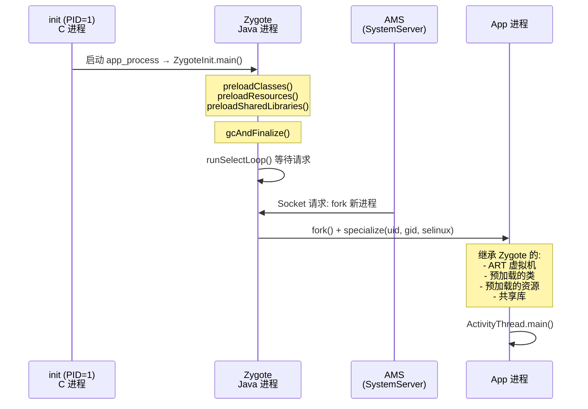

## 1. 概述

| 项目 | 说明 |
|------|------|
| **功能描述** | Android 通过 Zygote 进程 fork 所有应用进程和 SystemServer，而非由 init 进程直接 fork |
| **涉及进程** | init (PID=1) → Zygote → App 进程 / SystemServer |
| **核心类** | `ZygoteInit`、`Zygote`、`ZygoteServer`、`ZygoteConnection` |

---

## 2. 根本原因：三大核心优势

### 2.1 预加载共享，节省内存和时间（最核心）

Zygote 在 fork 之前预加载了大量公共资源。

**源码**: `ZygoteInit.java:169-221`

```java
static void preload(TimingsTraceLog bootTimingsTraceLog) {
    preloadClasses();                    // 数千个 Java 类
    cacheNonBootClasspathClassLoaders(); // 类加载器缓存
    Resources.preloadResources();        // 系统资源 (drawable/layout/string)
    nativePreloadAppProcessHALs();       // HAL 库
    maybePreloadGraphicsDriver();        // GPU 驱动
    preloadSharedLibraries();            // 共享 .so 库
    preloadTextResources();              // 文本/字体资源
    WebViewFactory.prepareWebViewInZygote(); // WebView 引擎
}
```

**fork 使用 COW（Copy-On-Write）机制**，子进程直接共享父进程的内存页：

- 100 个 App 进程共享同一份预加载类/资源的**物理内存**
- 如果用 init fork，每个进程都要独立加载一遍 → 内存和启动时间成倍增长

---

### 2.2 fork 速度极快

**源码**: `Zygote.java:395-425`

```java
static int forkAndSpecialize(int uid, int gid, int[] gids, ...) {
    ZygoteHooks.preFork();
    int pid = nativeForkAndSpecialize(uid, gid, gids, ...);
    // fork 后子进程已具备完整的 ART 虚拟机
    ZygoteHooks.postForkCommon();
    return pid;
}
```

fork Zygote = **直接获得一个已初始化好 ART 虚拟机 + 预加载类库的进程**。

而 init 是纯 C/C++ 进程，不包含 JVM：

| 方式 | 步骤 | 耗时 |
|------|------|------|
| **Zygote fork** | `fork()` → 特化 (uid/gid/selinux) → 运行 | **毫秒级** |
| **init fork（假设）** | `fork()` → `exec(app_process)` → 启动 ART VM → 加载类库 → 加载资源 → 运行 | **秒级** |

---

### 2.3 Zygote 是 Java 世界的"模板进程"

**源码**: `ZygoteInit.main()`（行 976）

```
ZygoteInit.main()
  → ZygoteHooks.startZygoteNoThreadCreation()  // 禁止创建线程（保证 fork 安全）
  → preload(...)                                 // 预加载所有公共资源
  → gcAndFinalize()                              // GC 清理，减少脏页
  → ZygoteServer.runSelectLoop()                 // 等待 AMS 发来的 fork 请求
```

init 进程是**所有进程的祖先**，但它是 C 进程，职责是：

- 解析 `init.rc`
- 启动 native daemon（servicemanager、surfaceflinger 等）
- 属性服务（property_service）
- 僵尸进程回收

**init 不具备 Java 运行环境**，无法作为 Java 应用进程的模板。

---

## 3. 调用链

| 步骤 | 类.方法() | 文件路径 | 进程/线程 |
|------|----------|---------|----------|
| 1 | `init` 解析 `init.rc` | `system/core/init/` | init 进程 |
| 2 | 启动 `app_process` | `frameworks/base/cmds/app_process/app_main.cpp` | init → zygote |
| 3 | `ZygoteInit.main()` | `frameworks/base/core/java/com/android/internal/os/ZygoteInit.java:976` | Zygote 主线程 |
| 4 | `preload()` | `ZygoteInit.java:169` | Zygote 主线程 |
| 5 | `ZygoteServer.runSelectLoop()` | `ZygoteServer.java` | Zygote 主线程 |
| 6 | AMS 发送 fork 请求 | `ZygoteProcess.java` | system_server |
| 7 | `Zygote.forkAndSpecialize()` | `Zygote.java:395` | Zygote 主线程 |
| 8 | `nativeForkAndSpecialize()` | `com_android_internal_os_Zygote.cpp` | Zygote → 子进程 |
| 9 | `ActivityThread.main()` | `ActivityThread.java` | App 主线程 |

---

## 4. 时序图



---

## 5. 核心数据结构

| 类名 | 关键字段/方法 | 作用 |
|------|-------------|------|
| `ZygoteInit` | `preload()`, `main()` | Zygote 入口，执行预加载并启动 Socket 监听 |
| `ZygoteServer` | `runSelectLoop()` | 监听来自 AMS 的 fork 请求 |
| `ZygoteConnection` | `processCommand()` | 解析 fork 参数并调用 `Zygote.forkAndSpecialize()` |
| `Zygote` | `forkAndSpecialize()`, `forkSystemServer()` | 实际执行 fork + 进程特化 |
| `ZygoteHooks` | `preFork()`, `postForkCommon()` | fork 前后的 ART 虚拟机状态管理 |

---

## 6. 对比总结

| 维度 | init fork（假设方案） | Zygote fork（实际方案） |
|------|---------------------|----------------------|
| **语言环境** | C/C++，无 JVM | 已初始化的 ART 虚拟机 |
| **预加载** | 无，每次从零加载 | 数千个类 + 系统资源已就绪 |
| **内存占用** | N 个进程 × 独立加载 = 巨大 | N 个进程 COW 共享 = 极小 |
| **启动速度** | 秒级（需 exec + VM 初始化） | 毫秒级（fork 即用） |
| **fork 安全** | 多线程环境 fork 不安全 | `startZygoteNoThreadCreation()` 保证单线程 |
| **职责定位** | 系统初始化 / 守护进程管理 | Java 应用进程孵化器 |

---

## 7. 要点总结

- **设计意图**: Zygote 本质是一个**预热好的 Java 进程模板**，通过 fork + COW 实现内存共享和快速启动
- **关键机制**:
  - `preload()` 将公共类/资源加载到内存 → fork 后所有子进程共享这份物理内存
  - `ZygoteHooks.startZygoteNoThreadCreation()` 确保 fork 时只有单线程，避免死锁
  - `gcAndFinalize()` 在 fork 前清理垃圾，减少不必要的 COW 脏页拷贝
- **init 不适合的本质原因**: init 是 C 进程，不包含 JVM/ART，无法为 Java 应用提供运行时模板

---

## 8. 推荐阅读

- **gityuan.com**: [理解 Android 进程创建流程](https://gityuan.com/tags/#zygote) — Zygote 系列文章
- **源码关键注释**: `ZygoteInit.java:1042-1044` — 说明 preload 必须在 fork 前完成
- **fork 入口**: `Zygote.java:395` — `forkAndSpecialize` 是理解 fork 特化过程的最佳入口