---
layout: post
title:  "View 绘制深度分析：HWUI · RenderThread · SurfaceFlinger"
date:   2026-05-12 00:00:00 +0800
categories: android
tag: HWUI
---

> 基于 Android 16 AOSP 源码实测  
> 核心路径：`frameworks/base/libs/hwui/` · `frameworks/native/services/surfaceflinger/`

---

## 一、总体流水线概览

```mermaid
flowchart LR
    subgraph UI["UI 线程 (Main Thread)"]
        direction TB
        CHO["Choreographer\ndoFrame()"]
        PTV["ViewRootImpl\nperformTraversals()"]
        URDL["updateRootDisplayList()\n录制 DisplayList"]
        DFD["DrawFrameTask.drawFrame()\n投递任务 → 阻塞等待"]
    end

    subgraph RT["RenderThread (进程单例)"]
        direction TB
        SFS["syncFrameState()\n① 同步阶段"]
        UBK["unblockUiThread()\n② 解锁UI线程"]
        CTX["CanvasContext::draw()\n③ GPU渲染阶段"]
        SWAP["swapBuffers()\n④ 提交Buffer"]
    end

    subgraph SF["SurfaceFlinger 进程"]
        direction TB
        LATCH["commit()\nlatchBufferImpl()"]
        COMP["composite()\nCompositionEngine::present()"]
        HWC2["HWComposer / RenderEngine"]
        DISP["Display 输出"]
    end

    CHO -->|"TRAVERSAL回调"| PTV
    PTV --> URDL
    URDL -->|"postAndWait()"| DFD
    DFD -->|"投递 run() 任务"| SFS
    SFS -->|"prepareTextures 成功\n早期解锁"| UBK
    UBK -.->|"解除阻塞"| DFD
    SFS --> CTX
    CTX --> SWAP
    SWAP -->|"queueBuffer\nBLASTBufferQueue"| LATCH
    LATCH --> COMP
    COMP --> HWC2
    HWC2 --> DISP
```

---

## 二、UI 线程详解

### 2.1 Choreographer 触发入口

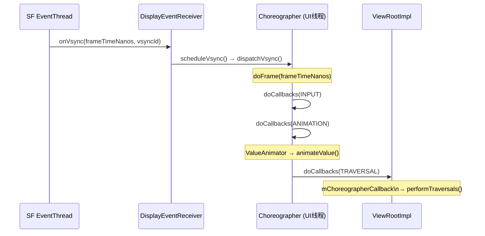

**关键源码**：`Choreographer.java`
- `VSYNC_SOURCE_APP`：App 侧 Vsync 源，与 SF 的 `VSYNC_SOURCE_SURFACE_FLINGER` 不同
- RenderThread 有独立的 `AChoreographer`，通过 `extendedFrameCallback` 接收 Vsync，用于驱动 RT 侧动画（`RenderThread.cpp:58`）

---

### 2.2 performTraversals 核心流程

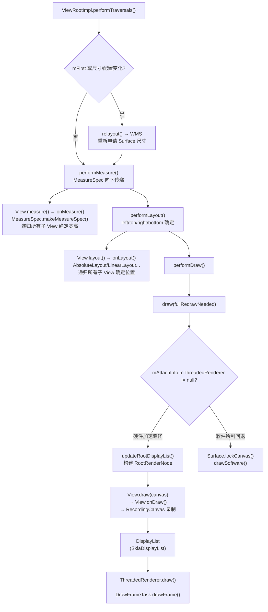

**关键细节**：
- `updateRootDisplayList()` 在 UI 线程执行，只"录制"指令，不执行 GPU 操作
- `RecordingCanvas` → `SkiaRecordingCanvas` 将 `onDraw()` 中的 Canvas 调用序列化为 `SkiaDisplayList`（`pipeline/skia/SkiaRecordingCanvas.cpp`）
- 每个 `View` 对应一个 `RenderNode`，`RenderNode` 持有 `DisplayList`

---

### 2.3 UI 线程的同步阻塞点

```mermaid
sequenceDiagram
    participant UI as UI线程
    participant DFT as DrawFrameTask
    participant RT as RenderThread

    UI->>DFT: drawFrame()
    DFT->>DFT: mSyncQueued = systemTime()
    DFT->>RT: queue().post([this]{ run(); })
    DFT->>DFT: mSignal.wait(mLock) ← 阻塞
    Note over RT: syncFrameState() 执行
    alt prepareTextures == true (纹理上传成功)
        RT->>UI: unblockUiThread() ← 早期解锁
        Note over UI: UI线程继续处理下一帧
        Note over RT: 异步执行 draw()
    else prepareTextures == false (纹理缓存满)
        Note over RT: draw() 执行完毕后才解锁
        RT->>UI: unblockUiThread() ← 延迟解锁
        Note over UI: 此帧 UI 线程被阻塞到绘制完成
    end
```

> **源码位置**：`DrawFrameTask.cpp:82-127`  
> `syncFrameState()` 返回 `info.prepareTextures`，即 `CacheManager` 纹理缓存是否充足（默认 24 MB）。缓存耗尽时触发 UI 线程超时等待，是 Jank 的常见原因之一。

---

## 三、RenderThread 详解

### 3.1 RenderThread 初始化

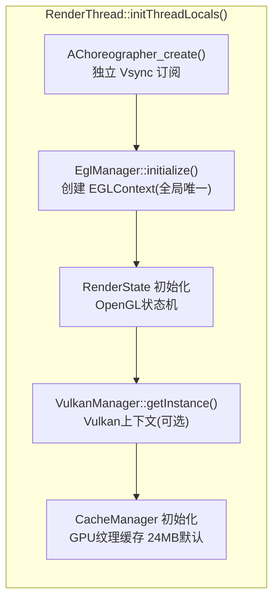

**单例保证**（`RenderThread.cpp:158-166`）：
```cpp
RenderThread& RenderThread::getInstance() {
    [[clang::no_destroy]] static sp<RenderThread> sInstance = []() {
        sp<RenderThread> thread = sp<RenderThread>::make();
        thread->start("RenderThread");
        return thread;
    }();
    return *sInstance;
}
```
- 进程内唯一，所有 Window 共享同一个 `EGLContext`
- 不同 Window 切换靠切换 `EGLSurface`（`CanvasContext::makeCurrent()`）

---

### 3.2 syncFrameState — 同步阶段详解

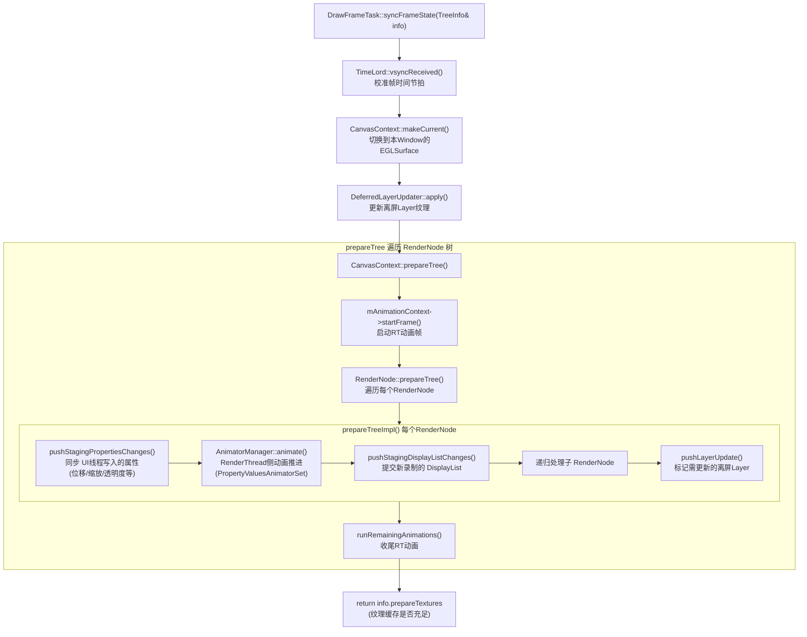

**关键概念 — Staging 双缓冲**：
- `RenderNode` 维护两套属性：**Staging**（UI线程写）和 **Active**（RT线程读）
- `pushStagingPropertiesChanges()` 是同步阶段把 Staging → Active 的时刻
- 这是 UI 线程和 RenderThread 唯一的数据交换窗口

---

### 3.3 CanvasContext::draw — GPU 渲染阶段

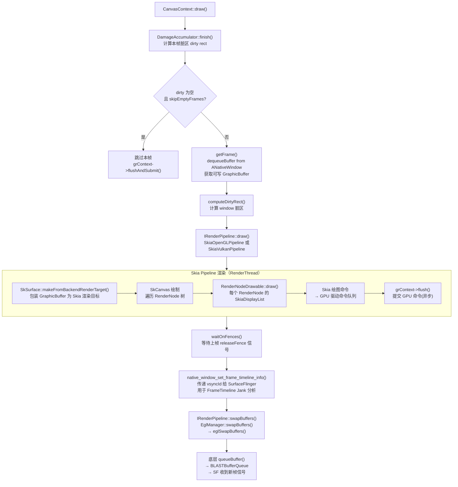

---

### 3.4 Pipeline 双路径

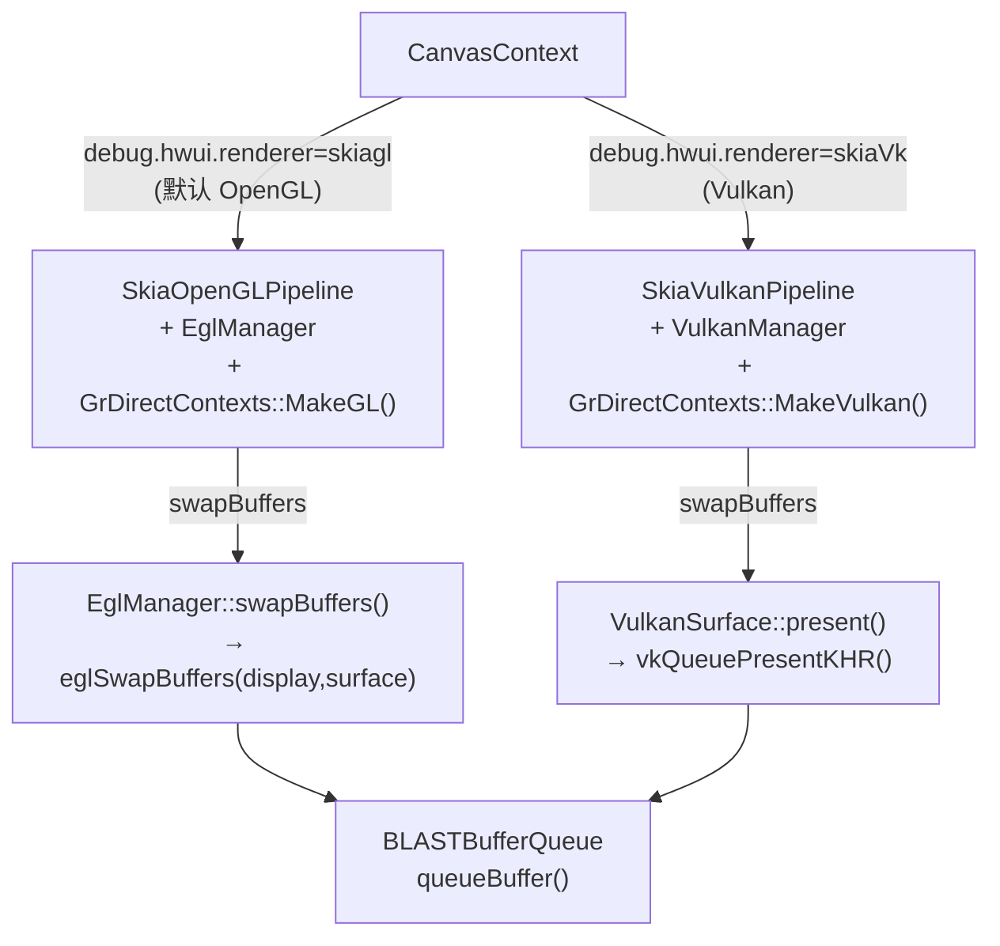

---

## 四、SurfaceFlinger 侧详解（Android 16）

> Android 16 SF 主循环采用 `commit()` + `composite()` 两阶段，取代旧的 `onMessageInvalidate/onMessageRefresh`

### 4.1 SF 主线程调度

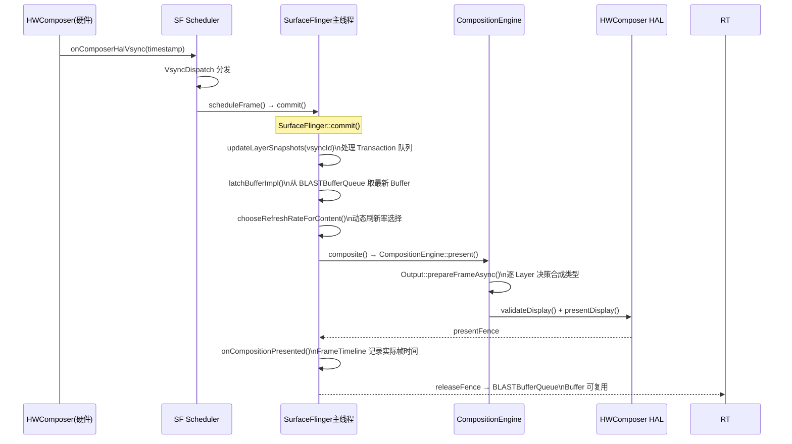

---

### 4.2 commit() 阶段 — latchBuffer

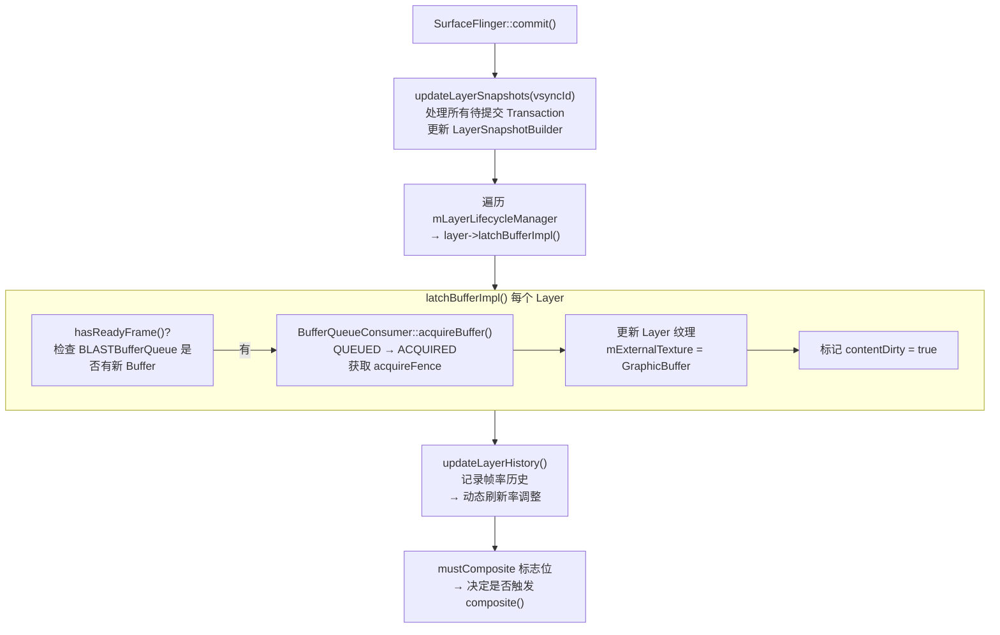

---

### 4.3 composite() 阶段 — 合成决策

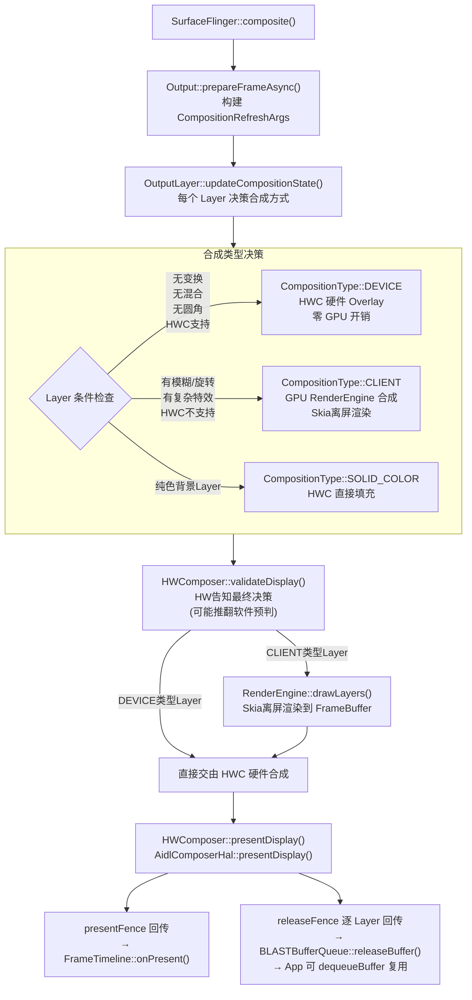

---

### 4.4 RenderEngine — SF 侧 GPU 合成

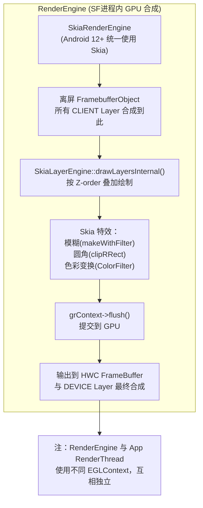

> **RenderEngine 与 HWUI 的区别**：
> - **HWUI RenderThread**：在 App 进程内，渲染单个 App 的 View 树，输出到 `GraphicBuffer`
> - **SF RenderEngine**：在 SF 进程内，将多个 App 的 `GraphicBuffer`（作为纹理）合成到最终 FrameBuffer

---

## 五、完整跨进程时序图

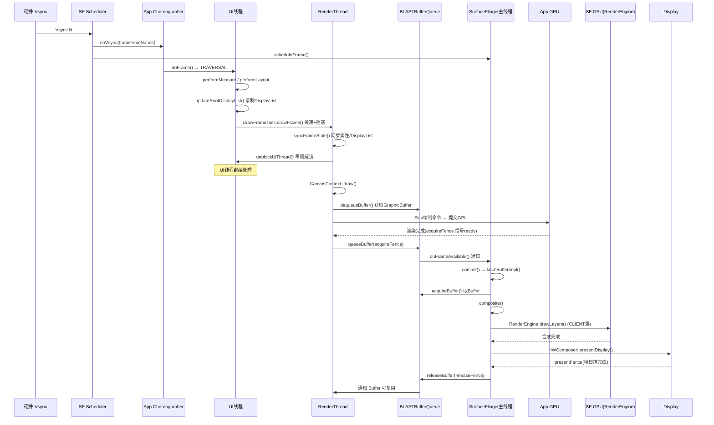

---

## 六、RenderThread 侧动画 vs UI 线程动画

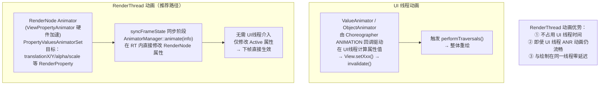

**关键源码路径**：
- `RenderNode.cpp:248` → `mAnimatorManager.animate(info)` 在 MODE_FULL 时执行
- `AnimationContext.cpp::runRemainingAnimations()` 处理 RT 动画收尾
- `RenderThread.cpp:73-96` → `frameCallback()` RT 侧有独立 Vsync 驱动

---

## 七、帧时序与 FrameTimeline

```mermaid
gantt
    title 单帧时间线（60Hz，16.67ms/帧）
    dateFormat x
    axisFormat %Lms

    section UI线程
    doFrame-INPUT+ANIMATION+TRAVERSAL    :ui1, 0, 4
    阻塞等待 syncFrameState               :crit, ui2, 4, 6

    section RenderThread
    syncFrameState-同步属性+prepareTree   :rt1, 4, 6
    早期解锁 UI 线程                       :milestone, rt2, 6, 0
    CanvasContext-draw-Skia录制           :rt3, 6, 9
    eglSwapBuffers-queueBuffer            :rt4, 9, 10

    section GPU App进程
    Skia GPU 渲染 GraphicBuffer           :gpu1, 9, 13

    section SurfaceFlinger
    latchBuffer                           :sf1, 10, 11
    HWC-RenderEngine合成                  :sf2, 11, 14
    presentDisplay                        :milestone, sf3, 14, 0

    section Display
    屏幕扫描输出 VsyncN+1                  :disp1, 16, 17
```

### FrameTimeline Jank 分类

| Jank 类型 | 根因 | 定位工具 |
|-----------|------|---------|
| `App Deadline Missed` | UI线程/RT超过 deadline | `FrameInfo` + Perfetto `RenderThread` track |
| `SF Deadline Missed` | SF commit/composite 超时 | Perfetto `SurfaceFlinger` track |
| `Buffer Stuffing` | App 生产过快，BLASTBufferQueue 堆积 | `latchBufferImpl` 中 `hasReadyFrame()` 计数 |
| `Prediction Error` | Vsync 预测偏差 | `FrameTimeline::FrameTimelineInfo` |
| `GPU 超时` | GPU 渲染超过 Vsync 周期 | `acquireFence` 等待时间 |

---

## 八、关键函数调用链速查

### App 侧（UI线程 → RenderThread）

```
Choreographer.doFrame()
  └─ ViewRootImpl.performTraversals()
       ├─ performMeasure() → View.onMeasure()
       ├─ performLayout() → View.onLayout()
       └─ performDraw()
            └─ draw()
                 └─ ThreadedRenderer.draw()                    [frameworks/base/core/java/android/graphics/HardwareRenderer.java]
                      └─ updateRootDisplayList()               [UI线程]
                           └─ View.draw() → onDraw()
                                └─ RecordingCanvas / SkiaRecordingCanvas
                                     └─ SkiaDisplayList 录制完成
                      └─ RenderProxy.syncAndDrawFrame()        [跨线程]
                           └─ DrawFrameTask.drawFrame()        [UI线程投递 + 阻塞]
                                └─ DrawFrameTask.run()         [RenderThread执行]
                                     ├─ syncFrameState()
                                     │    └─ CanvasContext.prepareTree()
                                     │         └─ RenderNode.prepareTree()
                                     │              └─ prepareTreeImpl()
                                     │                   ├─ pushStagingPropertiesChanges()  ← Staging→Active
                                     │                   ├─ AnimatorManager.animate()       ← RT动画
                                     │                   └─ pushStagingDisplayListChanges() ← DisplayList同步
                                     ├─ unblockUiThread()      ← 早期解锁
                                     └─ CanvasContext.draw()
                                          ├─ getFrame()          ← dequeueBuffer
                                          ├─ RenderPipeline.draw()
                                          │    └─ SkiaOpenGL/VulkanPipeline.draw()
                                          │         └─ Skia → GPU
                                          └─ swapBuffers()       ← eglSwapBuffers → queueBuffer
```

### SF 侧（commit + composite）

```
onComposerHalVsync()
  └─ Scheduler::scheduleFrame()
       └─ SurfaceFlinger::commit()                     [SurfaceFlinger.cpp:2691]
            ├─ updateLayerSnapshots()                  ← 处理 Transaction，更新 LayerSnapshotBuilder
            └─ latchBufferImpl()                       ← acquireBuffer from BLASTBufferQueue [2648]
       └─ SurfaceFlinger::composite()                  [SurfaceFlinger.cpp:2839]
            └─ CompositionEngine::present()
                 ├─ Output::prepareFrameAsync()         ← 每个 Layer 决策 DEVICE/CLIENT
                 ├─ HWComposer::validateDisplay()       ← HW 最终仲裁
                 ├─ RenderEngine::drawLayers()          ← CLIENT Layer GPU 合成
                 └─ HWComposer::presentDisplay()        ← AidlComposerHal → 扫描输出
       └─ SurfaceFlinger::onCompositionPresented()     [SurfaceFlinger.cpp:3263]
            └─ FrameTimeline::onPresent()              ← 记录实际帧时间
            └─ layer->releasePreviousBuffer()          ← releaseFence 回传 App
```

---

## 九、关键源文件索引

| 文件 | 路径 | 核心内容 |
|------|------|---------|
| `DrawFrameTask.cpp` | `base/libs/hwui/renderthread/` | UI线程↔RT同步点，`syncFrameState()`，早期解锁逻辑 |
| `CanvasContext.cpp` | `base/libs/hwui/renderthread/` | 帧渲染主体：`prepareTree()`，`draw()`，`swapBuffers()` |
| `RenderThread.cpp` | `base/libs/hwui/renderthread/` | 进程单例，独立 Choreographer，EGL/Vulkan 上下文初始化 |
| `RenderNode.cpp` | `base/libs/hwui/` | `prepareTreeImpl()`：属性同步，RT动画，DisplayList提交 |
| `SkiaOpenGLPipeline.cpp` | `base/libs/hwui/pipeline/skia/` | OpenGL路径 draw + swapBuffers |
| `SkiaVulkanPipeline.cpp` | `base/libs/hwui/pipeline/skia/` | Vulkan路径 draw + present |
| `SurfaceFlinger.cpp` | `native/services/surfaceflinger/` | `commit()`，`composite()`，`latchBufferImpl()` |
| `BLASTBufferQueue.cpp` | `native/libs/gui/` | 跨进程 Buffer 传递，acquireFence/releaseFence |
| `Output.cpp` | `native/services/surfaceflinger/CompositionEngine/` | 合成类型决策，`prepareFrameAsync()` |
| `ViewRootImpl.java` | `base/core/java/android/view/` | `performTraversals()`，`performDraw()`，`draw()` |
