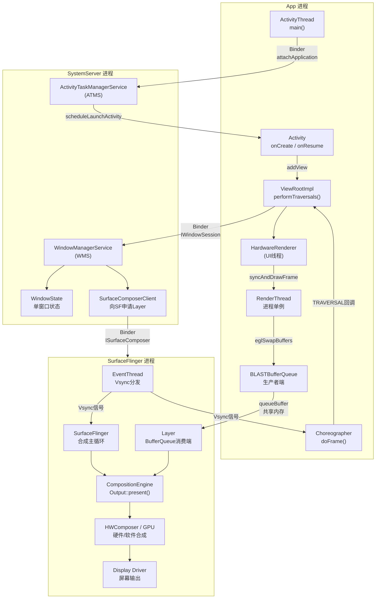
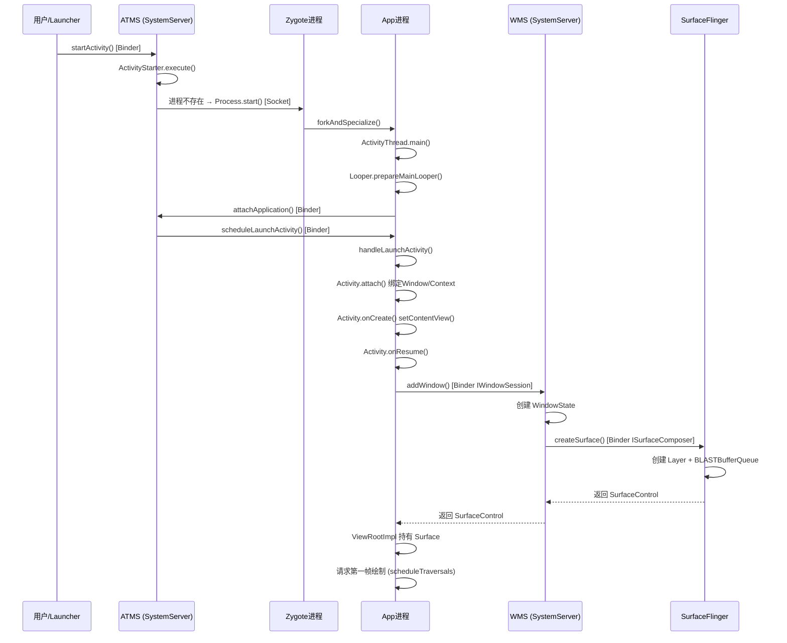
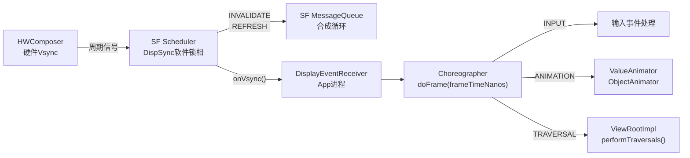
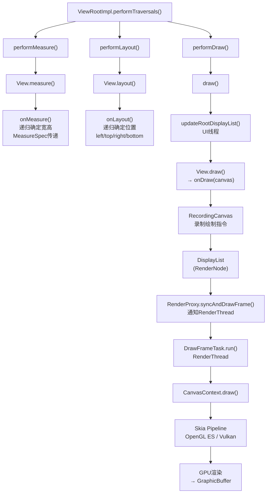
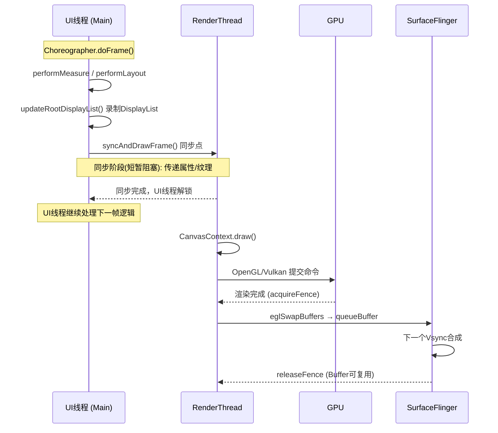
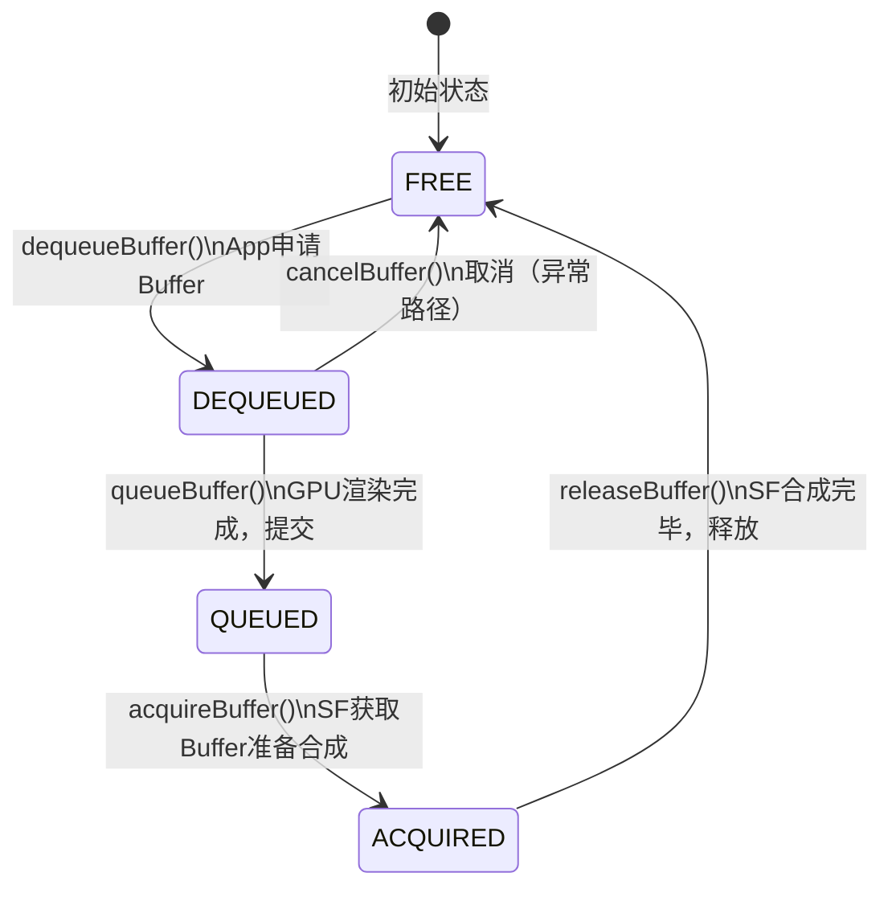
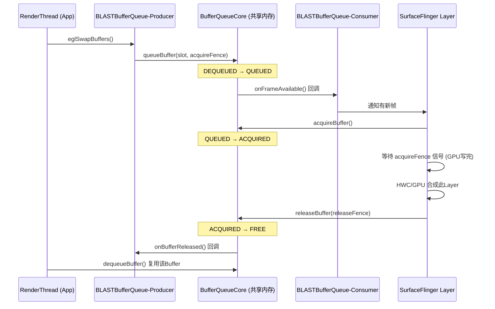
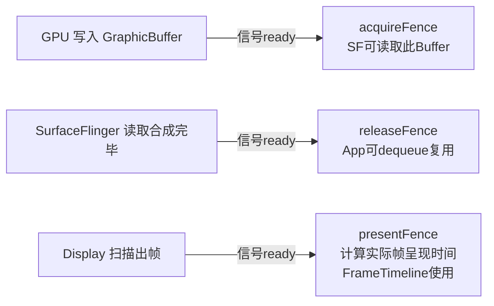
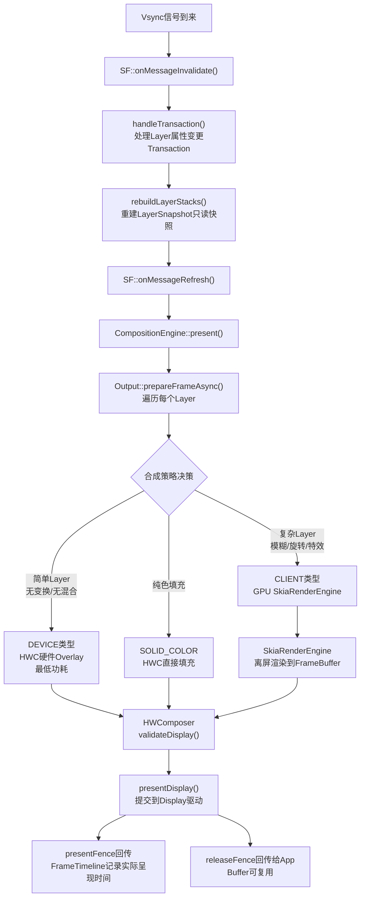
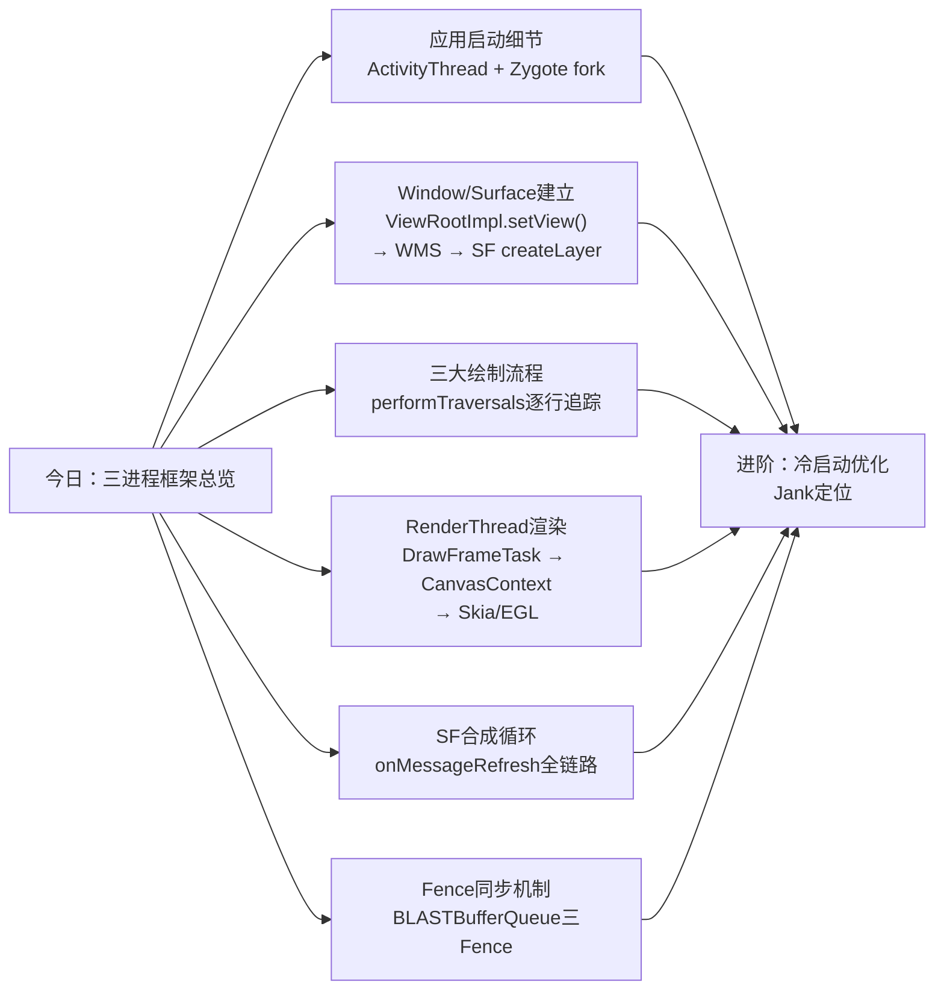

> 基于 Android 16 AOSP（`J:\aosp16`）源码分析

---

## 一、三进程全景架构

---

## 二、应用启动流程

### 2.1 完整启动时序

### 2.2 阶段说明

| 阶段 | 核心操作 | 关键文件 |
|------|---------|---------|
| **进程孵化** | Launcher → ATMS → Zygote fork | `ActivityStarter.java` `ActivityTaskSupervisor.java` |
| **Application初始化** | ActivityThread.main() → attach() | `ActivityThread.java` |
| **Activity创建** | onCreate() → setContentView() → View树构建 | `Activity.java` |
| **Window注册** | ViewRootImpl.setView() → WMS.addWindow() | `ViewRootImpl.java` `WindowManagerService.java` |
| **Surface创建** | WMS → SF创建Layer → BLASTBufferQueue | `SurfaceComposerClient.cpp` `BLASTBufferQueue.cpp` |
| **首帧绘制** | scheduleTraversals → Vsync → performTraversals | `ViewRootImpl.java` |

---

## 三、View 绘制流程

### 3.1 Vsync 驱动链

### 3.2 performTraversals — 三大流程

### 3.3 UI线程与RenderThread分工

---

## 四、图形框架流水线（Buffer生命周期）

### 4.1 BufferQueue 状态机

### 4.2 BLASTBufferQueue 跨进程流转

### 4.3 Fence 三种类型

---

## 五、SurfaceFlinger 合成循环

---

## 六、关键类与文件索引

### App 进程

| 类 | 文件路径 | 核心职责 |
|---|---------|---------|
| `ActivityThread` | `base/core/java/android/app/ActivityThread.java` | 主线程Loop，分发Activity生命周期 |
| `ViewRootImpl` | `base/core/java/android/view/ViewRootImpl.java` | 窗口根，驱动measure/layout/draw |
| `Choreographer` | `base/core/java/android/view/Choreographer.java` | Vsync回调分发，帧时序协调 |
| `HardwareRenderer` | `base/core/java/android/graphics/HardwareRenderer.java` | UI线程侧硬件加速接口 |
| `RenderProxy` | `base/libs/hwui/renderthread/RenderProxy.cpp` | UI线程→RenderThread任务提交 |
| `DrawFrameTask` | `base/libs/hwui/renderthread/DrawFrameTask.cpp` | 单帧同步点，跨线程协调 |
| `CanvasContext` | `base/libs/hwui/renderthread/CanvasContext.cpp` | 渲染上下文，管理EGLSurface |
| `RenderNode` | `base/libs/hwui/RenderNode.cpp` | 场景图节点，持有DisplayList |

### SystemServer 进程

| 类 | 文件路径 | 核心职责 |
|---|---------|---------|
| `ActivityTaskManagerService` | `base/services/core/java/com/android/server/wm/ActivityTaskManagerService.java` | Activity调度主体 |
| `ActivityStarter` | `base/services/core/java/com/android/server/wm/ActivityStarter.java` | 启动流程控制 |
| `WindowManagerService` | `base/services/core/java/com/android/server/wm/WindowManagerService.java` | 窗口管理主体 |
| `WindowState` | `base/services/core/java/com/android/server/wm/WindowState.java` | 单窗口服务端状态 |
| `RootWindowContainer` | `base/services/core/java/com/android/server/wm/RootWindowContainer.java` | Window容器树根节点 |

### SurfaceFlinger 进程

| 类 | 文件路径 | 核心职责 |
|---|---------|---------|
| `SurfaceFlinger` | `native/services/surfaceflinger/SurfaceFlinger.cpp` | 合成主循环、Transaction处理 |
| `Layer` | `native/services/surfaceflinger/Layer.cpp` | Layer属性、Buffer生命周期 |
| `LayerSnapshot` | `native/services/surfaceflinger/FrontEnd/LayerSnapshot.cpp` | 合成用只读快照 |
| `Output` | `native/services/surfaceflinger/CompositionEngine/Output.cpp` | 合成循环主体 |
| `HWComposer` | `native/services/surfaceflinger/DisplayHardware/HWComposer.cpp` | HWC接口总入口 |
| `EventThread` | `native/services/surfaceflinger/Scheduler/EventThread.cpp` | Vsync事件分发 |
| `FrameTimeline` | `native/services/surfaceflinger/FrameTimeline/FrameTimeline.cpp` | 帧时间线追踪，Jank分析 |

### libgui（跨进程共享）

| 类 | 文件路径 | 核心职责 |
|---|---------|---------|
| `BLASTBufferQueue` | `native/libs/gui/BLASTBufferQueue.cpp` | App→SF异步缓冲队列（主路径） |
| `BufferQueueCore` | `native/libs/gui/BufferQueueCore.cpp` | FREE/DEQUEUED/QUEUED/ACQUIRED状态机 |
| `SurfaceComposerClient` | `native/libs/gui/SurfaceComposerClient.cpp` | 创建Layer、提交Transaction |

> 路径前缀均为 `J:\aosp16\frameworks\`

---

## 七、核心概念速查

### 合成类型

| 类型 | 路径 | 适用场景 |
|------|------|---------|
| `DEVICE` | HWC 硬件 Overlay | 普通矩形Layer，无特殊混合 |
| `CLIENT` | GPU SkiaRenderEngine | 模糊、旋转、复杂特效 |
| `SOLID_COLOR` | HWC 纯色填充 | 背景色Layer |
| `CURSOR` | 硬件光标Plane | 系统鼠标光标 |

### 关键数据结构

| 对象 | 所在进程 | 含义 |
|------|---------|------|
| `ViewRootImpl` | App | 窗口根，驱动 measure/layout/draw |
| `Surface` (Java) | App | ANativeWindow 的 Java 封装 |
| `BLASTBufferQueue` | App/Native | Android 12+ 统一跨进程缓冲路径 |
| `SurfaceControl` | App + WMS | Layer客户端句柄，Transaction操作对象 |
| `WindowState` | SystemServer | WMS侧单窗口状态 |
| `Layer` | SurfaceFlinger | SF内部合成单元，持有BufferQueue消费端 |
| `LayerSnapshot` | SurfaceFlinger | 每帧合成前生成的只读快照 |
| `GraphicBuffer` | 跨进程共享 | GPU可直接读写的ION/DMA-BUF缓冲区 |
| `Fence` | 跨进程传递 | GPU同步信号（acquire/release/present） |

---

## 八、后续深入方向

