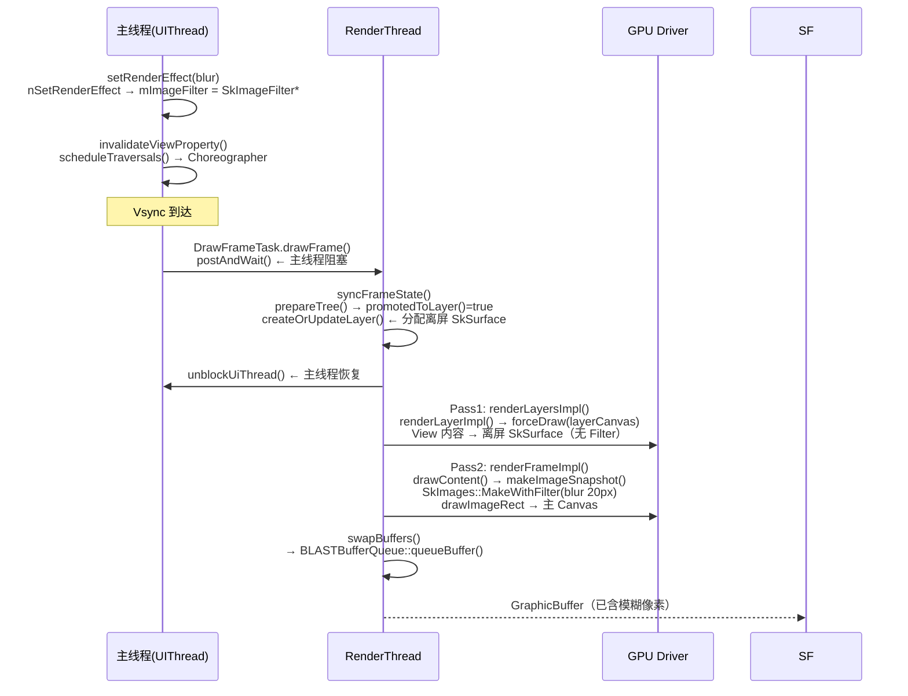
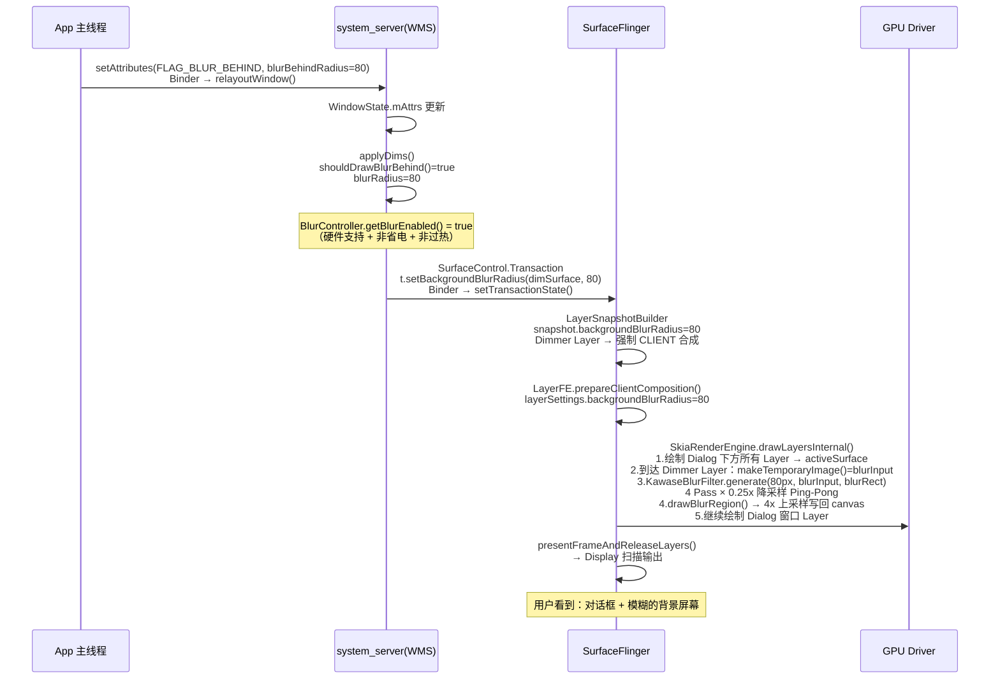

---
layout: post
title:  "View 模糊 & Window 模糊实例验证"
date:   2026-05-17 00:00:00 +0800
categories: android
tag: Blur
---

> 基于 Android 16 AOSP 源码（`J:\aosp16`）  
> 前置阅读：`docs/view_blur_analysis.md` · `docs/window_blur_analysis.md`  
> 目标：用两个具体场景，把分析文档中每个结论落到真实代码行

---

## 例一：View 模糊 — `ImageView.setRenderEffect(blur)`

### 场景描述

```java
// 在 Activity.onCreate() 中，对一个 ImageView 施加模糊效果
ImageView imageView = findViewById(R.id.avatar);
imageView.setRenderEffect(
    RenderEffect.createBlurEffect(20f, 20f, Shader.TileMode.CLAMP)
);
```

> **核心问题**：blur 发生在哪个进程？哪个线程？GPU 上的哪一步？

---

### Step 1：App 主线程 — 创建 SkImageFilter 对象

**调用链：**

```
RenderEffect.createBlurEffect(20f, 20f, Shader.TileMode.CLAMP)
```

`RenderEffect.java:112`：

```java
public static RenderEffect createBlurEffect(float radiusX, float radiusY,
        @NonNull TileMode edgeTreatment) {
    return new RenderEffect(
        nativeCreateBlurEffect(radiusX, radiusY, 0, edgeTreatment.nativeInt)
    );
}
```

JNI 落地在 `RenderEffect.cpp:39`：

```cpp
static jlong createBlurEffect(JNIEnv* env, jobject, jfloat radiusX,
        jfloat radiusY, jlong inputFilterHandle, jint edgeTreatment) {
    sk_sp<SkImageFilter> blurFilter =
            SkImageFilters::Blur(
                    Blur::convertRadiusToSigma(radiusX),   // radius → sigma 换算
                    Blur::convertRadiusToSigma(radiusY),
                    static_cast<SkTileMode>(edgeTreatment),
                    sk_ref_sp(inputImageFilter),
                    nullptr);
    return reinterpret_cast<jlong>(blurFilter.release());  // 返回裸指针给 Java
}
```

> **验证点 A**：`RenderEffect` 本质就是一个 `SkImageFilter*`，由 Skia 标准库 `SkImageFilters::Blur` 创建，存在 native heap。`radius → sigma` 换算由 `Blur::convertRadiusToSigma()` 完成（σ ≈ radius × 0.57735）。

---

### Step 2：主线程 — 写入 RenderNode，标记脏区

```java
// View.java:23567
public void setRenderEffect(@Nullable RenderEffect renderEffect) {
    if (mRenderNode.setRenderEffect(renderEffect)) {   // ← 返回 true 代表值变化
        invalidateViewProperty(true, true);            // ← 触发重绘调度
    }
}
```

`RenderNode.java:1010`：

```java
public boolean setRenderEffect(@Nullable RenderEffect renderEffect) {
    return nSetRenderEffect(mNativeRenderNode,
            renderEffect != null ? renderEffect.getNativeInstance() : 0);
}
```

JNI 落地 `android_graphics_RenderNode.cpp:238`：

```cpp
static jboolean android_view_RenderNode_setRenderEffect(
        CRITICAL_JNI_PARAMS_COMMA jlong renderNodePtr, jlong renderEffectPtr) {
    SkImageFilter* imageFilter = reinterpret_cast<SkImageFilter*>(renderEffectPtr);
    // SET_AND_DIRTY 宏：赋值 + 标记 GENERIC 脏位
    return SET_AND_DIRTY(mutateLayerProperties().setImageFilter, imageFilter, RenderNode::GENERIC);
}
```

`RenderProperties.cpp:52`：

```cpp
bool LayerProperties::setImageFilter(SkImageFilter* imageFilter) {
    if (mImageFilter.get() == imageFilter) return false;
    mImageFilter = sk_ref_sp(imageFilter);   // sp<> 持有，保证 RC 正确
    return true;
}
```

> **验证点 B**：`setRenderEffect` 把 `SkImageFilter*` 存入 `RenderNode` 的 `LayerProperties::mImageFilter`，然后通过 `invalidateViewProperty()` → `scheduleTraversals()` → `Choreographer` 注册 TRAVERSAL 回调，等待下一个 Vsync。

---

### Step 3：主线程 Vsync 到达 — `performTraversals()` → 提交到 RenderThread

Vsync 到达后 `Choreographer.doFrame()` → `performTraversals()` → `performDraw()` → `ThreadedRenderer.draw()` → `DrawFrameTask.drawFrame()`（提交任务给 RenderThread，主线程在 `postAndWait()` 处阻塞）。

---

### Step 4：RenderThread — `syncFrameState()` 发现 ImageFilter，晋升为 RenderLayer

`DrawFrameTask.cpp:169`：

```cpp
bool DrawFrameTask::syncFrameState(TreeInfo& info) {
    ...
    mContext->prepareTree(info, mFrameInfo, mSyncQueued, mTargetNode);
    ...
}
```

`prepareTree()` 递归遍历 RenderNode 树，对每个节点调用 `prepareLayer()`：

`RenderNode.cpp:170`：

```cpp
void RenderNode::prepareLayer(TreeInfo& info, uint32_t dirtyMask) {
    LayerType layerType = properties().effectiveLayerType();
    if (CC_UNLIKELY(layerType == LayerType::RenderLayer)) {
        // 需要离屏 Surface，标记脏区上报给父节点
        ...
    }
}
```

`RenderProperties.h:552`（**关键判断**）：

```cpp
bool promotedToLayer() const {
    return mLayerProperties.mType == LayerType::None && fitsOnLayer() &&
           (mComputedFields.mNeedLayerForFunctors
            || mLayerProperties.mImageFilter != nullptr    // ← ImageView 命中这里
            || mLayerProperties.getStretchEffect().requiresLayer()
            || (!isZero(mAlpha) && mAlpha < 1 && mHasOverlappingRendering));
}

LayerType effectiveLayerType() const {
    return CC_UNLIKELY(promotedToLayer()) ? LayerType::RenderLayer : mLayerProperties.mType;
}
```

> **验证点 C**：因为 `mImageFilter != nullptr`，`promotedToLayer()` 返回 true，`effectiveLayerType()` 返回 `LayerType::RenderLayer`。这是**自动晋升**机制——App 没有调用 `setLayerType(LAYER_TYPE_HARDWARE)`，系统因为有 ImageFilter 而自动为这个 View 分配离屏 SkSurface。

`RenderNode.cpp:198`：

```cpp
void RenderNode::pushLayerUpdate(TreeInfo& info) {
    ...
    if (info.canvasContext.createOrUpdateLayer(this, *info.damageAccumulator, info.errorHandler)) {
        damageSelf(info);   // 离屏 Surface 新建/尺寸变化时，强制全量重绘
    }
    ...
}
```

`createOrUpdateLayer()` 会为 ImageView 分配一个独立的 `SkSurface`（大小 = View 的 width × height），存入 `RenderNode::mLayerSurface`。

`syncFrameState()` 完成后调用 `unblockUiThread()`，**主线程恢复**。

---

### Step 5：RenderThread — Pass 1 `renderLayersImpl()` 把 View 内容渲染到离屏 Surface

`SkiaPipeline.cpp:77`：

```cpp
renderLayersImpl(*layerUpdateQueue, opaque);  // Pass 1：先渲染所有需要离屏的 Layer
```

`SkiaPipeline.cpp:81`：

```cpp
bool SkiaPipeline::renderLayerImpl(RenderNode* layerNode, const Rect& layerDamage) {
    SkCanvas* layerCanvas = layerNode->getLayerSurface()->getCanvas(); // 离屏 Surface
    layerCanvas->clear(SK_ColorTRANSPARENT);

    // 在离屏 Canvas 上直接 replay DisplayList（此时 不应用 ImageFilter）
    RenderNodeDrawable root(layerNode, layerCanvas, false /*composeLayer=false*/);
    root.forceDraw(layerCanvas);
    ...
}
```

> **验证点 D**：Pass 1 画到离屏 Surface 时 `composeLayer = false`，不应用 ImageFilter。只是把 ImageView 的像素（头像图片内容）完整地画到 `mLayerSurface`。ImageFilter 延迟到 Pass 2 合成时才施加。

---

### Step 6：RenderThread — Pass 2 `renderFrameImpl()` 合成时施加 blur

`SkiaPipeline.cpp:365`：

```cpp
renderLayersImpl(layers, opaque);         // Pass 1（已完成）
renderFrameImpl(..., canvas, ...);        // Pass 2：合成整帧
```

在 `renderFrameImpl()` 内部，`RenderNodeDrawable::drawContent()` 处理 ImageView 节点（`RenderNodeDrawable.cpp:244`）：

```cpp
// 检测到有离屏 Surface 且是合成模式
if (renderNode->getLayerSurface() && mComposeLayer) {
    SkPaint paint;
    layerNeedsPaint(layerProperties, alphaMultiplier, &paint);

    auto* imageFilter = layerProperties.getImageFilter();  // 取出 blur SkImageFilter
    sk_sp<SkImage> snapshotImage;

    if (!Properties::enableRenderEffectCache) {
        // 对离屏 Surface 拍快照
        snapshotImage = renderNode->getLayerSurface()->makeImageSnapshot();
        if (imageFilter) {
            // ★ 核心：把 imageFilter 施加到快照上
            snapshotImage = SkImages::MakeWithFilter(
                    recordingContext,   // GrDirectContext（GPU 上下文）
                    snapshotImage,      // 输入：View 原始内容
                    imageFilter,        // SkImageFilters::Blur(sigma_x, sigma_y)
                    subset, clipBounds.roundOut(),
                    &srcBounds, &offset);
        }
    } else {
        // 有缓存时走 updateSnapshotIfRequired()，原理相同
        const auto snapshotResult = renderNode->updateSnapshotIfRequired(
                recordingContext, layerProperties.getImageFilter(), clipBounds.roundOut());
        snapshotImage = snapshotResult->snapshot;
        srcBounds = snapshotResult->outSubset;
        offset = snapshotResult->outOffset;
    }

    // 把模糊后的图像画到主 Canvas（EGLSurface，即最终帧缓冲）
    canvas->drawImageRect(snapshotImage, SkRect::Make(srcBounds),
                          SkRect::Make(dstBounds), sampling, &paint,
                          SkCanvas::kStrict_SrcRectConstraint);
}
```

> **验证点 E**：`SkImages::MakeWithFilter()` 是 Skia 提供的 GPU 加速接口，把 `SkImageFilter`（高斯模糊）应用到离屏快照。整个过程提交的是 GPU 指令（通过 `GrDirectContext`），CPU 不做像素计算。

---

### Step 7：`swapBuffers()` → SurfaceFlinger（与 blur 无关）

模糊结果已经写入主 `SkSurface`（对应 App 的 EGLSurface），`swapBuffers()` 把 GraphicBuffer 交给 `BLASTBufferQueue`，SF 正常合成。**SF 侧看不到任何模糊参数**——blur 完全在 App RenderThread 完成。

---

### View 模糊完整时序图



---

### View 模糊关键验证结论

| 结论 | 验证代码位置 |
|------|------------|
| `RenderEffect` 本质是 `SkImageFilter*` | `RenderEffect.cpp:42` `SkImageFilters::Blur(sigma,...)` |
| 有 ImageFilter 自动晋升 RenderLayer | `RenderProperties.h:554` `mImageFilter != nullptr` |
| Pass 1 画内容到离屏 Surface（不加 Filter） | `SkiaPipeline.cpp:81` `composeLayer=false` |
| Pass 2 合成时通过 `MakeWithFilter` 加 blur | `RenderNodeDrawable.cpp:266` `SkImages::MakeWithFilter` |
| 全程在 App RenderThread，SF 不感知 blur | — 无 `layer_state_t.backgroundBlurRadius` 字段变化 |

---

---

## 例二：Window 模糊 — 对话框 `FLAG_BLUR_BEHIND`

### 场景描述

```java
// 创建一个半透明对话框，对话框后面整个屏幕变模糊
AlertDialog dialog = new AlertDialog.Builder(context).setTitle("确认操作").create();
Window window = dialog.getWindow();
window.addFlags(WindowManager.LayoutParams.FLAG_BLUR_BEHIND);
window.getAttributes().setBlurBehindRadius(80);   // 80px 模糊半径
window.setAttributes(window.getAttributes());
dialog.show();
```

> **核心问题**：blur 发生在哪个进程？谁创建了模糊用的 SurfaceControl？SF 如何知道要模糊哪个范围？

---

### Step 1：App 主线程 — LayoutParams 携带 blur 参数

`WindowManager.java:5242`：

```java
public void setBlurBehindRadius(@IntRange(from = 0) int blurBehindRadius) {
    mBlurBehindRadius = blurBehindRadius;
}
```

`window.setAttributes(params)` 触发 `ViewRootImpl.setLayoutParams()`，通过 `relayoutWindow()` Binder 调用把 `LayoutParams`（含 `FLAG_BLUR_BEHIND` + `mBlurBehindRadius=80`）发送给 WMS。

---

### Step 2：system_server — WMS 接收 LayoutParams，`WindowState` 存储

WMS 在 `relayoutWindow()` → `updateWindowAttributesIfNeeded()` 中把新的 `LayoutParams` 更新到 `WindowState.mAttrs`，包括：
- `mAttrs.flags |= FLAG_BLUR_BEHIND`
- `mAttrs.mBlurBehindRadius = 80`

---

### Step 3：WMS — `applyDims()` 触发 Dimmer 调度

WMS 在每次窗口绘制循环（`WindowSurfacePlacer.performSurfacePlacement()`）中调用 `WindowState.applyDims()`：

`WindowState.java:4980`：

```java
private void applyDims() {
    Task task = getTask();
    // FLAG_DIM_BEHIND 或 FLAG_BLUR_BEHIND 任一满足都需要 Dimmer
    if (((mAttrs.flags & FLAG_DIM_BEHIND) != 0 || shouldDrawBlurBehind())
            && mWinAnimator.getShown()
            && !mHidden
            && mTransitionController.canApplyDim(task)) {

        mIsDimming = true;
        final float dimAmount = (mAttrs.flags & FLAG_DIM_BEHIND) != 0 ? mAttrs.dimAmount : 0;
        // ★ 仅当 FLAG_BLUR_BEHIND && BlurController.getBlurEnabled() 时才取半径
        final int blurRadius = shouldDrawBlurBehind() ? mAttrs.getBlurBehindRadius() : 0;
        // 委托给当前 WindowContainer 的 Dimmer
        dimmer.adjustBlurRadius(w, dimAmount, blurRadius);
    }
}

private boolean shouldDrawBlurBehind() {
    // ★ 双重检查：flag + 全局开关
    return (mAttrs.flags & FLAG_BLUR_BEHIND) != 0
        && mWmService.mBlurController.getBlurEnabled();
}
```

`BlurController.getBlurEnabled()` 返回 true 的条件（`BlurController.java:122`）：

```java
final boolean newEnabled = CROSS_WINDOW_BLUR_SUPPORTED    // ro.surface_flinger.supports_background_blur=1
        && !mBlurDisabledSetting                           // Settings.Global.DISABLE_WINDOW_BLURS=0
        && !mInPowerSaveMode                               // 非省电模式
        && !mTunnelModeEnabled                             // 非 Tunnel 视频直通模式
        && !mCriticalThermalStatus;                        // 非严重过热
```

> **验证点 F**：blur 不是无条件生效的。假设当前设备满足条件，`getBlurEnabled()` 返回 true，`blurRadius = 80`。

---

### Step 4：WMS — Dimmer 创建独立 SurfaceControl（关键设计）

`Dimmer.adjustBlurRadius()` 最终到达 `DimmerAnimationHelper.applyChanges()`：

`DimmerAnimationHelper.java:291`：

```java
final SurfaceControl sc = dim.mDimSurface;   // ← Dimmer 自己创建的 SurfaceControl
try {
    t.setAlpha(sc, mCurrentProperties.mAlpha);
    // ★ 把 blur 半径写到 Dimmer 的独立 SurfaceControl，不是 Dialog 窗口的 Surface
    t.setBackgroundBlurRadius(sc, mCurrentProperties.mBlurRadius);
} catch (NullPointerException e) {
    ...
}
```

> **验证点 G**：Blur Behind 用的是 **WMS 创建的独立 Dimmer SurfaceControl**，而不是 Dialog 自身的窗口 Surface。这个 Dimmer Layer 位于 Dialog 窗口下方（Z 序低于 Dialog），尺寸覆盖 Dialog 在屏幕上的投影范围。这就是"背后模糊"能看到 Dialog 下方所有窗口内容的原因。

---

### Step 5：SurfaceControl.Transaction → JNI → Native

`SurfaceControl.java:3764`：

```java
public Transaction setBackgroundBlurRadius(SurfaceControl sc, int radius) {
    checkPreconditions(sc);
    nativeSetBackgroundBlurRadius(mNativeObject, sc.mNativeObject, radius);
    return this;
}
```

`SurfaceComposerClient.cpp:1492`：

```cpp
Transaction& Transaction::setBackgroundBlurRadius(
        const sp<SurfaceControl>& sc, int backgroundBlurRadius) {
    layer_state_t* s = getLayerState(sc);
    s->what |= layer_state_t::eBackgroundBlurRadiusChanged;  // ← 变更标志位
    s->backgroundBlurRadius = backgroundBlurRadius;           // ← 值 = 80
    return *this;
}
```

`transaction.apply()` 通过 Binder 调用 `ISurfaceComposer::setTransactionState()`，进入 SurfaceFlinger 进程。

---

### Step 6：SurfaceFlinger 前端 — `LayerSnapshotBuilder` 构建快照

SF 主线程处理 Transaction，在下一次合成（`composite()`）前：

`LayerSnapshotBuilder.cpp:904`：

```cpp
if (forceUpdate ||
    snapshot.clientChanges &
            (layer_state_t::eBackgroundBlurRadiusChanged | ...)) {
    // ★ 乘以父 Layer alpha（Dimmer 的 alpha 通常是 1.0f，所以值不变）
    snapshot.backgroundBlurRadius = args.supportsBlur
            ? static_cast<int>(parentSnapshot.color.a * (float)requested.backgroundBlurRadius)
            : 0;
    // 值 = 1.0 * 80 = 80
}
```

`args.supportsBlur` 来自 `SurfaceFlinger.cpp:2571`：

```cpp
.supportsBlur = mSupportsBlur,   // ro.surface_flinger.supports_background_blur
```

`mSupportsBlur` 在 SF 初始化时读取（`SurfaceFlinger.cpp:490`）：

```cpp
property_get("ro.surface_flinger.supports_background_blur", value, "0");
mSupportsBlur = atoi(value);   // 必须为 1，否则 blur 永远不生效
```

> **验证点 H**：`snapshot.backgroundBlurRadius = 80`。同时因为 `eBackgroundBlurRadiusChanged` 在 `COMPOSITION_EFFECTS` 掩码内，Dimmer Layer 自动降级为 CLIENT 合成（强制 GPU 路径）。

---

### Step 7：LayerFE — blur 参数传入 RenderEngine

`LayerFE.cpp:158`：

```cpp
switch (targetSettings.blurSetting) {
    case LayerFE::ClientCompositionTargetSettings::BlurSetting::Enabled:
        layerSettings.backgroundBlurRadius = mSnapshot->backgroundBlurRadius; // = 80
        layerSettings.blurRegions = mSnapshot->blurRegions;
        layerSettings.blurRegionTransform = mSnapshot->localTransformInverse.asMatrix4();
        break;
    ...
}
```

---

### Step 8：SkiaRenderEngine — 离屏 Surface + Kawase 模糊

SF 的 `SkiaRenderEngine.drawLayersInternal()` 处理当前帧所有 Layer（从下到上）：

**第一阶段：决定是否需要离屏 Surface（`SkiaRenderEngine.cpp:797`）**

```cpp
for (const auto& layer : layers) {   // 遍历所有 Layer
    if (!layerHasBlur(layer, ctModifiesAlpha)) continue;  // 跳过无 blur 的层

    if (layer.backgroundBlurRadius > 0 &&
        layer.backgroundBlurRadius < mBlurFilter->getMaxCrossFadeRadius()) {
        requiresCompositionLayer = true;   // 80 > 10(maxCrossFade)，跳过此分支
    }
    // 80 >= maxCrossFadeRadius(10)，不需要离屏 Surface
    // break 时 blurCompositionLayer 为 nullptr
}
```

> **验证点 I**：radius=80 超过 `maxCrossFadeRadius=10`，不进入 crossfade 路径，不需要提前创建离屏 Surface。此时用的是 `activeSurface = dstSurface`（直接渲染到目标 AHB）。

**第二阶段：到达 Dimmer Layer 时执行 blur（`SkiaRenderEngine.cpp:888`）**

```cpp
if (mBlurFilter && layerHasBlur(layer, ctModifiesAlpha)) {
    // blurRect = Dimmer Layer 在屏幕坐标系的矩形，裁剪到屏幕边界
    SkRect blurRect = canvas->getTotalMatrix().mapRect(bounds.rect());
    blurRect.intersect(SkRect::Make(canvas->getDeviceClipBounds()));

    if (layer.backgroundBlurRadius > 0) {   // = 80
        SFTRACE_NAME("BackgroundBlur");      // Perfetto 可见此 tag

        // blurInput 从当前 activeSurface（已画了 Dimmer 下方所有 Layer）取快照
        blurInput = activeSurface->makeTemporaryImage();

        // ★ 调用 Kawase 算法：对 blurInput 的 blurRect 区域执行 80px 模糊
        auto blurredImage = mBlurFilter->generate(
                context,
                layer.backgroundBlurRadius,   // = 80
                blurInput,                    // 当前帧已绘内容（Dialog 下方所有窗口）
                blurRect);                    // Dimmer 覆盖的屏幕区域

        // ★ 把模糊结果写回 canvas（覆盖原始内容）
        mBlurFilter->drawBlurRegion(canvas, bounds, 80, 1.0f,
                                    blurRect, blurredImage, blurInput);
    }
}
```

`KawaseBlurFilter.cpp:76`（Kawase 核心）：

```cpp
sk_sp<SkImage> KawaseBlurFilter::generate(SkiaGpuContext* context, const uint32_t blurRadius,
        const sk_sp<SkImage> input, const SkRect& blurRect) const {
    float tmpRadius = (float)blurRadius / 2.0f;           // 80 / 2 = 40
    uint32_t numberOfPasses = min(kMaxPasses, (uint32_t)ceil(tmpRadius)); // min(4, 40) = 4
    float radiusByPasses = tmpRadius / (float)numberOfPasses; // 40 / 4 = 10

    // 降采样到 0.25x：80px 模糊 → 在 20px 大小的 buffer 上操作（16 倍面积减少）
    SkImageInfo scaledInfo = input->imageInfo().makeWH(
            blurRect.width() * kInputScale,    // × 0.25
            blurRect.height() * kInputScale);

    // Pass 1：原图 → 0.25x 降采样 + 第一次 offset=10*0.25=2.5px 模糊
    SkRuntimeShaderBuilder blurBuilder(mBlurEffect);
    blurBuilder.uniform("in_blurOffset") = radiusByPasses * kInputScale; // 10 * 0.25 = 2.5
    sk_sp<SkSurface> surface = context->createRenderTarget(scaledInfo);
    sk_sp<SkImage> tmpBlur = makeImage(surface.get(), &blurBuilder);

    // Pass 2-4：Ping-Pong，offset 递增：5.0、7.5、10.0（均在 0.25x 空间）
    sk_sp<SkSurface> surfaceTwo = surface->makeSurface(scaledInfo);
    for (auto i = 1; i < numberOfPasses; i++) {
        blurBuilder.uniform("in_blurOffset") = (float)i * radiusByPasses * kInputScale;
        tmpBlur = makeImage(surfaceTwo.get(), &blurBuilder);
        swap(surface, surfaceTwo);
    }
    return tmpBlur;   // 返回 0.25x 的模糊纹理
}
```

`BlurFilter.cpp:78`（drawBlurRegion，80 >= maxCrossFade，直接上采样）：

```cpp
void BlurFilter::drawBlurRegion(SkCanvas* canvas, ..., const uint32_t blurRadius, ...) {
    SkPaint paint;
    paint.setAlphaf(blurAlpha);  // = 1.0f

    // 把 0.25x 模糊纹理的矩阵设置为 4x 放大（kInverseInputScale = 4.0）
    const auto blurMatrix = getShaderTransform(canvas, blurRect, kInverseInputScale);
    const auto blurShader = blurredImage->makeShader(SkTileMode::kClamp, SkTileMode::kClamp,
                                                     linearSampling, &blurMatrix);
    if (blurRadius < mMaxCrossFadeRadius) {   // 80 >= 10，走 else
        // crossfade 路径（小半径才用）
    } else {
        paint.setShader(blurShader);   // ★ 直接用模糊纹理（4x 双线性上采样）
    }

    // 绘制到 Dimmer Layer 的区域（effectRegion = Dimmer 覆盖范围）
    if (effectRegion.isRect()) {
        paint.setBlendMode(SkBlendMode::kSrc);   // 完全覆盖原始像素
        canvas->drawRect(effectRegion.rect(), paint);
    }
}
```

> **验证点 J**：
> - 4 Pass Kawase，在 0.25x（面积 1/16）的 buffer 上运行，GPU 负载极低
> - 最终上采样用双线性插值（`SkFilterMode::kLinear`）从 0.25x 放回原尺寸
> - 整个 blur 过程发生在 **SurfaceFlinger 进程的 RenderEngine 线程**，不在 App 进程

---

### Step 9：渲染剩余 Layer — Dialog 窗口画在模糊背景上

`drawLayersInternal()` 继续渲染 Dimmer 之后的 Layer：
- Dimmer Layer（已模糊）→ Dialog 的 SurfaceControl（内容透明，可见模糊背景）→ StatusBar → ...

最终 `presentFrameAndReleaseLayers()` 把帧提交给 Display，用户看到对话框后面的屏幕模糊。

---

### Window 模糊完整时序图



---

### Window 模糊关键验证结论

| 结论 | 验证代码位置 |
|------|------------|
| Blur Behind 用独立 Dimmer SurfaceControl | `DimmerAnimationHelper.java:291` `dim.mDimSurface` |
| 四重开关保护 | `BlurController.java:122` |
| blur 参数通过 `eBackgroundBlurRadiusChanged` 传入 SF | `LayerState.h:239` `SurfaceComposerClient.cpp:1499` |
| `mSupportsBlur=false` 时 `snapshot.backgroundBlurRadius=0` | `LayerSnapshotBuilder.cpp:908` |
| 80px > maxCrossFade(10px)，不需要离屏 Surface | `SkiaRenderEngine.cpp:804` 条件不满足 |
| Kawase 4 Pass × 0.25x | `KawaseBlurFilter.cpp:90` `numberOfPasses=min(4,40)=4` |
| blur 发生在 SF RenderEngine 线程，不在 App | — `drawLayersInternal()` 在 SF 进程的 RE 线程 |

---

## 两种 blur 核心差异对比验证

| 对比维度 | View blur（RenderEffect） | Window blur（FLAG_BLUR_BEHIND） |
|---------|--------------------------|--------------------------------|
| **blur 输入** | View 自身像素（离屏 SkSurface） | Dialog 下方所有 Layer 的合成结果 |
| **blur 执行进程** | App 进程 RenderThread | SurfaceFlinger 进程 RE 线程 |
| **blur 算法** | Skia SkImageFilters::Blur（高斯） | Kawase 多 Pass（默认）|
| **算法位置** | `RenderEffect.cpp:43` | `KawaseBlurFilter.cpp:76` |
| **开关控制** | 无（有 GPU 即可） | `BlurController` + `mSupportsBlur` |
| **SurfaceControl 变化** | 无，同一个 Window Surface | WMS 额外创建 Dimmer SurfaceControl |
| **是否影响 SF 合成类型** | 不影响（App 内部处理） | 强制 CLIENT（GPU）合成 |
| **Perfetto tag** | — | `BackgroundBlur`（`SkiaRenderEngine.cpp:938`） |

---

## 调试验证方法

### 验证 View blur 是否走了 RenderLayer 路径

```bash
# 开启 HWUI 调试，观察 Layer 分配
adb shell setprop debug.hwui.show_layers_updates 1
# 命中 RenderLayer 的 View 会闪烁绿色
```

### 验证 Window blur 参数是否传到 SF

```bash
# 查看 Dimmer Layer 的 backgroundBlurRadius
adb shell dumpsys SurfaceFlinger | grep -A 10 "Dim Layer"
# 期望看到：backgroundBlurRadius=80
```

### 验证 blur 是否实际执行（Perfetto）

```bash
adb shell perfetto -c - --txt -o /data/misc/perfetto-traces/blur.perfetto <<EOF
buffers { size_kb: 32768 }
data_sources { config { name: "linux.ftrace"
  ftrace_config { atrace_categories: "gfx" } } }
duration_ms: 3000
EOF
adb pull /data/misc/perfetto-traces/blur.perfetto
# 在 ui.perfetto.dev 搜索 "BackgroundBlur"（Window blur）
# View blur 在 App 进程搜索 "draw layers"
```

### 验证 BlurController 开关状态

```bash
adb shell dumpsys window | grep -E "mBlurEnabled|BLUR_SUPPORTED"
adb shell getprop ro.surface_flinger.supports_background_blur
# 强制禁用测试
adb shell wm set-blur-disabled 1
# 此时 FLAG_BLUR_BEHIND 无效，但 View.setRenderEffect 仍有效（不受此开关控制）
```
