---
layout: post
title:  "Android 16 View 模糊完整流程深度分析"
date:   2026-05-17 00:00:00 +0800
categories: android
tag: Blur
---

> 基于 Android 16 AOSP 源码（`J:\aosp16`）  
> 覆盖内容：View 绘制 → 模糊渲染 → 纹理关联 → 线程分工 → 跨进程通信 → SF 合成路径

---

## 一、整体架构框图

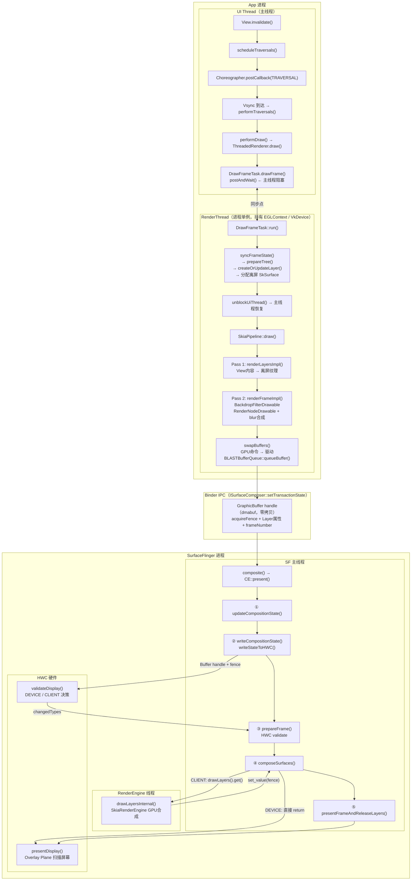

---

## 二、View 绘制过程：从 `invalidate()` 到 RenderThread

### 2.1 主线程驱动链

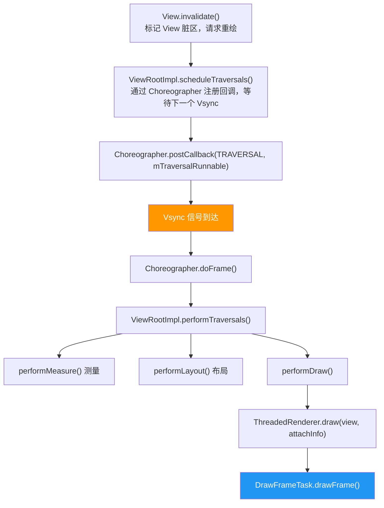

### 2.2 DrawFrameTask 跨线程同步点

> 源码：`frameworks/base/libs/hwui/renderthread/DrawFrameTask.cpp:72`

```cpp
int DrawFrameTask::drawFrame() {
    LOG_ALWAYS_FATAL_IF(!mContext, "Cannot drawFrame with no CanvasContext!");

    mSyncResult = SyncResult::OK;
    // 记录 Sync 排队时间，用于后续帧时间统计
    mSyncQueued = systemTime(SYSTEM_TIME_MONOTONIC);

    // 把任务投递到 RenderThread 队列，主线程在此处阻塞等待
    // 阻塞只持续到 syncFrameState() 完成（同步点），不是等整帧渲染完
    postAndWait();

    return mSyncResult;
}

void DrawFrameTask::postAndWait() {
    AutoMutex _lock(mLock);
    // 向 RenderThread 消息队列投递 run() 任务
    mRenderThread->queue().post([this]() { run(); });
    // 主线程条件变量等待，RenderThread 执行 syncFrameState() 完成后 signal
    mSignal.wait(mLock);
}
```

### 2.3 RenderThread 执行帧绘制

> 源码：`frameworks/base/libs/hwui/renderthread/DrawFrameTask.cpp:89`

```cpp
void DrawFrameTask::run() {
    // ── Phase 1: Sync（UI线程等待此阶段结束）──
    {
        TreeInfo info(TreeInfo::MODE_FULL, *mContext);
        // syncFrameState: 同步 RenderNode 属性，准备离屏 Layer
        // 重要：setRenderEffect(blur) 导致 mImageFilter != null
        // → promotedToLayer() = true → 为该 RenderNode 分配离屏 SkSurface
        canUnblockUiThread = syncFrameState(info);
        canDrawThisFrame = !info.out.skippedFrameReason.has_value();
    }

    // 同步完成后立刻解锁主线程（主线程恢复运行）
    if (canUnblockUiThread) {
        unblockUiThread();  // mSignal.signal()
    }

    // ── Phase 2: Draw（主线程此时已解锁，两线程并行）──
    if (CC_LIKELY(canDrawThisFrame)) {
        context->draw(solelyTextureViewUpdates);
        // draw() 内部依次执行：
        //   1. SkiaPipeline::draw() → renderLayersImpl() + renderFrameImpl()
        //   2. swapBuffers() → 提交到 BLASTBufferQueue
    }
}
```

### 2.4 SkiaPipeline 两 Pass 渲染

> 源码：`frameworks/base/libs/hwui/pipeline/skia/SkiaPipeline.cpp:351`

```cpp
void SkiaPipeline::renderFrame(
        const LayerUpdateQueue& layers,     // 需要更新的离屏 Layer 列表
        const SkRect& clip,
        const std::vector<sp<RenderNode>>& nodes,
        bool opaque,
        const Rect& contentDrawBounds,
        sk_sp<SkSurface> surface,           // 主 Surface（对应 GraphicBuffer）
        const SkMatrix& preTransform) {

    SkCanvas* canvas = tryCapture(surface.get(), nodes[0].get(), layers);

    // ═══ Pass 1：预渲染所有离屏 Layer ═══
    // 把被 setRenderEffect(blur) 提升为 RenderLayer 的 View 内容
    // 渲染到各自的离屏 SkSurface（GPU 纹理）
    renderLayersImpl(layers, opaque);

    // ═══ Pass 2：把所有 RenderNode 合成到主 Surface ═══
    // 此过程中，模糊效果被应用（离屏纹理 → blur → 写入主 Surface）
    renderFrameImpl(clip, nodes, opaque, contentDrawBounds, canvas, preTransform);
}
```

> 源码：`frameworks/base/libs/hwui/pipeline/skia/SkiaPipeline.cpp:385`

```cpp
void SkiaPipeline::renderFrameImpl(...) {
    canvas->androidFramework_setDeviceClipRestriction(clipRestriction);
    canvas->concat(preTransform);

    if (!opaque) {
        canvas->clear(SK_ColorTRANSPARENT);
    }

    // 从根 RenderNode 开始，递归绘制整棵 View 树
    // 每个 RenderNodeDrawable::onDraw() 会处理对应 View 的内容与模糊
    RenderNodeDrawable root(nodes[0].get(), canvas);
    root.draw(canvas);
    // 内部调用链：
    //   RenderNodeDrawable::forceDraw()
    //   └─ drawContent()
    //       ├─ [有离屏层] makeImageSnapshot() → applyBlur → drawImageRect()
    //       └─ [无离屏层] displayList->draw(canvas) 直接回放绘制指令
}
```

---

## 三、模糊的两条代码路径

### 路径 A：`setRenderEffect(blur)` — 内容自身模糊

#### 3A.1 触发 RenderLayer 自动提升

> 源码：`frameworks/base/libs/hwui/RenderProperties.h:552`

```cpp
// 当 mImageFilter != nullptr（即调用了 setRenderEffect(blur)），此函数返回 true
// 意味着这个 RenderNode 虽然 Java 层没设 LAYER_TYPE_HARDWARE，
// 但 Native 层会自动给它分配一块离屏 SkSurface（GPU 纹理），当作硬件 Layer 处理
bool promotedToLayer() const {
    return mLayerProperties.mType == LayerType::None     // 用户没手动设 Layer 类型
           && fitsOnLayer()                               // 尺寸合理，能放入纹理
           && (mComputedFields.mNeedLayerForFunctors      // Functor 特殊需求
               || mLayerProperties.mImageFilter != nullptr  // ← blur 触发此条件
               || mLayerProperties.getStretchEffect().requiresLayer()
               || (alpha < 1 && hasOverlappingRendering));
}

// effectiveLayerType 是判断 Layer 类型的统一入口
// 其他所有地方都调用此函数，而非直接访问 mType
LayerType effectiveLayerType() const {
    return CC_UNLIKELY(promotedToLayer())
               ? LayerType::RenderLayer   // ← 自动提升为 GPU 离屏层
               : mLayerProperties.mType;
}
```

#### 3A.2 分配离屏 GPU 纹理

> 源码：`frameworks/base/libs/hwui/pipeline/skia/SkiaGpuPipeline.cpp:72`

```cpp
bool SkiaGpuPipeline::createOrUpdateLayer(
        RenderNode* node,
        const DamageAccumulator& damageAccumulator,
        ErrorHandler* errorHandler) {

    // 计算离屏纹理尺寸（对齐到 LAYER_SIZE 边界，通常 64px）
    const int surfaceWidth  = ceilf(node->getWidth()  / float(LAYER_SIZE)) * LAYER_SIZE;
    const int surfaceHeight = ceilf(node->getHeight() / float(LAYER_SIZE)) * LAYER_SIZE;

    SkSurface* layer = node->getLayerSurface();

    // 尺寸变化或第一次分配时，创建新的 GPU 离屏 SkSurface
    if (!layer || layer->width() != surfaceWidth || layer->height() != surfaceHeight) {
        SkImageInfo info = SkImageInfo::Make(
                surfaceWidth, surfaceHeight,
                getSurfaceColorType(),   // RGBA_8888 / RGBA_F16 等
                kPremul_SkAlphaType,
                getSurfaceColorSpace());

        // 在 GPU 上分配一块渲染目标纹理（GrTexture）
        // skgpu::Budgeted::kYes 表示纳入 Skia 的 GPU 资源预算管理
        node->setLayerSurface(
                SkSurfaces::RenderTarget(
                        mRenderThread.getGrContext(),  // Skia GPU 上下文
                        skgpu::Budgeted::kYes,
                        info,
                        0,                             // 采样数（0=不抗锯齿）
                        this->getSurfaceOrigin(),
                        &props));
    }
    return true; // 返回 true 表示需要 damageSelf（全量重绘这个 Layer）
}
```

#### 3A.3 Pass 1：View 内容渲染进离屏纹理

> 源码：`frameworks/base/libs/hwui/pipeline/skia/SkiaPipeline.cpp:81`

```cpp
bool SkiaPipeline::renderLayerImpl(RenderNode* layerNode, const Rect& layerDamage) {
    // 取出该 RenderNode 专属的离屏 SkSurface
    SkCanvas* layerCanvas = layerNode->getLayerSurface()->getCanvas();

    int saveCount = layerCanvas->save();

    // 设置 Clip 限制，只绘制脏区，避免整帧重绘
    layerCanvas->androidFramework_setDeviceClipRestriction(layerDamage.toSkIRect());

    // 清空离屏纹理（透明背景）
    layerNode->getSkiaLayer()->hasRenderedSinceRepaint = false;
    layerCanvas->clear(SK_ColorTRANSPARENT);

    // mComposeLayer=false：此时不合成，只把 View 的 DisplayList 画到离屏纹理
    // 注意：此处不应用 imageFilter（模糊），只记录原始像素
    RenderNodeDrawable root(layerNode, layerCanvas, /*composeLayer=*/false);
    root.forceDraw(layerCanvas);
    // 执行完后，离屏 SkSurface 里存的是未模糊的 View 原始内容

    layerCanvas->restoreToCount(saveCount);
    return true;
}
```

Pass 1 完成后立刻 flush GPU 命令：

```cpp
// frameworks/base/libs/hwui/pipeline/skia/SkiaGpuPipeline.cpp:64
if (cachedContext.get()) {
    // 把所有 Layer 的 GPU 绘制命令提交给驱动（但 GPU 实际执行是异步的）
    // flush 是为了让离屏纹理数据准备好，后续 Pass 2 可以读取
    cachedContext->flushAndSubmit();
}
```

#### 3A.4 Pass 2：从离屏纹理取快照 → 应用模糊 → 写入主 Surface

> 源码：`frameworks/base/libs/hwui/pipeline/skia/RenderNodeDrawable.cpp:244`

```cpp
void RenderNodeDrawable::drawContent(SkCanvas* canvas) const {
    RenderNode* renderNode = mRenderNode.get();
    const RenderProperties& properties = renderNode->properties();
    const LayerProperties& layerProperties = properties.layerProperties();

    // ── 进入此分支的条件：
    //    1. getLayerSurface() != null  → 有离屏 SkSurface（由 promotedToLayer 创建）
    //    2. mComposeLayer == true       → 当前是"合成"调用，不是"预渲染"调用
    if (renderNode->getLayerSurface() && mComposeLayer) {

        SkPaint paint;
        layerNeedsPaint(layerProperties, alphaMultiplier, &paint);

        // ── Step 1：从离屏 SkSurface 取 GPU 纹理快照
        //    makeImageSnapshot() 返回的 SkImage 内部持有 GrTexture 引用（零拷贝）
        //    此时 snapshotImage 就是 View 原始内容的 GPU 纹理
        sk_sp<SkImage> snapshotImage = renderNode->getLayerSurface()->makeImageSnapshot();

        auto* imageFilter = layerProperties.getImageFilter();  // 即 blur SkImageFilter

        if (imageFilter) {
            auto subset = SkIRect::MakeWH(srcBounds.width(), srcBounds.height());
            auto recordingContext = canvas->recordingContext();

            // ── Step 2：GPU 执行 ImageFilter（高斯模糊）
            //    输入：snapshotImage（View 内容 GPU 纹理 A）
            //    输出：新的 SkImage（模糊后 GPU 纹理 B），仍在 GPU 显存
            //    底层调用 Skia Ganesh 的 GPU ImageFilter 执行路径：
            //    SkImageFilters::Blur → GrBlurUtils → GPU 着色器卷积
            if (recordingContext) {
                snapshotImage = SkImages::MakeWithFilter(
                        recordingContext,       // GPU 上下文（GrDirectContext）
                        snapshotImage,          // 输入：View 内容纹理
                        imageFilter,            // 模糊算子（SkImageFilters::Blur）
                        subset,                 // 输入范围
                        clipBounds.roundOut(),  // clip 范围（限制模糊扩散边界）
                        &srcBounds,             // 输出：实际有效像素范围
                        &offset);               // 输出：相对偏移（模糊后的位置修正）
            }
        }

        // ── Step 3：把模糊后的 GPU 纹理画到父 Canvas
        //    此时父 Canvas 背后是主 SkSurface，对应最终的 GraphicBuffer
        //    drawImageRect = 用 GPU Shader 对纹理采样后写入目标帧缓冲
        canvas->drawImageRect(
                snapshotImage,
                SkRect::Make(srcBounds),   // 源矩形（模糊图像的有效区域）
                SkRect::Make(dstBounds),   // 目标矩形（View 在屏幕上的位置）
                SkSamplingOptions(SkFilterMode::kLinear),
                &paint,
                SkCanvas::kStrict_SrcRectConstraint);
    }
}
```

---

### 路径 B：`setBackdropRenderEffect(blur)` — 背景模糊

**关键区别**：`mBackdropImageFilter` **不触发** `promotedToLayer()`，View 本身**不创建离屏纹理**。

#### 3B.1 录制时写入 DisplayList 的顺序（主线程执行）

> 源码：`frameworks/base/libs/hwui/pipeline/skia/SkiaRecordingCanvas.cpp:164`

```cpp
void SkiaRecordingCanvas::drawRenderNode(uirenderer::RenderNode* renderNode) {
    // 把 RenderNodeDrawable 加入父 View 的 DisplayList
    mDisplayList->mChildNodes.emplace_back(renderNode, asSkCanvas(), true, mCurrentBarrier);
    auto& renderNodeDrawable = mDisplayList->mChildNodes.back();

    // ── 如果设置了 backdropImageFilter，在 View 内容之前插入 BackdropFilterDrawable
    //    这里是"先记录后执行"的录制模式，顺序决定了后续回放时的绘制顺序
    if (renderNode->stagingProperties().layerProperties().getBackdropImageFilter()) {
        auto* backdropFilterDrawable =
                mDisplayList->allocateDrawable<BackdropFilterDrawable>(renderNode, asSkCanvas());

        // ★ 先记录 BackdropFilterDrawable（运行时先执行：截背景→模糊→画到底部）
        drawDrawable(backdropFilterDrawable);
    }

    // ★ 后记录 RenderNodeDrawable（运行时后执行：View 自身内容画在模糊层上方）
    drawDrawable(&renderNodeDrawable);
}
```

#### 3B.2 运行时：BackdropFilterDrawable 截背景并模糊

> 源码：`frameworks/base/libs/hwui/pipeline/skia/BackdropFilterDrawable.cpp:32`

```cpp
void BackdropFilterDrawable::onDraw(SkCanvas* canvas) {
    const RenderProperties& properties = mTargetRenderNode->properties();

    // 取出 backdropImageFilter（即 blur SkImageFilter）
    auto* backdropFilter = properties.layerProperties().getBackdropImageFilter();
    auto* surface = canvas->getSurface();  // 当前正在绘制的 SkSurface（主 Surface）

    if (!backdropFilter || !surface) return;

    // 计算 View 在屏幕坐标系中的矩形区域
    SkRect srcBounds = SkRect::MakeWH(properties.getWidth(), properties.getHeight());
    float alphaMultiplier = 1.0f;
    RenderNodeDrawable::setViewProperties(properties, canvas, &alphaMultiplier, true);

    SkRect surfaceSubset;
    // 把 View 的局部坐标映射到 Surface（屏幕）坐标
    canvas->getTotalMatrix().mapRect(&surfaceSubset, srcBounds);
    if (!surfaceSubset.intersect(SkRect::MakeWH(surface->width(), surface->height()))) return;

    // ── Step 1：截取当前 Surface 在 View 位置的快照
    //    此时其他 View 已绘制完（backdrop），但本 View 内容还没画
    //    makeImageSnapshot 是 GPU 纹理的引用，不是 CPU 拷贝
    auto backdropImage = surface->makeImageSnapshot(surfaceSubset.roundOut());

    SkIRect imageBounds = SkIRect::MakeWH(backdropImage->width(), backdropImage->height());
    SkIPoint offset;
    SkIRect imageSubset;

    // ── Step 2：GPU 执行模糊（同路径 A 的 Step 2，但输入是背景快照而非离屏纹理）
    if (canvas->recordingContext()) {
        backdropImage = SkImages::MakeWithFilter(
                canvas->recordingContext(),  // Skia GPU 上下文
                backdropImage,              // 输入：View 后面的背景快照
                backdropFilter,             // 模糊 SkImageFilter
                imageBounds, imageBounds,
                &imageSubset, &offset);
    }

    // ── Step 3：把模糊后的背景画回 Canvas（此时是最底层，View 内容尚未绘制）
    canvas->save();
    canvas->resetMatrix();  // 重置矩阵，避免双重变换
    canvas->drawImageRect(
            backdropImage,
            SkRect::Make(imageSubset),
            surfaceSubset,
            SkSamplingOptions(SkFilterMode::kLinear),
            &paint,
            SkCanvas::kFast_SrcRectConstraint);
    canvas->restore();
    // 执行完后：View 区域的 Surface 上已有模糊背景，等待 View 内容叠加
}
```

---

## 四、纹理 / 模糊 / View 内容三者关系图

### 路径 A（`setRenderEffect`）— 内容被模糊

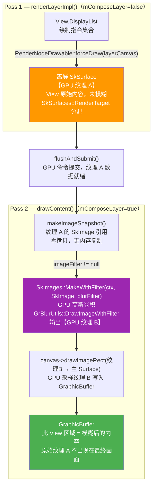

### 路径 B（`setBackdropRenderEffect`）— 背景被模糊，内容叠上去

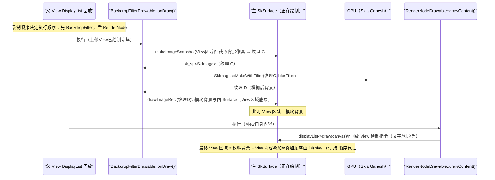

---

## 五、线程分工 UML 序列图

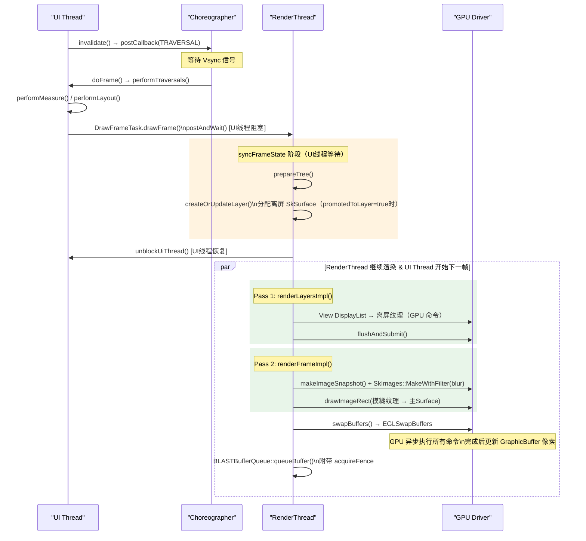

---

## 六、跨进程通信：BLASTBufferQueue + Binder

### 6.1 通信架构

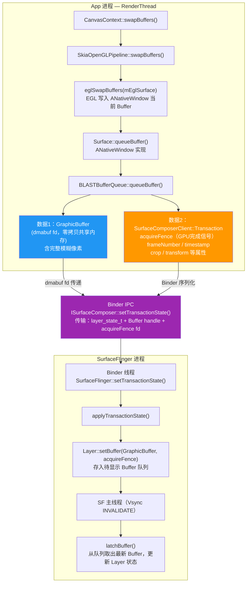

### 6.2 Fence 三件套（保证 Buffer 读写安全）

| Fence 类型 | 语义 | 使用方 |
|-----------|------|--------|
| `acquireFence` | App GPU 完成写入 GraphicBuffer 的信号 | SF/HWC 拿到 Buffer 后等此 Fence 才能读取像素 |
| `releaseFence` | SF（或 HWC）完成读取 GraphicBuffer 的信号 | App 下次 `dequeueBuffer` 时等此 Fence，确保 SF 不再读 |
| `presentFence` | HWC 把当前帧扫描到屏幕的信号 | 用于计算实际 present 时间，上报 FrameTimeline |

---

## 七、SF 合成路径：`present()` 阶段序列

> 源码：`frameworks/native/services/surfaceflinger/CompositionEngine/src/Output.cpp:440`

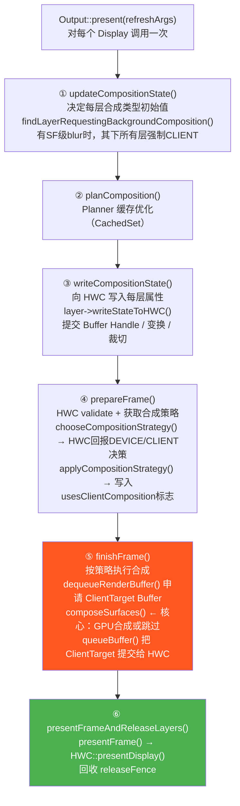

---

## 八、HWC 合成类型决策

### 8.1 HWC validate 流程

> 源码：`frameworks/native/services/surfaceflinger/CompositionEngine/src/Display.cpp:248`

```cpp
bool Display::chooseCompositionStrategy(
        std::optional<HWComposer::DeviceRequestedChanges>* outChanges) {

    auto& hwc = getCompositionEngine().getHwComposer();

    // SF 发送 validateDisplay 到 HWC HAL（通过 AIDL Binder IPC）
    // HWC 硬件根据自身 Overlay Plane 数量、格式支持等决定每层的最终类型
    // 结果放入 outChanges->changedTypes（哪些层需要改成 CLIENT）
    hwc.getDeviceCompositionChanges(
            *halDisplayId,
            requiresClientComposition,  // SF 是否已经强制要求 CLIENT
            getState().earliestPresentTime,
            getState().expectedPresentTime,
            getState().frameInterval,
            outChanges);
}
```

### 8.2 应用决策结果

> 源码：`frameworks/native/services/surfaceflinger/CompositionEngine/src/Display.cpp:289`

```cpp
void Display::applyCompositionStrategy(const std::optional<DeviceRequestedChanges>& changes) {
    if (changes) {
        // 把 HWC 回报的变更类型写入各 OutputLayer 的 hwcCompositionType
        applyChangedTypesToLayers(changes->changedTypes);
        applyDisplayRequests(changes->displayRequests);
        applyLayerRequestsToLayers(changes->layerRequests);
    }

    auto& state = editState();
    // 只要有一层是 CLIENT，usesClientComposition = true
    state.usesClientComposition = anyLayersRequireClientComposition();
    // 只要有一层不是 CLIENT，usesDeviceComposition = true
    state.usesDeviceComposition  = !allLayersRequireClientComposition();
}
```

### 8.3 每层的判断依据

> 源码：`frameworks/native/services/surfaceflinger/CompositionEngine/src/OutputLayer.cpp:941`

```cpp
bool OutputLayer::requiresClientComposition() const {
    const auto& state = getState();
    // 两种情况需要 CLIENT 合成：
    // 1. state.hwc 为空（没有 HWC 支持，如虚拟屏）
    // 2. HWC 回报的 hwcCompositionType == Composition::CLIENT（HWC 放弃该层）
    return !state.hwc || state.hwc->hwcCompositionType == Composition::CLIENT;
}
```

---

## 九、`composeSurfaces()`：GPU 合成的核心决策

> 源码：`frameworks/native/services/surfaceflinger/CompositionEngine/src/Output.cpp:1337`

```cpp
std::optional<base::unique_fd> Output::composeSurfaces(
        const Region& debugRegion,
        std::shared_ptr<renderengine::ExternalTexture> tex,
        base::unique_fd& fd) {

    const auto& outputState = getState();

    // ★ 路径 A：全部 DEVICE 合成 → 不需要 GPU，直接返回空 fd
    //   此时 SF 这一帧完全没有 GPU 工作
    //   HWC 直接读取每个 Layer 的 GraphicBuffer（dmabuf），硬件 Overlay 合成后扫描到屏幕
    if (!outputState.usesClientComposition) {
        setExpensiveRenderingExpected(false);
        return base::unique_fd();   // 返回空 fd，HWC 可直接 present
    }

    // ★ 路径 B：有 CLIENT 合成 → 需要 RenderEngine 执行 GPU 合成
    ALOGV("hasClientComposition");

    renderengine::DisplaySettings clientCompositionDisplay =
            generateClientCompositionDisplaySettings(tex);

    // 收集所有 CLIENT 类型 Layer 的绘制参数（LayerSettings）
    // 包含：Buffer handle / 变换矩阵 / 透明区域 / alpha / dataspace 等
    std::vector<LayerFE::LayerSettings> clientCompositionLayers =
            generateClientCompositionRequests(supportsProtectedContent,
                                              clientCompositionDisplay.outputDataspace,
                                              clientCompositionLayersFE);

    // 判断是否有 SF 级模糊，有则拉高 GPU 频率避免合成超时
    const bool expensiveBlurs = mLayerRequestingBackgroundBlur != nullptr;
    if (expensiveBlurs || /*有色彩空间转换*/) {
        setExpensiveRenderingExpected(true);
    }

    // ★ 关键调用：把 GPU 合成任务投递给 RenderEngine 线程，阻塞等待命令提交完成
    auto fenceResult = renderEngine
                           .drawLayers(clientCompositionDisplay,
                                       clientRenderEngineLayers,
                                       tex,          // ClientTarget Buffer
                                       std::move(fd))
                           .get();                   // ← .get() 阻塞 SF 主线程

    // 返回 GPU fence（GPU 渲染完成信号），给 HWC 用于同步
    const auto fence = std::move(fenceResult).value_or(Fence::NO_FENCE);
    return base::unique_fd(fence->dup());
}
```

---

## 十、RenderEngine 线程模型

### 10.1 类继承结构

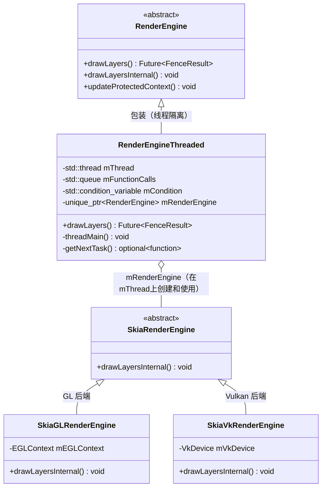

### 10.2 `drawLayers()` 任务投递

> 源码：`frameworks/native/libs/renderengine/threaded/RenderEngineThreaded.cpp:262`

```cpp
ftl::Future<FenceResult> RenderEngineThreaded::drawLayers(
        const DisplaySettings& display,
        const std::vector<LayerSettings>& layers,
        const std::shared_ptr<ExternalTexture>& buffer,
        base::unique_fd&& bufferFence) {

    // 创建 promise/future 对，用于跨线程传递结果（GPU fence）
    const auto resultPromise = std::make_shared<std::promise<FenceResult>>();
    std::future<FenceResult> resultFuture = resultPromise->get_future();

    int fd = bufferFence.release();  // 取出原始 fd，避免所有权问题

    {
        std::lock_guard lock(mThreadMutex);
        mNeedsPostRenderCleanup = true;

        // ★ 把真正的 GPU 工作打包成 lambda，推入队列
        //   注意：lambda 按值捕获所有参数，避免悬空引用
        mFunctionCalls.push(
            [resultPromise, display, layers, buffer, fd]
            (renderengine::RenderEngine& instance) {
                SFTRACE_NAME("REThreaded::drawLayers");
                instance.updateProtectedContext(layers, {buffer.get()});

                // ← 在 RenderEngine 线程调用 SkiaRenderEngine::drawLayersInternal()
                //   这里才真正提交 Skia/GPU 命令给驱动
                instance.drawLayersInternal(
                        std::move(resultPromise),  // promise 所有权转移
                        display, layers, buffer,
                        base::unique_fd(fd));
            });
    }

    mCondition.notify_one();  // 唤醒 RenderEngine 线程的 threadMain()
    return resultFuture;      // 立即返回 future，不阻塞调用方
}
```

### 10.3 RenderEngine 线程主循环

> 源码：`frameworks/native/libs/renderengine/threaded/RenderEngineThreaded.cpp:100`

```cpp
void RenderEngineThreaded::threadMain(CreateInstanceFactory factory) {
    // 在本线程创建 SkiaRenderEngine（确保 EGLContext/VkDevice 绑定到此线程）
    mRenderEngine = factory();

    while (mRunning) {
        const auto task = getNextTask();

        if (task) {
            // ← 执行任务：调用 drawLayersInternal()
            //   持有 mRenderingMutex，Skia 提交 GL/Vulkan 命令给 GPU 驱动
            (*task)(*mRenderEngine);
            // GPU 驱动将命令放入 GPU 命令队列，实际渲染异步进行
            // drawLayersInternal 在命令提交（不是执行完成）后调用
            // resultPromise->set_value(fence) 解除 SF 主线程的 .get() 阻塞
        }

        // 等待下一个任务（条件变量休眠，被 notify_one() 唤醒）
        std::unique_lock<std::mutex> lock(mThreadMutex);
        mCondition.wait(lock, [this]() REQUIRES(mThreadMutex) {
            return !mRunning || !mFunctionCalls.empty();
        });
    }
}
```

---

## 十一、SF 合成 UML 序列图

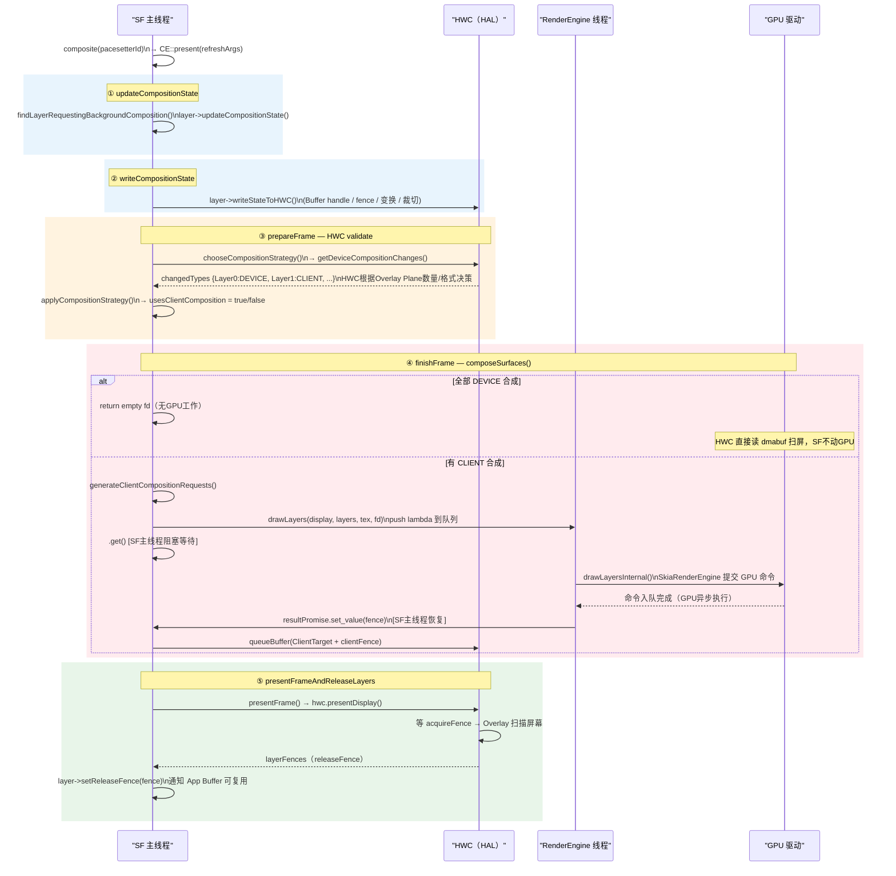

---

## 十二、全 DEVICE 合成时 GraphicBuffer 的流向

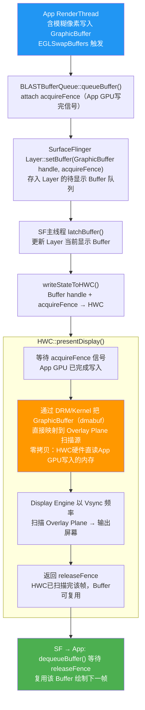

---

## 十三、关键类/方法完整调用链

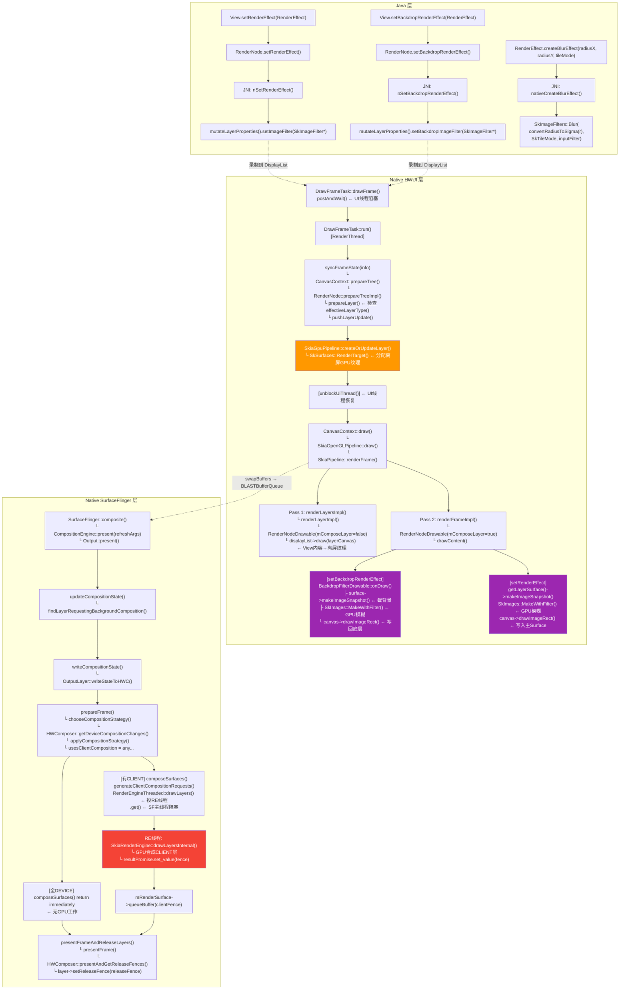

---

## 十四、关键结论速查表

| 问题 | 结论 | 关键代码位置 |
|------|------|-------------|
| `setRenderEffect(blur)` 是否创建离屏纹理？ | **是**，`mImageFilter != null → promotedToLayer() = true → SkSurfaces::RenderTarget()` | `RenderProperties.h:552` / `SkiaGpuPipeline.cpp:72` |
| `setBackdropRenderEffect(blur)` 是否创建离屏纹理？ | **否**，只在 DisplayList 插入 `BackdropFilterDrawable` | `SkiaRecordingCanvas.cpp:174` |
| 模糊在哪个线程执行？ | **App 的 RenderThread**，调用 Skia GPU ImageFilter | `RenderNodeDrawable.cpp:265` / `BackdropFilterDrawable.cpp:62` |
| "模糊在内容底部"怎么实现的？ | 录制顺序决定：`BackdropFilterDrawable` 先于 `RenderNodeDrawable` 写入 DisplayList | `SkiaRecordingCanvas.cpp:175-180` |
| App 到 SF 传输了什么？ | 像素数据：`GraphicBuffer`（dmabuf，零拷贝）；属性：`Transaction`（Binder IPC） | `BLASTBufferQueue.cpp` / `LayerState.h` |
| SF 主线程执行 GPU 合成吗？ | **不执行**，GPU 工作在独立 `RenderEngine` 线程；SF 主线程 `.get()` 等待命令提交完成 | `RenderEngineThreaded.cpp:262` |
| 全 DEVICE 合成时 SF 做什么？ | `composeSurfaces()` 直接 return，SF 不动 GPU，HWC 硬件直接读 dmabuf 扫描屏幕 | `Output.cpp:1347` |
| Fence 的作用？ | `acquireFence`：App GPU 写完信号；`releaseFence`：SF 读完信号；`presentFence`：扫描完成信号 | `OutputLayer.cpp:1663` |

---

## 十五、关键源文件速查

| 文件路径 | 核心职责 |
|---------|---------|
| `frameworks/base/libs/hwui/RenderProperties.h:552` | `promotedToLayer()` — 决定是否创建离屏纹理 |
| `frameworks/base/libs/hwui/pipeline/skia/SkiaGpuPipeline.cpp:72` | `createOrUpdateLayer()` — 分配 GPU 离屏 SkSurface |
| `frameworks/base/libs/hwui/pipeline/skia/SkiaPipeline.cpp:81` | `renderLayerImpl()` — Pass 1：View 内容渲染到离屏纹理 |
| `frameworks/base/libs/hwui/pipeline/skia/SkiaPipeline.cpp:351` | `renderFrame()` — 协调 Pass 1 + Pass 2 |
| `frameworks/base/libs/hwui/pipeline/skia/RenderNodeDrawable.cpp:220` | `drawContent()` — Pass 2：应用 ImageFilter 并合成 |
| `frameworks/base/libs/hwui/pipeline/skia/BackdropFilterDrawable.cpp:32` | `onDraw()` — 截背景 → GPU 模糊 → 写底层 |
| `frameworks/base/libs/hwui/pipeline/skia/SkiaRecordingCanvas.cpp:164` | `drawRenderNode()` — 录制 Drawable 顺序 |
| `frameworks/base/libs/hwui/jni/RenderEffect.cpp:39` | `createBlurEffect()` — 创建 SkImageFilter |
| `frameworks/base/libs/hwui/renderthread/DrawFrameTask.cpp:72` | `drawFrame()` — UI/RT 同步点 |
| `frameworks/native/libs/gui/BLASTBufferQueue.cpp` | App → SF Buffer 提交 |
| `frameworks/native/services/surfaceflinger/CompositionEngine/src/Output.cpp:1337` | `composeSurfaces()` — GPU 合成决策 |
| `frameworks/native/services/surfaceflinger/CompositionEngine/src/Display.cpp:248` | `chooseCompositionStrategy()` — HWC validate |
| `frameworks/native/libs/renderengine/threaded/RenderEngineThreaded.cpp:262` | `drawLayers()` — RE 线程任务投递 |
