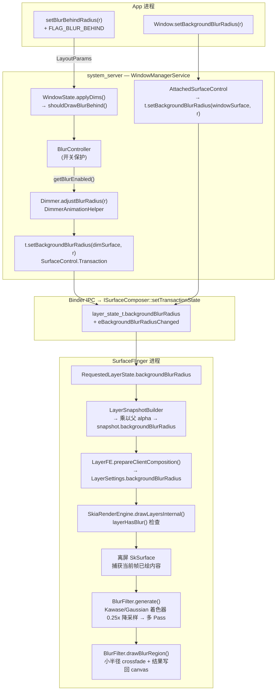

---
layout: post
title:  "Android 16 Window 模糊完整流程深度分析"
date:   2026-05-17 00:00:00 +0800
categories: android
tag: Blur
---

> 基于 Android 16 AOSP 源码（`J:\aosp16`）  
> 前置知识：View 模糊分析见 `docs/view_blur_analysis.md`  
> 覆盖内容：两种 Window 模糊类型 → WMS 调度 → SurfaceControl 事务 → SF Layer 快照 → 跨窗口机制 → SkiaRenderEngine GPU 模糊

---

## 一、两种 Window 模糊的本质区别

Android 提供两套 Window 级模糊 API，语义完全不同：

| 维度 | Blur Behind（背后模糊） | Background Blur（背景模糊） |
|------|------------------------|--------------------------|
| **API** | `FLAG_BLUR_BEHIND` + `setBlurBehindRadius()` | `Window.setBackgroundBlurRadius()` |
| **模糊对象** | 窗口**下方**的整个屏幕内容（跨 Window） | 窗口**自身边界内**的后方内容 |
| **实现载体** | WMS 创建独立 Dimmer SurfaceControl | 直接设置窗口 Surface 的 Layer 属性 |
| **开关保护** | `BlurController.getBlurEnabled()` | 仅受 `mSupportsBlur` 约束 |
| **典型场景** | 对话框、底部抽屉后的屏幕模糊 | 半透明 Activity 背景模糊 |

---

## 二、整体架构框图



---

## 三、Blur Behind（背后模糊）完整路径

### 3.1 App 侧设置

```java
// WindowManager.java LayoutParams
params.flags |= WindowManager.LayoutParams.FLAG_BLUR_BEHIND;
params.setBlurBehindRadius(80);  // 像素半径
getWindow().setAttributes(params);
```

**关键定义**（`WindowManager.java:2783`）：

```java
// FLAG_BLUR_BEHIND = 0x00000004（旧 flag，Android 1.x 就存在，Android 12 重新激活）
public static final int FLAG_BLUR_BEHIND = 0x00000004;
```

### 3.2 WMS 侧：BlurController 开关保护

`BlurController`（`BlurController.java:40`）是跨窗口模糊的唯一开关仲裁者：

```java
// BlurController.java:120
private void updateBlurEnabled() {
    synchronized (mLock) {
        // 四个条件全满足才开启
        final boolean newEnabled = CROSS_WINDOW_BLUR_SUPPORTED  // 硬件支持（编译期）
                && !mBlurDisabledSetting    // Settings.Global.DISABLE_WINDOW_BLURS == 0
                && !mInPowerSaveMode        // 非省电模式
                && !mTunnelModeEnabled      // 非 Tunnel（视频解码器直通）模式
                && !mCriticalThermalStatus; // 非严重过热
        ...
    }
}
```

**`CROSS_WINDOW_BLUR_SUPPORTED`** 由 `ro.surface_flinger.supports_background_blur` 系统属性决定（编译期注入）。

### 3.3 WMS 侧：WindowState 触发 Dimmer

`WindowState.applyDims()`（`WindowState.java:4980`）在每次合成前执行：

```java
private void applyDims() {
    if (((mAttrs.flags & FLAG_DIM_BEHIND) != 0 || shouldDrawBlurBehind())
            && mWinAnimator.getShown() && !mHidden
            && mTransitionController.canApplyDim(task)) {
        mIsDimming = true;
        final float dimAmount = (mAttrs.flags & FLAG_DIM_BEHIND) != 0 ? mAttrs.dimAmount : 0;
        // 只有 FLAG_BLUR_BEHIND && BlurController.getBlurEnabled() 才取半径
        final int blurRadius = shouldDrawBlurBehind() ? mAttrs.getBlurBehindRadius() : 0;
        // Dimmer 是每个 WindowContainer 持有的独立模糊/遮罩 SurfaceControl
        dimmer.adjustBlurRadius(w, dimAmount, blurRadius);
    }
}

private boolean shouldDrawBlurBehind() {
    return (mAttrs.flags & FLAG_BLUR_BEHIND) != 0
        && mWmService.mBlurController.getBlurEnabled();  // 双重检查
}
```

### 3.4 DimmerAnimationHelper 设置 SurfaceControl

`DimmerAnimationHelper`（`DimmerAnimationHelper.java:294`）把 blur 半径通过 `SurfaceControl.Transaction` 写到 Dimmer 专用 Layer：

```java
// DimmerAnimationHelper.java:294
t.setAlpha(sc, mCurrentProperties.mAlpha);
t.setBackgroundBlurRadius(sc, mCurrentProperties.mBlurRadius);
```

> **关键设计**：Blur Behind 的效果层是 WMS 创建的**独立 SurfaceControl**（Dimmer Surface），不是 App 窗口自身的 Surface。这样模糊区域可以精确覆盖窗口下方所有 Layer，且生命周期由 WMS 管理。

---

## 四、Background Blur（背景模糊）路径

### 4.1 App 侧 API

```java
// Window.java:1975
public void setBackgroundBlurRadius(int blurRadius) {}
// PhoneWindow 的实现 → AttachedSurfaceControl → SurfaceControl.Transaction
```

实际调用链（Android 12+ 路径）：

```
Window.setBackgroundBlurRadius(r)
  └─ PhoneWindow → ViewRootImpl.mSurface
       └─ SurfaceControl.Transaction.setBackgroundBlurRadius(windowSurface, r)
```

或通过 `SyncRtSurfaceTransactionApplier`（`SyncRtSurfaceTransactionApplier.java:128`）在 RenderThread 上应用：

```java
if ((params.flags & FLAG_BACKGROUND_BLUR_RADIUS) != 0) {
    t.setBackgroundBlurRadius(params.surface, params.backgroundBlurRadius);
}
```

**注意**：Background Blur 直接作用于窗口自身 Surface，无需 BlurController 鉴权，但仍受 SF 侧 `mSupportsBlur` 约束。

---

## 五、SurfaceControl.Transaction → SF 传递链

### 5.1 Java → Native

```java
// SurfaceControl.java:3764（Java Transaction）
public Transaction setBackgroundBlurRadius(SurfaceControl sc, int radius) {
    nativeSetBackgroundBlurRadius(mNativeObject, sc.mNativeObject, radius);
    return this;
}
```

### 5.2 Native Transaction 侧（SurfaceComposerClient）

`SurfaceComposerClient.cpp:1492`：

```cpp
Transaction& Transaction::setBackgroundBlurRadius(
        const sp<SurfaceControl>& sc, int backgroundBlurRadius) {
    layer_state_t* s = getLayerState(sc);
    s->what |= layer_state_t::eBackgroundBlurRadiusChanged;  // 标记变更 bit
    s->backgroundBlurRadius = backgroundBlurRadius;
    return *this;
}
```

### 5.3 layer_state_t 变更标志位

`LayerState.h:239`：

```cpp
eBackgroundBlurRadiusChanged = 0x80'00000000,
eBlurRegionsChanged          = 0x800'00000000,
```

这两个 flag 同时出现在 `CONTENT_CHANGES` 和 `AFFECTS_CHILDREN` 掩码中（`LayerState.h:292-308`），意味着：
- 模糊变更触发内容重合成（强制 GPU，不走 HWC 硬件合成）
- 变更会传播到子 Layer（影响子层可见度计算）

---

## 六、SurfaceFlinger 前端：LayerSnapshot 构建

### 6.1 LayerSnapshotBuilder 处理 alpha 继承

`LayerSnapshotBuilder.cpp:904`：

```cpp
if (forceUpdate ||
    snapshot.clientChanges &
            (layer_state_t::eBackgroundBlurRadiusChanged | layer_state_t::eBlurRegionsChanged |
             layer_state_t::eAlphaChanged)) {
    // 关键：模糊半径乘以父 Layer 的 alpha（透明度影响模糊强度）
    snapshot.backgroundBlurRadius = args.supportsBlur
            ? static_cast<int>(parentSnapshot.color.a * (float)requested.backgroundBlurRadius)
            : 0;  // 硬件不支持直接清零
    snapshot.blurRegions = requested.blurRegions;
    for (auto& region : snapshot.blurRegions) {
        region.alpha = region.alpha * snapshot.color.a;  // blurRegions 也继承 alpha
    }
}
```

**`args.supportsBlur`** 来自 `SurfaceFlinger.cpp:2571`：

```cpp
.supportsBlur = mSupportsBlur,  // ro.surface_flinger.supports_background_blur
```

`mSupportsBlur` 在 SF 初始化时读取（`SurfaceFlinger.cpp:490`）：

```cpp
property_get("ro.surface_flinger.supports_background_blur", value, "0");
mSupportsBlur = atoi(value);
```

### 6.2 合成类型强制 GPU

含 blur 的 Layer 无法走 HWC 硬件合成，必须 GPU（CLIENT 模式）。`LayerState.h:325`：

```cpp
// COMPOSITION_EFFECTS 包含 eBackgroundBlurRadiusChanged
// 任何带 COMPOSITION_EFFECTS 的 Layer 强制降级为 CLIENT 合成
static constexpr uint64_t COMPOSITION_EFFECTS = ...
        | eBackgroundBlurRadiusChanged | eBlurRegionsChanged | ...;
```

---

## 七、跨窗口模糊的实现机制

### 7.1 核心原理：SF 是所有窗口的"总画布"

SurfaceFlinger 是系统唯一的合成器，持有**所有进程、所有窗口**的 GraphicBuffer 引用，并在每帧以 Z 序从下到上绘制到同一个 GPU render target（`dstSurface`）。

当 `drawLayersInternal()` 到达 Dimmer Layer（blur 层）时，render target 上已经累积了下方所有窗口（来自不同 App 进程）的像素——这就是"跨窗口"模糊的物理基础，与 View 模糊有本质区别（View 模糊的离屏 SkSurface 只含该 View 自身的像素）。

### 7.2 问题：HWC Layer 的像素不在 GPU render target 里

正常情况下，HWC 会把尽可能多的 Layer 分配给硬件 Overlay（DEVICE 合成）。这类 Layer 的像素**不经过 GPU render target**，SF 读不到它们的内容。如果 blur 层下方存在 HWC Layer，`blurInput` 会读到空白区域，产生错误画面。

### 7.3 解决方案：`forceClientComposition` 级联下压

`Output::updateCompositionState()`（`Output.cpp:851`）在每帧合成前执行：

```cpp
// 第一步：扫描全部 Layer，定位最上面的 blur 层
mLayerRequestingBackgroundBlur = findLayerRequestingBackgroundComposition();

// 第二步：只要存在 blur 层，就开启强制 GPU 标志
bool forceClientComposition = mLayerRequestingBackgroundBlur != nullptr;

// 第三步：按 Z 序遍历所有 Layer，逐一下压强制标志
for (auto* layer : getOutputLayersOrderedByZ()) {
    layer->updateCompositionState(...,
            forceClientComposition,  // blur 层下方的所有 Layer 全部强制 GPU
            ...);

    // ★ 到达 blur 层本身时，立即关掉标志
    // blur 层上方的 Layer 恢复正常 HWC/GPU 决策，不受影响
    if (mLayerRequestingBackgroundBlur == layer) {
        forceClientComposition = false;
    }
}
```

**效果**：blur 层**下方**所有 Layer（无论来自哪个 App 进程）全部降级为 CLIENT（GPU）合成，像素全部进入 GPU render target；blur 层**上方**不受影响，仍可走 HWC 节省功耗。

### 7.4 `findLayerRequestingBackgroundComposition()` 的扫描逻辑

`Output.cpp:974`：

```cpp
compositionengine::OutputLayer* Output::findLayerRequestingBackgroundComposition() const {
    compositionengine::OutputLayer* layerRequestingBgComposition = nullptr;
    for (auto* layer : getOutputLayersOrderedByZ()) {
        const auto* compState = layer->getLayerFE().getCompositionState();

        // sideband stream（视频解码器直通）存在 → 立即放弃整个 blur 特性
        if (compState->sidebandStream != nullptr) return nullptr;

        // 完全不透明的 Layer 跳过（blur 被其完全遮住，无意义）
        if (compState->isOpaque) continue;

        if (compState->backgroundBlurRadius > 0 || compState->blurRegions.size() > 0) {
            layerRequestingBgComposition = layer;  // 保留最上面那个 blur 层
        }
    }
    return layerRequestingBgComposition;
}
```

函数遍历完整列表取最高 Z 序的 blur 层，确保 `forceClientComposition` 涵盖全部 blur 输入范围。

### 7.5 blurInput 的来源：render target 累积像素快照

`drawLayersInternal()` 按 Z 序逐层绘制，到达 blur 层时（`SkiaRenderEngine.cpp:913`）：

```cpp
// activeSurface 此时已包含 blur 层下方所有窗口的像素
// （壁纸 + 后台 App + Launcher + 状态栏 + ... 全部叠加其上）
blurInput = activeSurface->makeTemporaryImage();

// 对这张"所有下方窗口合并"的图像执行 Kawase 模糊
auto blurredImage = mBlurFilter->generate(context,
        layer.backgroundBlurRadius, blurInput, blurRect);
```

`makeTemporaryImage()` 是零拷贝的 GPU 纹理引用，不涉及像素回读（不经过 CPU）。

### 7.6 完整 Z 序视图

```
按 Z 序（低 → 高）绘制进 activeSurface：

  壁纸 Layer           ─┐
  后台 App 窗口 Layer    │  forceClientComposition = true
  Launcher Layer        │  全部强制 GPU 合成
  状态栏 Layer            ─┘  像素依次叠入 activeSurface
                              │
  Dimmer Layer（blur=80）      ├─ makeTemporaryImage() → blurInput
  ─────────────────────────── │   读取上方所有窗口合并像素
                              ▼
                        Kawase 4 Pass × 0.25x 模糊
                              │
                              ▼ drawBlurRegion() 写回
  Dialog 窗口 Layer    ─┐   （forceClientComposition = false）
  输入法 Layer            │   可恢复 HWC 硬件合成
  系统 UI Layer           ─┘
```

### 7.7 两个关键边界条件

**① Sideband Stream 使 blur 完全失效**

视频解码器直通（Tunnel Mode）使用专用硬件路径，像素永远不进 GPU render target。`findLayerRequestingBackgroundComposition()` 检测到 `sidebandStream != nullptr` 时立即返回 `nullptr`，`forceClientComposition` 机制整体关闭，blur 特性全部禁用。

这也是 `BlurController`（`BlurController.java:53`）监听 `TunnelModeEnabledListener`、Tunnel 开启时将 `mBlurEnabled` 置 false 的原因——从 WMS 源头拦截，与 SF 侧形成双重保护。

**② GPU 频率主动提升**

`Output.cpp:1396`：

```cpp
const bool expensiveBlurs = mLayerRequestingBackgroundBlur != nullptr;
if (expensiveRenderingExpected) {
    setExpensiveRenderingExpected(true);  // 通知 SF 提升 GPU 运行频率
}
```

只要帧内存在 blur 层，SF 主动提升 GPU 频率，确保 Kawase 多 Pass 渲染在一个 Vsync 周期内完成，不引发 Jank。

---

## 八、LayerFE：BlurSetting 枚举控制模糊范围

`LayerFE.h:65`：

```cpp
enum class BlurSetting {
    Disabled,           // 关闭
    BackgroundBlurOnly, // 仅背景整体模糊
    BlurRegionsOnly,    // 仅区域模糊（BlurRegion）
    Enabled             // 两种都生效
};
```

`LayerFE.cpp:158` 根据 `targetSettings.blurSetting` 决定写入哪些字段：

```cpp
switch (targetSettings.blurSetting) {
    case LayerFE::ClientCompositionTargetSettings::BlurSetting::Enabled:
        layerSettings.backgroundBlurRadius = mSnapshot->backgroundBlurRadius;
        layerSettings.blurRegions = mSnapshot->blurRegions;
        layerSettings.blurRegionTransform = mSnapshot->localTransformInverse.asMatrix4();
        break;
    case LayerFE::ClientCompositionTargetSettings::BlurSetting::BackgroundBlurOnly:
        layerSettings.backgroundBlurRadius = mSnapshot->backgroundBlurRadius;
        break;
    ...
}
```

---

## 九、SkiaRenderEngine：GPU 模糊渲染核心

### 8.1 算法选择（SF 初始化时）

`SurfaceFlinger.cpp:873`：

```cpp
// 默认选 Kawase：速度快，视觉效果接近高斯
renderengine::RenderEngine::BlurAlgorithm chooseBlurAlgorithm(bool supportsBlur) {
    if (!supportsBlur) return BlurAlgorithm::NONE;
    // 优先 KAWASE_DUAL_FILTER，其次 KAWASE，最后 GAUSSIAN
    ...
}
```

`SkiaRenderEngine.cpp:286`：

```cpp
switch (blurAlgorithm) {
    case BlurAlgorithm::GAUSSIAN:        mBlurFilter = new GaussianBlurFilter(); break;
    case BlurAlgorithm::KAWASE:          mBlurFilter = new KawaseBlurFilter(); break;
    case BlurAlgorithm::KAWASE_DUAL_FILTER: mBlurFilter = new KawaseBlurDualFilter(); break;
    default: mBlurFilter = nullptr; break;
}
```

### 8.2 `layerHasBlur()` 过滤检查

`SkiaRenderEngine.cpp:217`：

```cpp
static inline bool layerHasBlur(const LayerSettings& layer, bool colorTransformModifiesAlpha) {
    if (layer.backgroundBlurRadius > 0 || layer.blurRegions.size()) {
        const bool opaqueContent = !layer.source.buffer.buffer || layer.source.buffer.isOpaque;
        const bool opaqueAlpha = layer.alpha == 1.0f && !colorTransformModifiesAlpha;
        // 如果内容完全不透明，后面看不到，不需要模糊
        return layer.skipContentDraw || !(opaqueContent && opaqueAlpha);
    }
    return false;
}
```

### 8.3 离屏 Surface 决策

`SkiaRenderEngine.cpp:797`：

```cpp
// 遍历所有 layer，找到第一个需要 crossFade 的模糊层
for (const auto& layer : layers) {
    if (!layerHasBlur(layer, ctModifiesAlpha)) continue;
    if (layer.backgroundBlurRadius > 0 &&
        layer.backgroundBlurRadius < mBlurFilter->getMaxCrossFadeRadius()) {
        requiresCompositionLayer = true;  // 小半径需要 crossfade，必须离屏
    }
    if (requiresCompositionLayer) {
        // 创建与 dstSurface 同尺寸的离屏 SkSurface
        activeSurface = dstSurface->makeSurface(dstSurface->imageInfo());
        blurCompositionLayer = &layer;  // 记录触发离屏的 layer
        break;
    }
}
```

**为什么需要离屏 Surface？**  
模糊需要读取**当前帧已绘制的内容**作为输入，而 SkCanvas 不支持边写边读同一 Surface。离屏 Surface 先接收模糊层之前的所有 Layer 绘制，到达模糊层时将离屏结果作为 `blurInput`。

### 8.4 核心模糊渲染循环

`SkiaRenderEngine.cpp:888`：

```cpp
if (mBlurFilter && layerHasBlur(layer, ctModifiesAlpha)) {
    // 计算 blurRect（裁剪到屏幕范围，避免超大 Layer 分配巨量 buffer）
    SkRect blurRect = canvas->getTotalMatrix().mapRect(bounds.rect());
    blurRect.intersect(SkRect::Make(canvas->getDeviceClipBounds()));

    if (layer.backgroundBlurRadius > 0) {
        SFTRACE_NAME("BackgroundBlur");
        // 1. generate：0.25x 降采样 → Kawase 多 Pass 模糊 → 返回模糊纹理
        auto blurredImage = mBlurFilter->generate(context,
                layer.backgroundBlurRadius, blurInput, blurRect);
        // 2. drawBlurRegion：将模糊结果写回 canvas（带 crossfade）
        mBlurFilter->drawBlurRegion(canvas, bounds, layer.backgroundBlurRadius,
                1.0f, blurRect, blurredImage, blurInput);
    }
    // BlurRegion（区域模糊）类似，支持多个区域缓存复用
    for (auto region : layer.blurRegions) {
        if (cachedBlurs[region.blurRadius] == nullptr) {
            cachedBlurs[region.blurRadius] =
                    mBlurFilter->generate(context, region.blurRadius, blurInput, blurRect);
        }
        mBlurFilter->drawBlurRegion(canvas, getBlurRRect(region), region.blurRadius,
                region.alpha, blurRect, cachedBlurs[region.blurRadius], blurInput);
    }
}
```

---

## 十、Kawase 模糊算法详解

### 9.1 核心 SKSL 着色器

`KawaseBlurFilter.cpp:42`：

```glsl
uniform shader child;
uniform float in_blurOffset;

half4 main(float2 xy) {
    half4 c = child.eval(xy);
    c += child.eval(xy + float2(+in_blurOffset, +in_blurOffset));
    c += child.eval(xy + float2(+in_blurOffset, -in_blurOffset));
    c += child.eval(xy + float2(-in_blurOffset, -in_blurOffset));
    c += child.eval(xy + float2(-in_blurOffset, +in_blurOffset));
    return half4(c.rgb * 0.2, 1.0);  // 5 点采样均值
}
```

### 9.2 多 Pass 实现

`KawaseBlurFilter.cpp:89`：

```cpp
float tmpRadius = (float)blurRadius / 2.0f;
uint32_t numberOfPasses = std::min(kMaxPasses, (uint32_t)ceil(tmpRadius));
float radiusByPasses = tmpRadius / (float)numberOfPasses;

// 第 1 Pass：原图 → 0.25x 降采样 + 模糊
SkImageInfo scaledInfo = input->imageInfo().makeWH(
    blurRect.width() * kInputScale,   // kInputScale = 0.25
    blurRect.height() * kInputScale);

// 后续 Pass：Ping-Pong 在两个 SkSurface 之间交替（节省分配）
for (auto i = 1; i < numberOfPasses; i++) {
    blurBuilder.uniform("in_blurOffset") = (float) i * radiusByPasses * kInputScale;
    tmpBlur = makeImage(surfaceTwo.get(), &blurBuilder);
    swap(surface, surfaceTwo);
}
```

**性能关键**：`kInputScale = 0.25`，即在 1/16 面积上做模糊，GPU 负载极低；最终上采样时 `kInverseInputScale = 4.0` 双线性插值拉伸。

### 9.3 CrossFade（小半径渐变）

`BlurFilter.cpp:35`（SKSL mix 着色器）：

```glsl
uniform shader blurredInput;
uniform shader originalInput;
uniform float mixFactor;   // = blurRadius / mMaxCrossFadeRadius (默认 10px)

half4 main(float2 xy) {
    return half4(mix(originalInput.eval(xy), blurredInput.eval(xy), mixFactor)).rgb1;
}
```

半径 < 10px 时，模糊结果与原始图像做线性插值，避免小半径时的 0.25x 降采样块状感。

---

## 十一、BlurRegion（区域模糊）

除全窗口背景模糊外，Android 12+ 还支持在 Layer 内指定多个矩形区域独立模糊：

```java
// App 侧（Native API）
List<BlurRegion> regions = new ArrayList<>();
regions.add(new BlurRegion(blurRadius, cornerRadiusX, cornerRadiusY,
        left, top, right, bottom, alpha));
SurfaceControl.Transaction t = new SurfaceControl.Transaction();
t.setBlurRegions(surfaceControl, regions);
t.apply();
```

SF 侧：每个区域独立调用 `mBlurFilter->generate()` + `drawBlurRegion()`，相同半径复用缓存。

---

## 十二、与 View 模糊的核心差异

| 维度 | View 模糊（RenderEffect） | Window 模糊（backgroundBlurRadius） |
|------|--------------------------|-------------------------------------|
| **执行进程** | App RenderThread | SurfaceFlinger RenderEngine 线程 |
| **输入纹理** | View 自身的离屏纹理 | 当前帧所有 Layer 的合成中间结果 |
| **跨窗口** | 不支持（只看到本 View 内容） | 支持（看到整个屏幕） |
| **GPU 着色器** | Skia ImageFilter（HWUI 侧） | SkiaRenderEngine 的 BlurFilter（SF 侧） |
| **HWC** | 最终结果可走 HWC | 含 blur 的 Layer 强制 GPU 合成 |
| **降采样** | 依赖 Skia ImageFilter 内部 | 明确 0.25x（BlurFilter.kInputScale） |

---

## 十三、关键调试命令

```bash
# 查看 blur 是否开启
adb shell dumpsys window | grep mBlurEnabled

# 强制禁用/开启 window blur
adb shell wm set-blur-disabled 1   # 禁用
adb shell wm set-blur-disabled 0   # 开启

# 查看 Layer 的 backgroundBlurRadius
adb shell dumpsys SurfaceFlinger | grep -A5 "backgroundBlurRadius"

# 查看硬件是否支持
adb shell getprop ro.surface_flinger.supports_background_blur

# Perfetto 抓 blur 渲染耗时（关注 BackgroundBlur 和 BlurRegion tag）
adb shell perfetto --txt -c - <<EOF
buffers { size_kb: 32768 }
data_sources { config { name: "linux.ftrace"
  ftrace_config { atrace_categories: "gfx" } } }
duration_ms: 5000
EOF
```

---

## 十四、关键源文件速查

| 文件 | 职责 |
|------|------|
| `frameworks/base/core/java/android/view/WindowManager.java:5242` | `setBlurBehindRadius()` API 定义 |
| `frameworks/base/services/core/java/com/android/server/wm/BlurController.java` | 跨窗口模糊开关仲裁 |
| `frameworks/base/services/core/java/com/android/server/wm/WindowState.java:4980` | `applyDims()` 触发 blur 调度 |
| `frameworks/base/services/core/java/com/android/server/wm/DimmerAnimationHelper.java:294` | Dimmer Layer 设置模糊半径 |
| `frameworks/native/libs/gui/include/gui/LayerState.h:239` | `eBackgroundBlurRadiusChanged` flag |
| `frameworks/native/libs/gui/SurfaceComposerClient.cpp:1492` | Native Transaction `setBackgroundBlurRadius` |
| `frameworks/native/services/surfaceflinger/FrontEnd/LayerSnapshotBuilder.cpp:904` | 快照构建时 alpha 继承 |
| `frameworks/native/services/surfaceflinger/LayerFE.cpp:158` | BlurSetting → LayerSettings 映射 |
| `frameworks/native/services/surfaceflinger/CompositionEngine/src/Output.cpp:851` | `updateCompositionState()` — forceClientComposition 级联下压 |
| `frameworks/native/services/surfaceflinger/CompositionEngine/src/Output.cpp:974` | `findLayerRequestingBackgroundComposition()` — 定位 blur 层 |
| `frameworks/native/libs/renderengine/skia/SkiaRenderEngine.cpp:797` | 离屏 Surface 决策 |
| `frameworks/native/libs/renderengine/skia/SkiaRenderEngine.cpp:913` | `makeTemporaryImage()` — blurInput 快照 |
| `frameworks/native/libs/renderengine/skia/SkiaRenderEngine.cpp:937` | 核心模糊渲染调用 |
| `frameworks/native/libs/renderengine/skia/filters/BlurFilter.cpp` | CrossFade 混合着色器 |
| `frameworks/native/libs/renderengine/skia/filters/KawaseBlurFilter.cpp` | Kawase 多 Pass 实现 |
