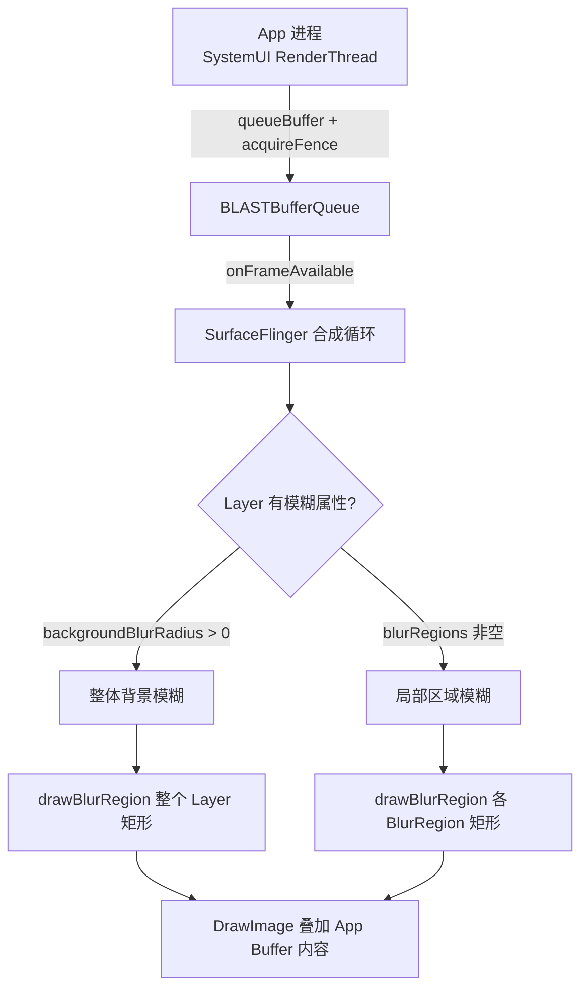
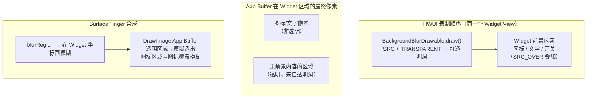
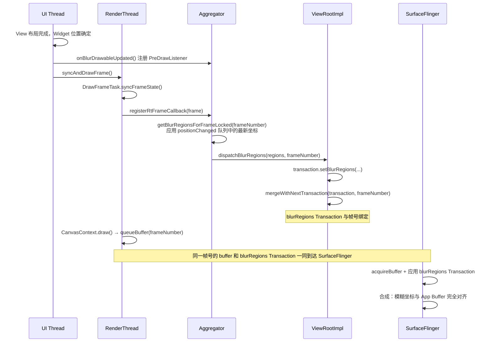
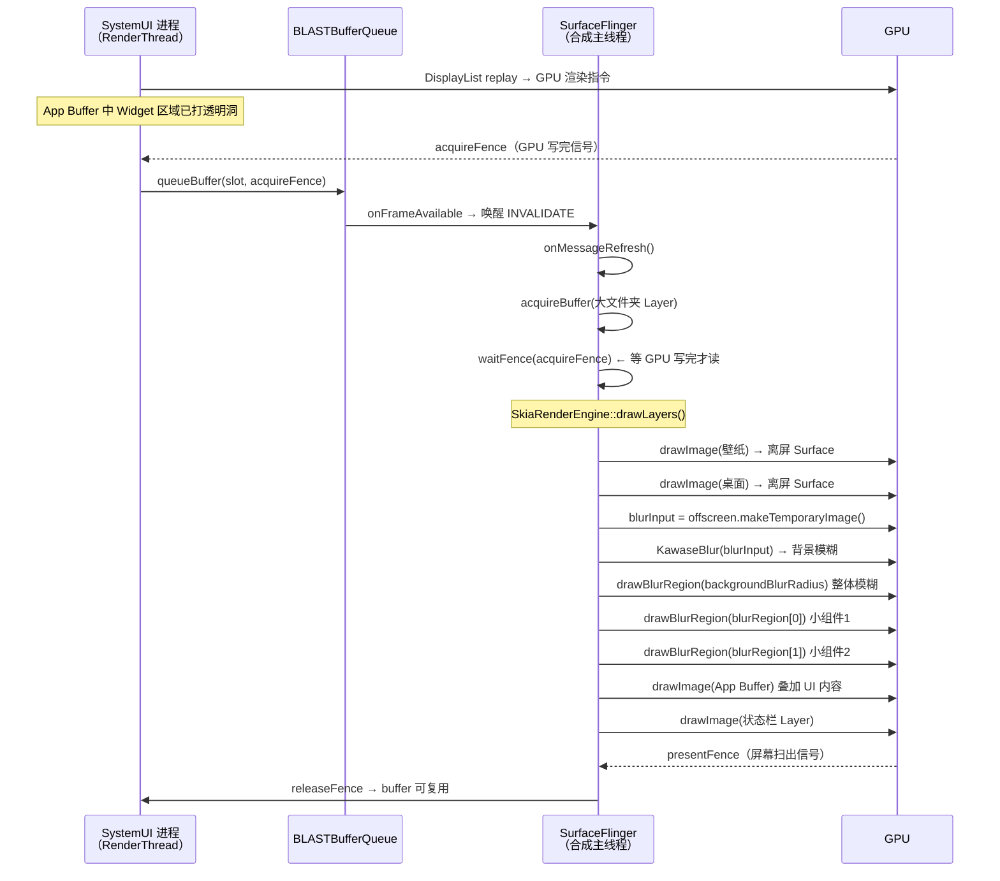

> 基于 Android 16 AOSP 源码分析，覆盖 App 进程、SurfaceFlinger 进程的完整调用链。

---

## 1. 两种模糊路径总览

大文件夹的模糊效果涉及两个维度：

| 维度 | 实现接口 | 执行进程 | 模糊对象 |
|------|---------|---------|---------|
| 整个窗口背景模糊 | `SurfaceControl.Transaction.setBackgroundBlurRadius()` | SurfaceFlinger | 该 Layer **背后**所有 Layer 的合成结果 |
| 单个小组件局部模糊 | `SurfaceControl.Transaction.setBlurRegions()` | SurfaceFlinger | 同上，限制在指定矩形区域内 |

两种接口最终都由 SurfaceFlinger 中的 `SkiaRenderEngine` 在合成阶段执行，与 App 进程的 HWUI 绘制**互不阻塞**。



---

## 2. SurfaceFlinger 合成阶段：模糊的执行位置

### 2.1 找到需要模糊的 Layer

合成开始前，SurfaceFlinger 会预扫描所有 Layer，找到第一个有模糊属性的 Layer，创建一个**离屏 Surface**（offscreen Surface），后续该 Layer 以下的所有 Layer 都先渲染到这个离屏 Surface 里。

```cpp
// frameworks/native/libs/renderengine/skia/SkiaRenderEngine.cpp:793~819
sk_sp<SkSurface> activeSurface(dstSurface);  // 初始指向屏幕目标
SkCanvas* canvas = dstCanvas;
const LayerSettings* blurCompositionLayer = nullptr;

if (mBlurFilter) {
    bool requiresCompositionLayer = false;
    for (const auto& layer : layers) {
        if (!layerHasBlur(layer, ctModifiesAlpha)) continue;
        if (layer.backgroundBlurRadius > 0 &&
            layer.backgroundBlurRadius < mBlurFilter->getMaxCrossFadeRadius()) {
            requiresCompositionLayer = true;
        }
        for (auto region : layer.blurRegions) {
            if (region.blurRadius < mBlurFilter->getMaxCrossFadeRadius())
                requiresCompositionLayer = true;
        }
        if (requiresCompositionLayer) {
            // 创建离屏 Surface，背后的 Layer 全画到这里
            activeSurface = dstSurface->makeSurface(dstSurface->imageInfo());
            canvas = mCapture->tryOffscreenCapture(activeSurface.get(), ...);
            blurCompositionLayer = &layer;
            break;
        }
    }
}
```

### 2.2 绘制顺序：按 Z-order 从底到顶

```mermaid
sequenceDiagram
    participant RE as SkiaRenderEngine
    participant Off as 离屏 Surface
    participant Dst as 屏幕目标 Surface

    RE->>Off: drawImage(壁纸 Layer)
    RE->>Off: drawImage(桌面 Layer)
    Note over RE,Off: 积累大文件夹背后的画面
    RE->>RE: blurInput = offscreen.makeTemporaryImage()
    Note over RE: 对离屏内容拍快照，这是模糊的原料

    alt 有 blurRegions（小组件局部模糊）
        RE->>Dst: drawImage(blurInput) 先把原始背景 blit 到屏幕
    end

    RE->>Dst: drawBlurRegion(backgroundBlurRadius) 整体背景模糊
    loop 每个 BlurRegion（小组件）
        RE->>Dst: drawBlurRegion(region) 局部模糊
    end

    RE->>Dst: drawImage(大文件夹 App Buffer)
    Note over Dst: App Buffer 中小组件区域是透明洞<br/>模糊透过来，UI 内容叠在上方
```

### 2.3 到达模糊 Layer 时的关键切换

```cpp
// frameworks/native/libs/renderengine/skia/SkiaRenderEngine.cpp:838~871
if (blurCompositionLayer == &layer) {
    // 对离屏 Surface（桌面+壁纸）拍快照，作为模糊原料
    blurInput = activeSurface->makeTemporaryImage();

    // 如果有 blurRegions，先把原始背景整体 blit 到屏幕
    // 原因：blurRegions 只模糊特定区域，其余区域要保持原始背景
    if (layer.blurRegions.size() || FlagManager::getInstance().restore_blur_step()) {
        SkPaint paint;
        paint.setBlendMode(SkBlendMode::kSrc);
        dstCanvas->drawImage(blurInput, 0, 0, SkSamplingOptions(), &paint);
    }

    // 切换回屏幕目标 Surface，后续直接画到屏幕
    canvas = dstCanvas;
    activeSurface = dstSurface;
}
```

---

## 3. 整体背景模糊：backgroundBlurRadius

### 3.1 调用链

```cpp
// frameworks/native/libs/renderengine/skia/SkiaRenderEngine.cpp:937~946
if (layer.backgroundBlurRadius > 0) {
    SFTRACE_NAME("BackgroundBlur");
    // 对 blurInput（背后画面快照）执行 KawaseBlur，返回模糊图像
    auto blurredImage = mBlurFilter->generate(
        context, layer.backgroundBlurRadius, blurInput, blurRect);

    cachedBlurs[layer.backgroundBlurRadius] = blurredImage;

    // 将模糊图像画到 dstCanvas 的整个 Layer 矩形范围内
    mBlurFilter->drawBlurRegion(canvas, bounds, layer.backgroundBlurRadius, 1.0f,
                                blurRect, blurredImage, blurInput);
}
```

### 3.2 KawaseBlur 算法（多 Pass 降采样）

KawaseBlur 是 Gaussian 模糊的近似，性能更优，通过多次降采样+双线性插值实现大半径模糊。

```cpp
// frameworks/native/libs/renderengine/skia/filters/KawaseBlurFilter.cpp:76~135
sk_sp<SkImage> KawaseBlurFilter::generate(SkiaGpuContext* context, const uint32_t blurRadius,
                                          const sk_sp<SkImage> input,
                                          const SkRect& blurRect) const {
    float tmpRadius = (float)blurRadius / 2.0f;
    // 最多 4 次 Pass（kMaxPasses = 4）
    uint32_t numberOfPasses = std::min(kMaxPasses, (uint32_t)ceil(tmpRadius));
    float radiusByPasses = tmpRadius / (float)numberOfPasses;

    // 降采样至 0.25x（kInputScale），减少 GPU 带宽
    SkImageInfo scaledInfo = input->imageInfo().makeWH(
        std::ceil(blurRect.width() * kInputScale),
        std::ceil(blurRect.height() * kInputScale));

    // Pass 1：降采样 + 第一次 Kawase Shader
    SkRuntimeShaderBuilder blurBuilder(mBlurEffect);
    blurBuilder.child("child") = input->makeShader(..., blurMatrix);
    blurBuilder.uniform("in_blurOffset") = radiusByPasses * kInputScale;
    sk_sp<SkSurface> surface = context->createRenderTarget(scaledInfo);
    sk_sp<SkImage> tmpBlur = makeImage(surface.get(), &blurBuilder);

    // Pass 2~N：Ping-Pong 两个 Surface 交替，逐步增大 offset
    for (auto i = 1; i < numberOfPasses; i++) {
        blurBuilder.child("child") = tmpBlur->makeShader(...);
        blurBuilder.uniform("in_blurOffset") = (float)i * radiusByPasses * kInputScale;
        tmpBlur = makeImage(surfaceTwo.get(), &blurBuilder);
        swap(surface, surfaceTwo);
    }
    return tmpBlur;  // 返回降采样后的模糊结果（由 drawBlurRegion 负责还原尺寸）
}
```

Kawase Shader 的核心（`KawaseBlurFilter.cpp:43~53`）：

```glsl
uniform shader child;
uniform float in_blurOffset;

half4 main(float2 xy) {
    half4 c = child.eval(xy);
    c += child.eval(xy + float2(+in_blurOffset, +in_blurOffset));
    c += child.eval(xy + float2(+in_blurOffset, -in_blurOffset));
    c += child.eval(xy + float2(-in_blurOffset, -in_blurOffset));
    c += child.eval(xy + float2(-in_blurOffset, +in_blurOffset));
    return half4(c.rgb * 0.2, 1.0);  // 5 点均值
}
```

### 3.3 drawBlurRegion：将模糊图像画到目标区域

```cpp
// frameworks/native/libs/renderengine/skia/filters/BlurFilter.cpp:78~123
void BlurFilter::drawBlurRegion(SkCanvas* canvas, const SkRRect& effectRegion,
                                const uint32_t blurRadius, const float blurAlpha,
                                const SkRect& blurRect, sk_sp<SkImage> blurredImage,
                                sk_sp<SkImage> input) {
    SkPaint paint;
    paint.setAlphaf(blurAlpha);

    // 把降采样的模糊图还原回屏幕坐标的 Shader（kInverseInputScale = 4x）
    const auto blurShader = blurredImage->makeShader(
        SkTileMode::kClamp, SkTileMode::kClamp, linearSampling, &blurMatrix);

    if (blurRadius < mMaxCrossFadeRadius) {
        // 小半径：模糊结果与原始背景线性插值（平滑过渡，避免突变）
        SkRuntimeShaderBuilder blurBuilder(mMixEffect);
        blurBuilder.child("blurredInput") = blurShader;
        blurBuilder.child("originalInput") = input->makeShader(...);
        blurBuilder.uniform("mixFactor") = blurRadius / mMaxCrossFadeRadius;
        paint.setShader(blurBuilder.makeShader());
    } else {
        // 大半径：直接用模糊结果
        paint.setShader(blurShader);
    }

    // 将结果画到 effectRegion（矩形或圆角矩形）
    if (effectRegion.isRect()) {
        canvas->drawRect(effectRegion.rect(), paint);
    } else {
        canvas->drawRRect(effectRegion, paint);
    }
}
```

---

## 4. 局部区域模糊：blurRegions（小组件）

### 4.1 BlurRegion 数据结构

```cpp
// frameworks/native/libs/ui/include/ui/BlurRegion.h:27~48
struct BlurRegion {
    uint32_t blurRadius;      // 模糊半径（px）
    float cornerRadiusTL;     // 左上圆角
    float cornerRadiusTR;     // 右上圆角
    float cornerRadiusBL;     // 左下圆角
    float cornerRadiusBR;     // 右下圆角
    float alpha;              // 模糊透明度
    int left;                 // 矩形坐标（Layer 坐标系）
    int top;
    int right;
    int bottom;
};
```

### 4.2 blurRegions 的绘制逻辑

```cpp
// frameworks/native/libs/renderengine/skia/SkiaRenderEngine.cpp:948~960
canvas->concat(getSkM44(layer.blurRegionTransform).asM33());
for (auto region : layer.blurRegions) {
    // 相同半径复用，避免重复计算
    if (cachedBlurs[region.blurRadius] == nullptr) {
        SFTRACE_NAME("BlurRegion");
        cachedBlurs[region.blurRadius] =
            mBlurFilter->generate(context, region.blurRadius, blurInput, blurRect);
    }

    // 画到 region 定义的圆角矩形（getBlurRRect 将 BlurRegion 转为 SkRRect）
    mBlurFilter->drawBlurRegion(canvas, getBlurRRect(region), region.blurRadius,
                                region.alpha, blurRect,
                                cachedBlurs[region.blurRadius], blurInput);
}
```

**与 backgroundBlurRadius 的关键区别**：

- `backgroundBlurRadius`：模糊整个 Layer 的几何范围，调用一次 `drawBlurRegion(bounds, ...)`
- `blurRegions`：模糊 Layer 内的多个指定矩形，每个矩形独立调用 `drawBlurRegion(getBlurRRect(region), ...)`

两者的 `blurInput`（原料）相同——都是大文件夹**背后**所有 Layer 的合成快照。

---

## 5. BackgroundBlurDrawable：坐标同步机制

### 5.1 整体设计

`BackgroundBlurDrawable` 是 Android Framework 提供的 `Drawable` 子类，专门用于与 `setBlurRegions` 配合使用。它解决两个问题：

1. **模糊区域坐标如何精确对应 View 位置**
2. **CC buffer（HWUI 渲染结果）如何让模糊透出来**

源文件：`frameworks/base/core/java/com/android/internal/graphics/drawable/BackgroundBlurDrawable.java`

### 5.2 位置追踪：RenderNode.PositionUpdateListener

```java
// BackgroundBlurDrawable.java:78~94
public final RenderNode.PositionUpdateListener mPositionUpdateListener =
    new RenderNode.PositionUpdateListener() {
        @Override
        public void positionChanged(long frameNumber, int left, int top, int right, int bottom) {
            // RenderThread 处理该帧时，Widget View 的精确屏幕坐标通过这里上报
            // frameNumber 与 HWUI buffer 的帧号绑定，确保坐标和 buffer 同帧
            mAggregator.onRenderNodePositionChanged(frameNumber, () -> {
                mRect.set(left, top, right, bottom);
            });
        }

        @Override
        public void positionLost(long frameNumber) {
            mAggregator.onRenderNodePositionChanged(frameNumber, () -> {
                mRect.setEmpty();  // Widget 不可见时清空区域
            });
        }
    };
```

`Aggregator` 在 `PreDrawListener` 中收集所有 `BackgroundBlurDrawable` 的当前位置，注册 `RtFrameCallback` 在 RenderThread 处理该帧时执行提交：

```java
// BackgroundBlurDrawable.java:292~315（Aggregator.registerPreDrawListener）
mOnPreDrawListener = () -> {
    final BlurRegion[] blurRegionsForNextFrame = getBlurRegionsCopyForRT();
    mViewRoot.registerRtFrameCallback(frame -> {
        synchronized (mRtLock) {
            mLastFrameNumber = frame;
            handleDispatchBlurTransactionLocked(frame, blurRegionsForNextFrame, hasUiUpdates);
        }
    });
    return true;
};
```

最终由 `ViewRootImpl.dispatchBlurRegions()` 提交给 SurfaceFlinger，**关键在于与 buffer 帧绑定**：

```java
// ViewRootImpl.java:12667~12679
public void dispatchBlurRegions(float[][] regionCopy, long frameNumber) {
    SurfaceControl.Transaction transaction = new SurfaceControl.Transaction();
    transaction.setBlurRegions(surfaceControl, regionCopy);

    if (mBlastBufferQueue != null) {
        transaction.onMergeWithNextTransaction(getTitle());
        // 将 setBlurRegions Transaction 与编号为 frameNumber 的 HWUI buffer 合并
        // SurfaceFlinger 收到该 buffer 时，blurRegions 坐标同帧生效，不会差帧
        mBlastBufferQueue.mergeWithNextTransaction(transaction, frameNumber);
    }
}
```

### 5.3 透明洞：让模糊透过 App Buffer

这是 `BackgroundBlurDrawable` 最关键的设计。它的 `draw()` 方法使用 `PorterDuff.Mode.SRC + Color.TRANSPARENT`，在 HWUI 录制 DisplayList 时，将 Widget 区域的像素**直接替换为透明**：

```java
// BackgroundBlurDrawable.java:96~113
private BackgroundBlurDrawable(Aggregator aggregator) {
    mPaint.setXfermode(new PorterDuffXfermode(PorterDuff.Mode.SRC));
    mPaint.setColor(Color.TRANSPARENT);  // 默认透明
    mRenderNode = new RenderNode("BackgroundBlurDrawable");
    mRenderNode.addPositionUpdateListener(mPositionUpdateListener);
}

@Override
public void draw(@NonNull Canvas canvas) {
    if (mRectPath.isEmpty() || !isVisible() || getAlpha() == 0) return;
    // SRC + TRANSPARENT：dst = src = 完全透明，无论之前画了什么都被清除
    canvas.drawPath(mRectPath, mPaint);
    canvas.drawRenderNode(mRenderNode);  // 仅用于位置追踪，无绘制内容
}
```

`PorterDuff.Mode.SRC` 的语义是 **直接替换**（dst = src），不做任何混合。结合 `Color.TRANSPARENT`，效果是将该圆角矩形区域内的所有像素的 alpha 清零，打出一个"透明洞"。

`setColor()` 方法支持设置非透明颜色，为模糊叠加半透明色调：

```java
public void setColor(@ColorInt int color) {
    mPaint.setColor(color);  // 如 Color.argb(77, 255, 255, 255) → 白色30%透明度叠层
}
```

### 5.4 Widget 区域的像素分层



---

## 6. 为什么不会错位



错位问题的三重保障：

| 错位来源 | 解决方案 | 代码位置 |
|---------|---------|---------|
| 坐标获取时机 | `RenderNode.PositionUpdateListener.positionChanged()` 在 RenderThread 处理该帧时回调，拿到的是 HWUI 布局最终坐标 | `BackgroundBlurDrawable.java:81` |
| 坐标与 buffer 不同帧 | `mergeWithNextTransaction(transaction, frameNumber)` 将 Transaction 与 buffer 帧号强绑定 | `ViewRootImpl.java:12678` |
| 动画过程中 Widget 移动 | 每帧都触发 `positionChanged` 回调，每帧都重新提交最新坐标 | `BackgroundBlurDrawable.java:80~86` |

---

## 7. 完整帧合成顺序



---

## 8. 强制 GPU 合成

设置了 `backgroundBlurRadius` 或 `blurRegions` 的 Layer 会强制走 GPU（CLIENT）合成，不能使用 HWC（DEVICE）合成。这一约束在 `LayerState.h` 中明确定义：

```cpp
// frameworks/native/libs/gui/include/gui/LayerState.h:324~328
// Changes that force GPU composition.
static constexpr uint64_t COMPOSITION_EFFECTS =
    layer_state_t::eBackgroundBlurRadiusChanged |
    layer_state_t::eBlurRegionsChanged |
    layer_state_t::eCornerRadiusChanged |
    layer_state_t::eShadowRadiusChanged |
    layer_state_t::eStretchChanged |
    layer_state_t::eBorderSettingsChanged;
```

原因是 KawaseBlur 需要先采样其他 Layer 的像素再执行多 Pass 渲染，HWC 的 Overlay Plane 只支持简单的 Buffer 显示，无法完成这类依赖前序 Layer 内容的操作。

---

## 9. 关键源文件速查

| 文件 | 职责 |
|------|------|
| `frameworks/native/libs/renderengine/skia/SkiaRenderEngine.cpp` | 合成主循环，离屏 Surface 创建、blurInput 快照、blur 绘制 |
| `frameworks/native/libs/renderengine/skia/filters/KawaseBlurFilter.cpp` | KawaseBlur 多 Pass 降采样算法 |
| `frameworks/native/libs/renderengine/skia/filters/BlurFilter.cpp` | `drawBlurRegion` 实现，含小半径 CrossFade 混合逻辑 |
| `frameworks/native/libs/ui/include/ui/BlurRegion.h` | `BlurRegion` 结构体定义 |
| `frameworks/native/libs/gui/include/gui/LayerState.h` | Layer 状态位定义，含强制 GPU 合成约束 |
| `frameworks/base/core/java/com/android/internal/graphics/drawable/BackgroundBlurDrawable.java` | 透明洞机制 + 坐标追踪 + 帧同步 |
| `frameworks/base/core/java/android/view/ViewRootImpl.java:12667` | `dispatchBlurRegions`，含 `mergeWithNextTransaction` |
